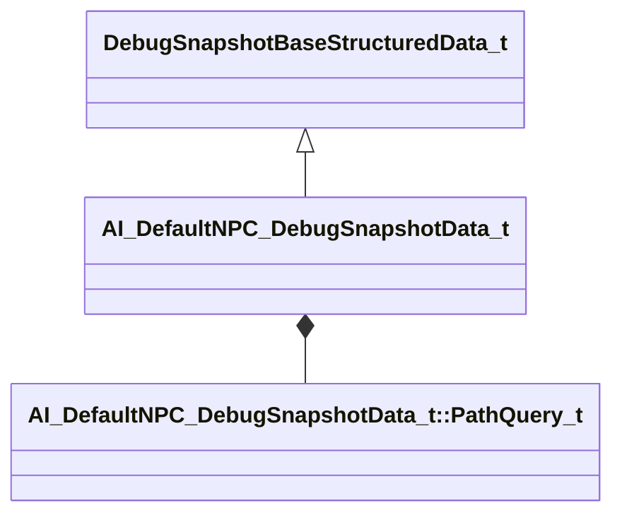

[Schemas](../../schemas.md) / [server](../server.md) / AI_DefaultNPC_DebugSnapshotData_t

# AI_DefaultNPC_DebugSnapshotData_t

> Source: **Build 25000182** · 2026-08-28 · `windows-x86_64` · schema `0.10.0`

**Kind:** class · **Size:** 120 bytes (`0x78`) · **Align:** 8 · **Module:** server

**Inherits from:** [DebugSnapshotBaseStructuredData_t](../server/DebugSnapshotBaseStructuredData_t.md)

**Metadata:** `MPropertyFriendlyName Default NPC`

**Relationships:**

## Memory layout

6 fields (6 declared here, 0 inherited). Offsets are absolute from the object base.

| Offset | Field | Type | From | Annotations |
|--------|-------|------|------|-------------|
| `0x8` | `s_npc_current_ability` | CGlobalSymbol |  |  |
| `0x10` | `s_npc_tactic_current` | CGlobalSymbol |  |  |
| `0x18` | `s_npc_tactic_phase` | CGlobalSymbol |  |  |
| `0x20` | `tactic_interrupt_conditions` | CUtlVector< CGlobalSymbol > |  |  |
| `0x38` | `path_query` | [AI_DefaultNPC_DebugSnapshotData_t::PathQuery_t](../server/AI_DefaultNPC_DebugSnapshotData_t.PathQuery_t.md) |  |  |
| `0x60` | `path_queries_speculative` | CUtlVector< [AI_DefaultNPC_DebugSnapshotData_t::PathQuery_t](../server/AI_DefaultNPC_DebugSnapshotData_t.PathQuery_t.md) > |  |  |

KV3 class defaults

<pre>{
	&quot;_class&quot;: &quot;AI_DefaultNPC_DebugSnapshotData_t&quot;,
	&quot;s_npc_current_ability&quot;: &quot;&quot;,
	&quot;s_npc_tactic_current&quot;: &quot;&quot;,
	&quot;s_npc_tactic_phase&quot;: &quot;&quot;,
	&quot;tactic_interrupt_conditions&quot;:
	[
	],
	&quot;path_query&quot;:
	{
		&quot;m_nInitialMovementId&quot;: &quot;&quot;,
		&quot;m_nCurrentMovementId&quot;: &quot;&quot;,
		&quot;m_nMode&quot;: &quot;&quot;,
		&quot;m_nType&quot;: &quot;&quot;,
		&quot;m_nState&quot;: &quot;&quot;
	},
	&quot;path_queries_speculative&quot;:
	[
	]
}</pre>

