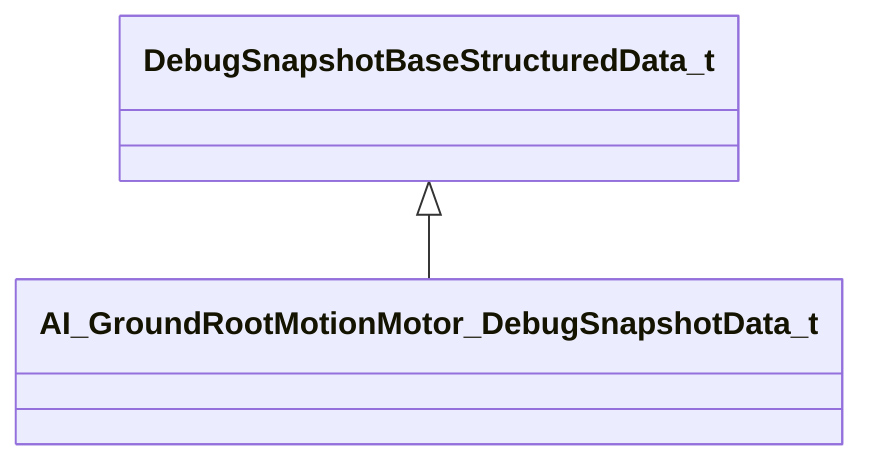

[Schemas](../../schemas.md) / [server](../server.md) / AI_GroundRootMotionMotor_DebugSnapshotData_t

# AI_GroundRootMotionMotor_DebugSnapshotData_t

**Kind:** class · **Size:** 136 bytes (`0x88`) · **Align:** 8 · **Module:** server

**Inherits from:** [DebugSnapshotBaseStructuredData_t](../server/DebugSnapshotBaseStructuredData_t.md)

**Metadata:** `MPropertyFriendlyName Ground Root Motion Motor`

**Relationships:**

## Memory layout

18 fields (18 declared here, 0 inherited). Offsets are absolute from the object base.

| Offset | Field | Type | From | Annotations |
|--------|-------|------|------|-------------|
| `0x8` | `desired_movement_gait_set` | CGlobalSymbol |  |  |
| `0x10` | `desired_movement_gait` | CGlobalSymbol |  |  |
| `0x18` | `current_movement_gait_set` | CGlobalSymbol |  |  |
| `0x20` | `current_movement_gait` | CGlobalSymbol |  |  |
| `0x28` | `movement_setting_id` | CGlobalSymbol |  |  |
| `0x30` | `gait_switch_blocked_reason` | CGlobalSymbol |  |  |
| `0x38` | `b_goal_completion_allowed` | bool |  |  |
| `0x40` | `state` | CGlobalSymbol |  |  |
| `0x48` | `n_state_active_tick_count` | int32 |  |  |
| `0x4c` | `b_has_path` | bool |  |  |
| `0x50` | `f_remaining_ground_path_length` | float32 |  |  |
| `0x54` | `f_current_speed` | float32 |  |  |
| `0x58` | `move_type` | CGlobalSymbol |  |  |
| `0x60` | `f_forward_strafing_angle_actual` | float32 |  |  |
| `0x64` | `f_forward_strafing_angle_desired` | float32 |  |  |
| `0x68` | `f_current_lean` | float32 |  |  |
| `0x6c` | `f_target_lean` | float32 |  |  |
| `0x70` | `vec_events` | CUtlVector< [AI_GroundRootMotionMotor_DebugSnapshotData_t](../server/AI_GroundRootMotionMotor_DebugSnapshotData_t.md)::Event_t > |  |  |

KV3 class defaults

<pre>{
	&quot;_class&quot;: &quot;AI_GroundRootMotionMotor_DebugSnapshotData_t&quot;,
	&quot;desired_movement_gait_set&quot;: &quot;&quot;,
	&quot;desired_movement_gait&quot;: &quot;&quot;,
	&quot;current_movement_gait_set&quot;: &quot;&quot;,
	&quot;current_movement_gait&quot;: &quot;&quot;,
	&quot;movement_setting_id&quot;: &quot;&quot;,
	&quot;gait_switch_blocked_reason&quot;: &quot;&quot;,
	&quot;b_goal_completion_allowed&quot;: true,
	&quot;state&quot;: &quot;&quot;,
	&quot;n_state_active_tick_count&quot;: 0,
	&quot;b_has_path&quot;: false,
	&quot;f_remaining_ground_path_length&quot;: -1.000000,
	&quot;f_current_speed&quot;: -1.000000,
	&quot;move_type&quot;: &quot;&quot;,
	&quot;f_forward_strafing_angle_actual&quot;: -1.000000,
	&quot;f_forward_strafing_angle_desired&quot;: -1.000000,
	&quot;f_current_lean&quot;: 0.000000,
	&quot;f_target_lean&quot;: 0.000000,
	&quot;vec_events&quot;:
	[
	]
}</pre>

