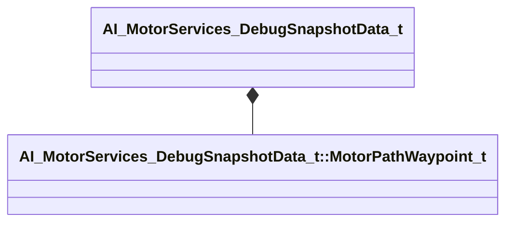

[Schemas](../../schemas.md) / [server](../server.md) / AI_MotorServices_DebugSnapshotData_t

# AI_MotorServices_DebugSnapshotData_t

> Source: **Build 25000182** · 2026-08-28 · `windows-x86_64` · schema `0.10.0`

**Kind:** class · **Size:** 48 bytes (`0x30`) · **Align:** 8 · **Module:** server

**Metadata:** `MDebugSnapshotDataRenderFn`, `MPropertyFriendlyName Motor Services`

**Relationships:**

## Memory layout

4 fields (4 declared here, 0 inherited). Offsets are absolute from the object base.

| Offset | Field | Type | From | Annotations |
|--------|-------|------|------|-------------|
| `0x0` | `active_motor` | CGlobalSymbol |  |  |
| `0x8` | `desired_speed` | float32 |  |  |
| `0xc` | `motor_velocity` | Vector |  |  |
| `0x18` | `motor_path` | CUtlVector< [AI_MotorServices_DebugSnapshotData_t::MotorPathWaypoint_t](../server/AI_MotorServices_DebugSnapshotData_t.MotorPathWaypoint_t.md) > |  |  |

KV3 class defaults

<pre>{
	&quot;active_motor&quot;: &quot;&quot;,
	&quot;desired_speed&quot;: 0.000000,
	&quot;motor_velocity&quot;:
	[
		0.000000,
		0.000000,
		0.000000
	],
	&quot;motor_path&quot;:
	[
	]
}</pre>

