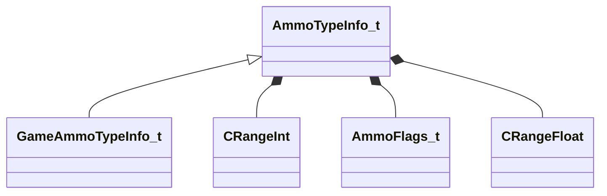

[Schemas](../../schemas.md) / [server](../server.md) / AmmoTypeInfo_t

# AmmoTypeInfo_t

> Source: **Build 25000182** · 2026-08-28 · `windows-x86_64` · schema `0.10.0`

**Kind:** class · **Size:** 56 bytes (`0x38`) · **Align:** 8 · **Module:** server

**Derived by:** [GameAmmoTypeInfo_t](../server/GameAmmoTypeInfo_t.md)

**Relationships:**

## Memory layout

5 fields (5 declared here, 0 inherited). Offsets are absolute from the object base.

| Offset | Field | Type | From | Annotations |
|--------|-------|------|------|-------------|
| `0x10` | `m_nMaxCarry` | int32 |  |  |
| `0x1c` | `m_nSplashSize` | [CRangeInt](../tier2/CRangeInt.md) |  |  |
| `0x24` | `m_nFlags` | [AmmoFlags_t](../server/AmmoFlags_t.md) |  |  |
| `0x28` | `m_flMass` | float32 |  |  |
| `0x2c` | `m_flSpeed` | [CRangeFloat](../tier2/CRangeFloat.md) |  |  |

KV3 class defaults

<pre>{
	&quot;_class&quot;: &quot;AmmoTypeInfo_t&quot;,
	&quot;m_nMaxCarry&quot;: 0,
	&quot;m_nSplashSize&quot;: 0,
	&quot;m_nFlags&quot;: &quot;&quot;,
	&quot;m_flMass&quot;: 0.000000,
	&quot;m_flSpeed&quot;: 0.000000
}</pre>

