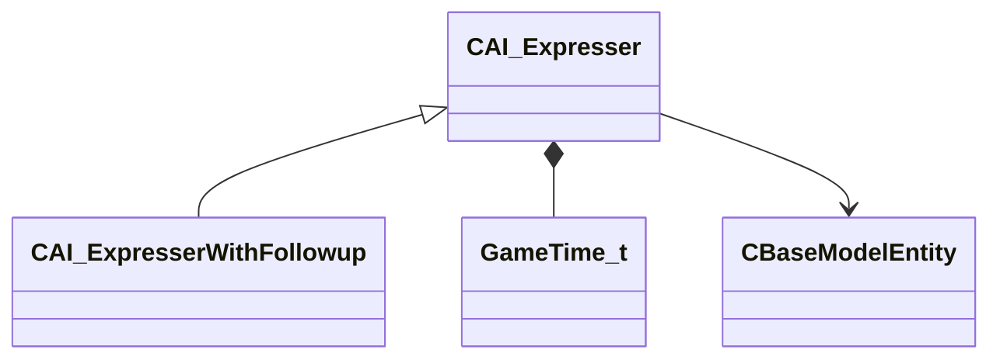

[Schemas](../../schemas.md) / [server](../server.md) / CAI_Expresser

# CAI_Expresser

**Kind:** class · **Size:** 160 bytes (`0xa0`) · **Align:** 8 · **Module:** server

**Derived by:** [CAI_ExpresserWithFollowup](../server/CAI_ExpresserWithFollowup.md)

**Relationships:**

## Memory layout

13 fields (13 declared here, 0 inherited). Offsets are absolute from the object base.

| Offset | Field | Type | From | Annotations |
|--------|-------|------|------|-------------|
| `0x10` | `m_conceptCooldowns` | CUtlDict< [GameTime_t](../entity2/GameTime_t.md) > |  |  |
| `0x38` | `m_ruleCooldowns` | CUtlDict< [GameTime_t](../entity2/GameTime_t.md) > |  |  |
| `0x60` | `m_flStopTalkTime` | [GameTime_t](../entity2/GameTime_t.md) |  |  |
| `0x64` | `m_flStopTalkTimeWithoutDelay` | [GameTime_t](../entity2/GameTime_t.md) |  |  |
| `0x68` | `m_flQueuedSpeechTime` | [GameTime_t](../entity2/GameTime_t.md) |  |  |
| `0x6c` | `m_flBlockedTalkTime` | [GameTime_t](../entity2/GameTime_t.md) |  |  |
| `0x70` | `m_voicePitch` | int32 |  |  |
| `0x74` | `m_flLastTimeAcceptedSpeak` | [GameTime_t](../entity2/GameTime_t.md) |  |  |
| `0x78` | `m_bAllowSpeakingInterrupts` | bool |  |  |
| `0x79` | `m_bConsiderSceneInvolvementAsSpeech` | bool |  |  |
| `0x7a` | `m_bSceneEntityDisabled` | bool |  |  |
| `0x7c` | `m_nLastSpokenPriority` | int32 |  |  |
| `0x98` | `m_pOuter` | [CBaseModelEntity](../server/CBaseModelEntity.md)* |  | `MNotSaved` |

KV3 class defaults

<pre>{
	&quot;_class&quot;: &quot;CAI_Expresser&quot;,
	&quot;m_conceptCooldowns&quot;:
	{
	},
	&quot;m_ruleCooldowns&quot;:
	{
	},
	&quot;m_flStopTalkTime&quot;: null,
	&quot;m_flStopTalkTimeWithoutDelay&quot;: null,
	&quot;m_flQueuedSpeechTime&quot;: null,
	&quot;m_flBlockedTalkTime&quot;: null,
	&quot;m_voicePitch&quot;: 100,
	&quot;m_flLastTimeAcceptedSpeak&quot;: null,
	&quot;m_bAllowSpeakingInterrupts&quot;: false,
	&quot;m_bConsiderSceneInvolvementAsSpeech&quot;: false,
	&quot;m_bSceneEntityDisabled&quot;: false,
	&quot;m_nLastSpokenPriority&quot;: 0
}</pre>

