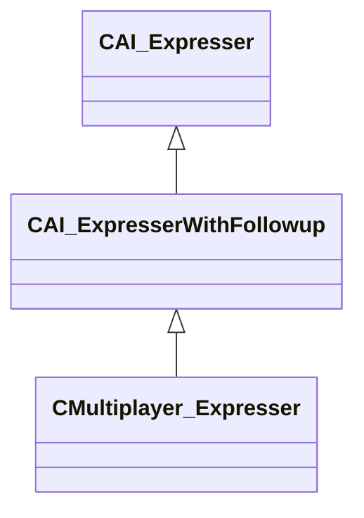

[Schemas](../../schemas.md) / [server](../server.md) / CAI_ExpresserWithFollowup

# CAI_ExpresserWithFollowup

**Kind:** class · **Size:** 160 bytes (`0xa0`) · **Align:** 8 · **Module:** server

**Inherits from:** [CAI_Expresser](../server/CAI_Expresser.md)

**Derived by:** [CMultiplayer_Expresser](../server/CMultiplayer_Expresser.md)

**Relationships:**

## Memory layout

13 fields (0 declared here, 13 inherited). Offsets are absolute from the object base.

| Offset | Field | Type | From | Annotations |
|--------|-------|------|------|-------------|
| `0x10` | `m_conceptCooldowns` | CUtlDict< [GameTime_t](../entity2/GameTime_t.md) > | [CAI_Expresser](../server/CAI_Expresser.md) |  |
| `0x38` | `m_ruleCooldowns` | CUtlDict< [GameTime_t](../entity2/GameTime_t.md) > | [CAI_Expresser](../server/CAI_Expresser.md) |  |
| `0x60` | `m_flStopTalkTime` | [GameTime_t](../entity2/GameTime_t.md) | [CAI_Expresser](../server/CAI_Expresser.md) |  |
| `0x64` | `m_flStopTalkTimeWithoutDelay` | [GameTime_t](../entity2/GameTime_t.md) | [CAI_Expresser](../server/CAI_Expresser.md) |  |
| `0x68` | `m_flQueuedSpeechTime` | [GameTime_t](../entity2/GameTime_t.md) | [CAI_Expresser](../server/CAI_Expresser.md) |  |
| `0x6c` | `m_flBlockedTalkTime` | [GameTime_t](../entity2/GameTime_t.md) | [CAI_Expresser](../server/CAI_Expresser.md) |  |
| `0x70` | `m_voicePitch` | int32 | [CAI_Expresser](../server/CAI_Expresser.md) |  |
| `0x74` | `m_flLastTimeAcceptedSpeak` | [GameTime_t](../entity2/GameTime_t.md) | [CAI_Expresser](../server/CAI_Expresser.md) |  |
| `0x78` | `m_bAllowSpeakingInterrupts` | bool | [CAI_Expresser](../server/CAI_Expresser.md) |  |
| `0x79` | `m_bConsiderSceneInvolvementAsSpeech` | bool | [CAI_Expresser](../server/CAI_Expresser.md) |  |
| `0x7a` | `m_bSceneEntityDisabled` | bool | [CAI_Expresser](../server/CAI_Expresser.md) |  |
| `0x7c` | `m_nLastSpokenPriority` | int32 | [CAI_Expresser](../server/CAI_Expresser.md) |  |
| `0x98` | `m_pOuter` | [CBaseModelEntity](../server/CBaseModelEntity.md)* | [CAI_Expresser](../server/CAI_Expresser.md) | `MNotSaved` |
