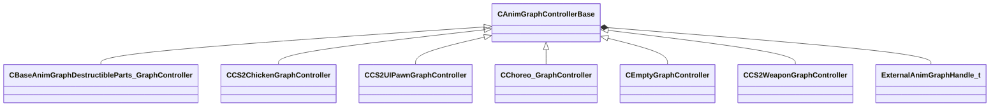

[Schemas](../../schemas.md) / [server](../server.md) / CAnimGraphControllerBase

# CAnimGraphControllerBase

**Kind:** class · **Size:** 136 bytes (`0x88`) · **Align:** 255 · **Module:** server

**Derived by:** [CBaseAnimGraphDestructibleParts_GraphController](../server/CBaseAnimGraphDestructibleParts_GraphController.md), [CCS2ChickenGraphController](../server/CCS2ChickenGraphController.md), [CCS2UIPawnGraphController](../client/CCS2UIPawnGraphController.md), [CCS2WeaponGraphController](../server/CCS2WeaponGraphController.md), [CChoreo_GraphController](../server/CChoreo_GraphController.md), [CEmptyGraphController](../server/CEmptyGraphController.md)

**Relationships:**

## Memory layout

1 fields (1 declared here, 0 inherited). Offsets are absolute from the object base.

| Offset | Field | Type | From | Annotations |
|--------|-------|------|------|-------------|
| `0x10` | `m_hExternalGraph` | [ExternalAnimGraphHandle_t](../server/ExternalAnimGraphHandle_t.md) |  |  |
