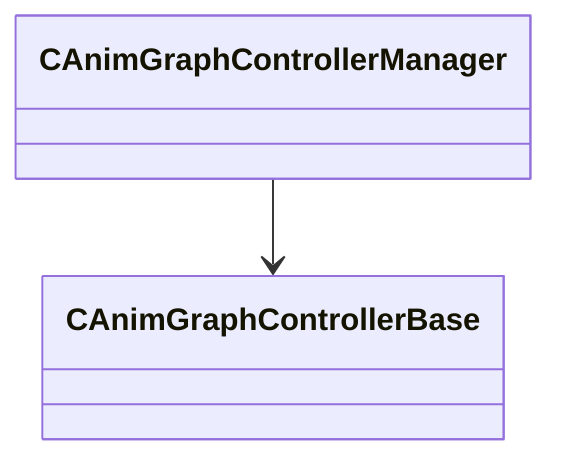

[Schemas](../../schemas.md) / [server](../server.md) / CAnimGraphControllerManager

# CAnimGraphControllerManager

**Kind:** class · **Size:** 152 bytes (`0x98`) · **Align:** 255 · **Module:** server

**Relationships:**

## Memory layout

2 fields (2 declared here, 0 inherited). Offsets are absolute from the object base.

| Offset | Field | Type | From | Annotations |
|--------|-------|------|------|-------------|
| `0x0` | `m_controllers` | CUtlVector< [CAnimGraphControllerBase](../server/CAnimGraphControllerBase.md)* > |  |  |
| `0x90` | `m_bGraphBindingsCreated` | bool |  |  |
