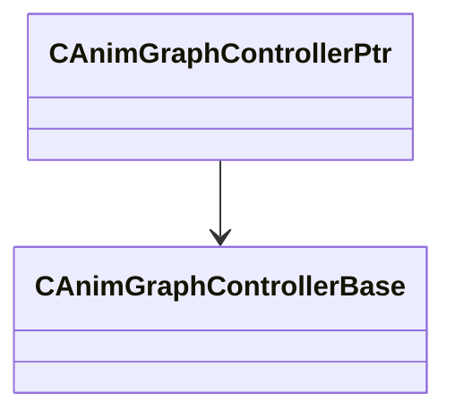

[Schemas](../../schemas.md) / [server](../server.md) / CAnimGraphControllerPtr

# CAnimGraphControllerPtr

**Kind:** class · **Size:** 8 bytes (`0x8`) · **Align:** 255 · **Module:** server

**Relationships:**

## Memory layout

1 fields (1 declared here, 0 inherited). Offsets are absolute from the object base.

| Offset | Field | Type | From | Annotations |
|--------|-------|------|------|-------------|
| `0x0` | `m_pController` | [CAnimGraphControllerBase](../server/CAnimGraphControllerBase.md)* |  |  |
