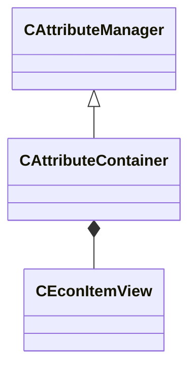

[Schemas](../../schemas.md) / [server](../server.md) / CAttributeContainer

# CAttributeContainer

> Source: **Build 25000182** · 2026-08-28 · `windows-x86_64` · schema `0.10.0`

**Kind:** class · **Size:** 760 bytes (`0x2f8`) · **Align:** n/a (unspecified) · **Module:** server

**Inherits from:** [CAttributeManager](../server/CAttributeManager.md)

**Relationships:**

## Memory layout

7 fields (1 declared here, 6 inherited). Offsets are absolute from the object base.

| Offset | Field | Type | From | Annotations |
|--------|-------|------|------|-------------|
| `0x8` | `m_Providers` | CUtlVector< CHandle< [CBaseEntity](../server/CBaseEntity.md) > > | [CAttributeManager](../server/CAttributeManager.md) |  |
| `0x20` | `m_iReapplyProvisionParity` | int32 | [CAttributeManager](../server/CAttributeManager.md) |  |
| `0x24` | `m_hOuter` | CHandle< [CBaseEntity](../server/CBaseEntity.md) > | [CAttributeManager](../server/CAttributeManager.md) |  |
| `0x28` | `m_bPreventLoopback` | bool | [CAttributeManager](../server/CAttributeManager.md) |  |
| `0x2c` | `m_ProviderType` | attributeprovidertypes_t | [CAttributeManager](../server/CAttributeManager.md) |  |
| `0x30` | `m_CachedResults` | CUtlVector< [CAttributeManager::cached_attribute_float_t](../server/CAttributeManager.cached_attribute_float_t.md) > | [CAttributeManager](../server/CAttributeManager.md) |  |
| `0x50` | `m_Item` | [CEconItemView](../server/CEconItemView.md) |  |  |
