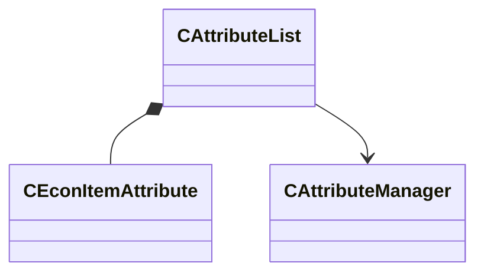

[Schemas](../../schemas.md) / [server](../server.md) / CAttributeList

# CAttributeList

> Source: **Build 25000182** · 2026-08-28 · `windows-x86_64` · schema `0.10.0`

**Kind:** class · **Size:** 120 bytes (`0x78`) · **Align:** n/a (unspecified) · **Module:** server

**Twin:** [CAttributeList (client)](../client/CAttributeList.md)

**Relationships:**

## Memory layout

2 fields (2 declared here, 0 inherited). Offsets are absolute from the object base.

| Offset | Field | Type | From | Annotations |
|--------|-------|------|------|-------------|
| `0x8` | `m_Attributes` | CUtlVectorEmbeddedNetworkVar< [CEconItemAttribute](../server/CEconItemAttribute.md) > |  |  |
| `0x70` | `m_pManager` | [CAttributeManager](../server/CAttributeManager.md)* |  |  |
