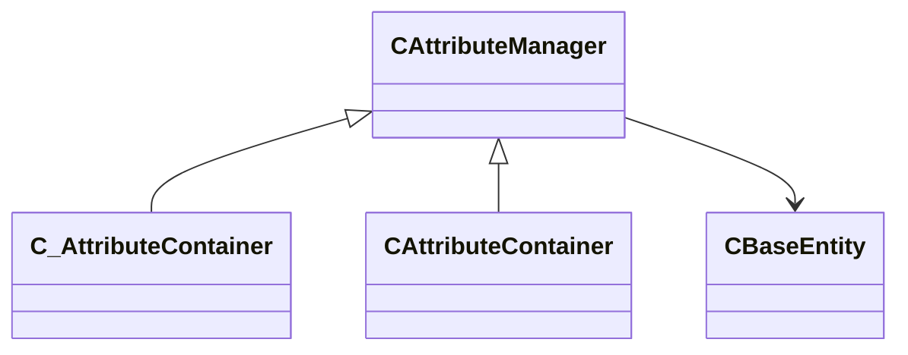

[Schemas](../../schemas.md) / [server](../server.md) / CAttributeManager

# CAttributeManager

**Kind:** class · **Size:** 80 bytes (`0x50`) · **Align:** 255 · **Module:** server

**Derived by:** [CAttributeContainer](../server/CAttributeContainer.md), [C_AttributeContainer](../client/C_AttributeContainer.md)

**Relationships:**

## Memory layout

6 fields (6 declared here, 0 inherited). Offsets are absolute from the object base.

| Offset | Field | Type | From | Annotations |
|--------|-------|------|------|-------------|
| `0x8` | `m_Providers` | CUtlVector< CHandle< [CBaseEntity](../server/CBaseEntity.md) > > |  |  |
| `0x20` | `m_iReapplyProvisionParity` | int32 |  |  |
| `0x24` | `m_hOuter` | CHandle< [CBaseEntity](../server/CBaseEntity.md) > |  |  |
| `0x28` | `m_bPreventLoopback` | bool |  |  |
| `0x2c` | `m_ProviderType` | attributeprovidertypes_t |  |  |
| `0x30` | `m_CachedResults` | CUtlVector< [CAttributeManager](../server/CAttributeManager.md)::cached_attribute_float_t > |  |  |
