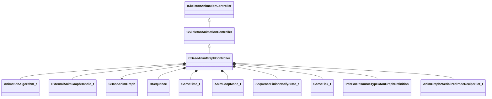

[Schemas](../../schemas.md) / [server](../server.md) / CBaseAnimGraphController

# CBaseAnimGraphController

**Kind:** class · **Size:** 1616 bytes (`0x650`) · **Align:** 8 · **Module:** server

**Inherits from:** [CSkeletonAnimationController](../server/CSkeletonAnimationController.md)

**Relationships:**

## Memory layout

32 fields (31 declared here, 1 inherited). Offsets are absolute from the object base.

| Offset | Field | Type | From | Annotations |
|--------|-------|------|------|-------------|
| `0x8` | `m_pSkeletonInstance` | [CSkeletonInstance](../server/CSkeletonInstance.md)* | [CSkeletonAnimationController](../server/CSkeletonAnimationController.md) | `MNotSaved` |
| `0x18` | `m_nAnimationAlgorithm` | [AnimationAlgorithm_t](../!GlobalTypes/AnimationAlgorithm_t.md) |  |  |
| `0x1c` | `m_nNextExternalGraphHandle` | [ExternalAnimGraphHandle_t](../server/ExternalAnimGraphHandle_t.md) |  |  |
| `0x20` | `m_vecSecondarySkeletonSlotIDs` | CNetworkUtlVectorBase< CGlobalSymbol > |  |  |
| `0x38` | `m_vecSecondarySkeletons` | CNetworkUtlVectorBase< CHandle< [CBaseAnimGraph](../server/CBaseAnimGraph.md) > > |  |  |
| `0x50` | `m_nSecondarySkeletonMasterCount` | int32 |  |  |
| `0x54` | `m_flSoundSyncTime` | float32 |  |  |
| `0x58` | `m_nActiveIKChainMask` | uint32 |  |  |
| `0x5c` | `m_hSequence` | [HSequence](../animationsystem/HSequence.md) |  |  |
| `0x60` | `m_flSeqStartTime` | [GameTime_t](../entity2/GameTime_t.md) |  |  |
| `0x64` | `m_flSeqFixedCycle` | float32 |  |  |
| `0x68` | `m_nAnimLoopMode` | [AnimLoopMode_t](../!GlobalTypes/AnimLoopMode_t.md) |  |  |
| `0x6c` | `m_flPlaybackRate` | CNetworkedQuantizedFloat |  |  |
| `0x78` | `m_nNotifyState` | [SequenceFinishNotifyState_t](../!GlobalTypes/SequenceFinishNotifyState_t.md) |  |  |
| `0x79` | `m_bNetworkedAnimationInputsChanged` | bool |  |  |
| `0x7a` | `m_bNetworkedSequenceChanged` | bool |  |  |
| `0x7b` | `m_bLastUpdateSkipped` | bool |  |  |
| `0x7c` | `m_bSequenceFinished` | bool |  |  |
| `0x80` | `m_nPrevAnimUpdateTick` | [GameTick_t](../entity2/GameTick_t.md) |  |  |
| `0x320` | `m_hGraphDefinitionAG2` | CStrongHandle< [InfoForResourceTypeCNmGraphDefinition](../resourcesystem/InfoForResourceTypeCNmGraphDefinition.md) > |  |  |
| `0x328` | `m_SerializePoseRecipeAG2Slots` | CUtlVectorEmbeddedNetworkVar< [AnimGraph2SerializedPoseRecipeSlot_t](../server/AnimGraph2SerializedPoseRecipeSlot_t.md) > |  | `MNotSaved` |
| `0x390` | `m_SerializePoseRecipeAG2Dynamic` | CNetworkUtlVectorBase< uint8 > |  | `MNotSaved` |
| `0x3a8` | `m_nSerializePoseRecipeAG2ActiveSlot` | uint32 |  | `MNotSaved` |
| `0x3ac` | `m_nSerializePoseRecipeVersionAG2` | int32 |  | `MNotSaved` |
| `0x3c0` | `m_nServerGraphInstanceIteration` | int32 |  |  |
| `0x3c4` | `m_nServerSerializationContextIteration` | int32 |  |  |
| `0x3c8` | `m_primaryGraphId` | [ResourceId_t](../resourcefile/ResourceId_t.md) |  |  |
| `0x3d0` | `m_vecExternalGraphIds` | CNetworkUtlVectorBase< [ResourceId_t](../resourcefile/ResourceId_t.md) > |  |  |
| `0x3e8` | `m_vecExternalClipIds` | CNetworkUtlVectorBase< [ResourceId_t](../resourcefile/ResourceId_t.md) > |  |  |
| `0x400` | `m_sAnimGraph2Identifier` | CGlobalSymbol |  |  |
| `0x408` | `m_pGraphInstanceAG2` | [CAnimGraph2InstancePtr](../server/CAnimGraph2InstancePtr.md) |  |  |
| `0x628` | `m_vecExternalGraphs` | [CExternalAnimGraphList](../server/CExternalAnimGraphList.md) |  |  |

KV3 class defaults

<pre>{
	&quot;m_nAnimationAlgorithm&quot;: &quot;eInvalid&quot;,
	&quot;m_nNextExternalGraphHandle&quot;: 0,
	&quot;m_vecSecondarySkeletonSlotIDs&quot;:
	[
	],
	&quot;m_vecSecondarySkeletons&quot;:
	[
	],
	&quot;m_nSecondarySkeletonMasterCount&quot;: 0,
	&quot;m_flSoundSyncTime&quot;: 0.000000,
	&quot;m_nActiveIKChainMask&quot;: 0,
	&quot;m_hSequence&quot;: -1,
	&quot;m_flSeqStartTime&quot;: null,
	&quot;m_flSeqFixedCycle&quot;: 0.000000,
	&quot;m_nAnimLoopMode&quot;: &quot;ANIM_LOOP_MODE_USE_SEQUENCE_SETTINGS&quot;,
	&quot;m_flPlaybackRate&quot;: 1.000000,
	&quot;m_nNotifyState&quot;: &quot;eDoNotNotify&quot;,
	&quot;m_bNetworkedAnimationInputsChanged&quot;: false,
	&quot;m_bNetworkedSequenceChanged&quot;: false,
	&quot;m_bLastUpdateSkipped&quot;: false,
	&quot;m_bSequenceFinished&quot;: false,
	&quot;m_nPrevAnimUpdateTick&quot;: null,
	&quot;m_hGraphDefinitionAG2&quot;: &quot;&quot;,
	&quot;m_nServerGraphInstanceIteration&quot;: 0,
	&quot;m_nServerSerializationContextIteration&quot;: 0,
	&quot;m_primaryGraphId&quot;: 0,
	&quot;m_vecExternalGraphIds&quot;:
	[
	],
	&quot;m_vecExternalClipIds&quot;:
	[
	],
	&quot;m_sAnimGraph2Identifier&quot;: &quot;&quot;,
	&quot;m_pGraphInstanceAG2&quot;: null,
	&quot;m_vecExternalGraphs&quot;: null
}</pre>

