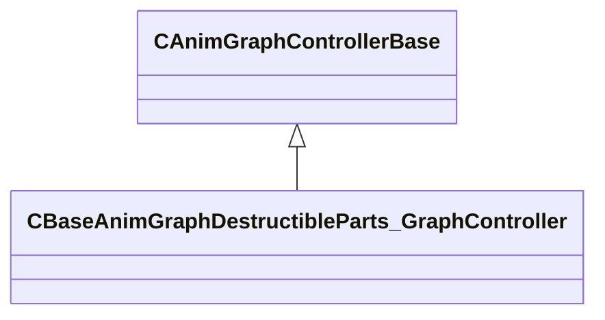

[Schemas](../../schemas.md) / [server](../server.md) / CBaseAnimGraphDestructibleParts_GraphController

# CBaseAnimGraphDestructibleParts_GraphController

**Kind:** class · **Size:** 136 bytes (`0x88`) · **Align:** 8 · **Module:** server

**Inherits from:** [CAnimGraphControllerBase](../server/CAnimGraphControllerBase.md)

**Relationships:**

## Memory layout

1 fields (0 declared here, 1 inherited). Offsets are absolute from the object base.

| Offset | Field | Type | From | Annotations |
|--------|-------|------|------|-------------|
| `0x10` | `m_hExternalGraph` | [ExternalAnimGraphHandle_t](../server/ExternalAnimGraphHandle_t.md) | [CAnimGraphControllerBase](../server/CAnimGraphControllerBase.md) |  |

KV3 class defaults

<pre>{
	&quot;_class&quot;: &quot;CBaseAnimGraphDestructibleParts_GraphController&quot;,
	&quot;m_hExternalGraph&quot;: 4294967295
}</pre>

