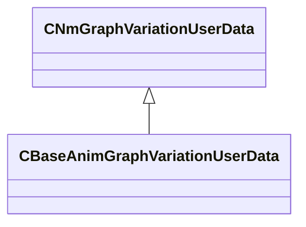

[Schemas](../../schemas.md) / [server](../server.md) / CBaseAnimGraphVariationUserData

# CBaseAnimGraphVariationUserData

**Kind:** class · **Size:** 8 bytes (`0x8`) · **Align:** 8 · **Module:** server

**Inherits from:** [CNmGraphVariationUserData](../animlib/CNmGraphVariationUserData.md)

**Relationships:**

KV3 class defaults

<pre>{
	&quot;_class&quot;: &quot;CBaseAnimGraphVariationUserData&quot;
}</pre>

