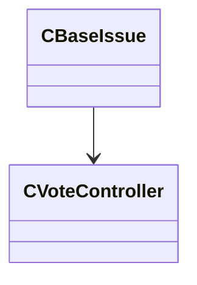

[Schemas](../../schemas.md) / [server](../server.md) / CBaseIssue

# CBaseIssue

> Source: **Build 25000182** · 2026-08-28 · `windows-x86_64` · schema `0.10.0`

**Kind:** class · **Size:** 376 bytes (`0x178`) · **Align:** n/a (unspecified) · **Module:** server

**Relationships:**

## Memory layout

6 fields (6 declared here, 0 inherited). Offsets are absolute from the object base.

| Offset | Field | Type | From | Annotations |
|--------|-------|------|------|-------------|
| `0x20` | `m_szTypeString` | char[64] |  |  |
| `0x60` | `m_szDetailsString` | char[260] |  |  |
| `0x164` | `m_iNumYesVotes` | int32 |  |  |
| `0x168` | `m_iNumNoVotes` | int32 |  |  |
| `0x16c` | `m_iNumPotentialVotes` | int32 |  |  |
| `0x170` | `m_pVoteController` | [CVoteController](../server/CVoteController.md)* |  |  |
