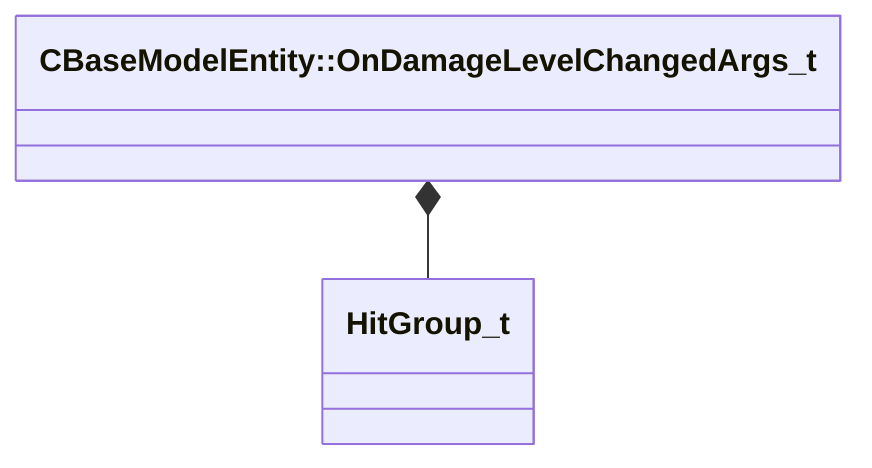

[Schemas](../../schemas.md) / [server](../server.md) / CBaseModelEntity::OnDamageLevelChangedArgs_t

# CBaseModelEntity::OnDamageLevelChangedArgs_t

> Source: **Build 25000182** · 2026-08-28 · `windows-x86_64` · schema `0.10.0`

**Kind:** class · **Size:** 16 bytes (`0x10`) · **Align:** 4 · **Module:** server

**Relationships:**

## Memory layout

4 fields (4 declared here, 0 inherited). Offsets are absolute from the object base.

| Offset | Field | Type | From | Annotations |
|--------|-------|------|------|-------------|
| `0x0` | `nHitGroup` | [HitGroup_t](../server/HitGroup_t.md) |  |  |
| `0x4` | `nDamageLevel` | int32 |  |  |
| `0x8` | `nDamageLevelsRemaining` | int32 |  |  |
| `0xc` | `nPrevDamageLevel` | int32 |  |  |

KV3 class defaults

<pre>{
	&quot;nHitGroup&quot;: &quot;HITGROUP_GENERIC&quot;,
	&quot;nDamageLevel&quot;: 0,
	&quot;nDamageLevelsRemaining&quot;: 0,
	&quot;nPrevDamageLevel&quot;: 0
}</pre>

