[Schemas](../../schemas.md) / [server](../server.md) / CBaseModelEntity

# CBaseModelEntity

Extends CBaseEntity with a visible model, collision, glow, and render properties.  Base class for all entities that have a mesh in the world.

**Kind:** class · **Size:** 1904 bytes (`0x770`) · **Align:** 8 · **Module:** server

**Inherits from:** [CBaseEntity](../server/CBaseEntity.md)

**Derived by:** [CBarnLight](../server/CBarnLight.md), [CBaseClientUIEntity](../server/CBaseClientUIEntity.md), [CBaseToggle](../server/CBaseToggle.md), [CBeam](../server/CBeam.md), [CBreakable](../server/CBreakable.md), [CDynamicLight](../server/CDynamicLight.md), [CEntityBlocker](../server/CEntityBlocker.md), [CEntityDissolve](../server/CEntityDissolve.md), [CEnvDecal](../server/CEnvDecal.md), [CEnvSky](../server/CEnvSky.md), [CFuncBrush](../server/CFuncBrush.md), [CFuncConveyor](../server/CFuncConveyor.md), [CFuncIllusionary](../server/CFuncIllusionary.md), [CFuncInteractionLayerClip](../server/CFuncInteractionLayerClip.md), [CFuncLadder](../server/CFuncLadder.md), [CFuncMover](../server/CFuncMover.md), [CFuncNavBlocker](../server/CFuncNavBlocker.md), [CFuncNavObstruction](../server/CFuncNavObstruction.md), [CFuncRotating](../server/CFuncRotating.md), [CFuncRotator](../server/CFuncRotator.md), [CFuncShatterglass](../server/CFuncShatterglass.md), [CFuncTrackTrain](../server/CFuncTrackTrain.md), [CFuncTrainControls](../server/CFuncTrainControls.md), [CFuncVPhysicsClip](../server/CFuncVPhysicsClip.md), [CFuncVehicleClip](../server/CFuncVehicleClip.md), [CFuncWall](../server/CFuncWall.md), [CInferno](../server/CInferno.md), [CItemGenericTriggerHelper](../server/CItemGenericTriggerHelper.md), [CLightEntity](../server/CLightEntity.md), [CMarkupVolume](../server/CMarkupVolume.md), [CModelPointEntity](../server/CModelPointEntity.md), [CParticleSystem](../server/CParticleSystem.md), [CPlatTrigger](../server/CPlatTrigger.md), [CPrecipitationBlocker](../server/CPrecipitationBlocker.md), [CRopeKeyframe](../server/CRopeKeyframe.md), [CRuleEntity](../server/CRuleEntity.md), [CShatterGlassShardPhysics](../server/CShatterGlassShardPhysics.md), [CSpotlightEnd](../server/CSpotlightEnd.md), [CSprite](../server/CSprite.md), [CTextureBasedAnimatable](../server/CTextureBasedAnimatable.md), [CTriggerBrush](../server/CTriggerBrush.md), [CTriggerVolume](../server/CTriggerVolume.md), [CWorld](../server/CWorld.md)

**Relationships:**

```mermaid
classDiagram
    CBaseEntity <|-- CBaseModelEntity
    CEntityInstance <|-- CBaseEntity
    CBaseModelEntity <|-- CBarnLight
    CBaseModelEntity <|-- CBaseClientUIEntity
    CBaseModelEntity <|-- CBaseToggle
    CBaseModelEntity <|-- CBeam
    CBaseModelEntity <|-- CBreakable
    CBaseModelEntity <|-- CDynamicLight
    CBaseModelEntity <|-- CEntityBlocker
    CBaseModelEntity <|-- CEntityDissolve
    CBaseModelEntity <|-- CEnvDecal
    CBaseModelEntity <|-- CEnvSky
    CBaseModelEntity <|-- CFuncBrush
    CBaseModelEntity <|-- CFuncConveyor
    CBaseModelEntity <|-- CFuncIllusionary
    CBaseModelEntity <|-- CFuncInteractionLayerClip
    CBaseModelEntity <|-- CFuncLadder
    CBaseModelEntity <|-- CFuncMover
    CBaseModelEntity <|-- CFuncNavBlocker
    CBaseModelEntity <|-- CFuncNavObstruction
    CBaseModelEntity <|-- CFuncRotating
    CBaseModelEntity <|-- CFuncRotator
    CBaseModelEntity <|-- CFuncShatterglass
    CBaseModelEntity <|-- CFuncTrackTrain
    CBaseModelEntity <|-- CFuncTrainControls
    CBaseModelEntity <|-- CFuncVPhysicsClip
    CBaseModelEntity <|-- CFuncVehicleClip
    CBaseModelEntity <|-- CFuncWall
    CBaseModelEntity <|-- CInferno
    CBaseModelEntity <|-- CItemGenericTriggerHelper
    CBaseModelEntity <|-- CLightEntity
    CBaseModelEntity <|-- CMarkupVolume
    CBaseModelEntity <|-- CModelPointEntity
    CBaseModelEntity <|-- CParticleSystem
    CBaseModelEntity <|-- CPlatTrigger
    CBaseModelEntity <|-- CPrecipitationBlocker
    CBaseModelEntity <|-- CRopeKeyframe
    CBaseModelEntity <|-- CRuleEntity
    CBaseModelEntity <|-- CShatterGlassShardPhysics
    CBaseModelEntity <|-- CSpotlightEnd
    CBaseModelEntity <|-- CSprite
    CBaseModelEntity <|-- CTextureBasedAnimatable
    CBaseModelEntity <|-- CTriggerBrush
    CBaseModelEntity <|-- CTriggerVolume
    CBaseModelEntity <|-- CWorld
    CBaseModelEntity --> CRenderComponent
    CBaseModelEntity *-- CHitboxComponent
    CBaseModelEntity --> CChoreoComponent
    CBaseModelEntity *-- HitGroup_t
    CBaseModelEntity --> CDestructiblePartsComponent
    CBaseModelEntity *-- GameTime_t
    CBaseModelEntity *-- CEntityIOOutput
    CBaseModelEntity *-- RenderMode_t
    CBaseModelEntity *-- RenderFx_t
    CBaseModelEntity *-- EntityRenderAttribute_t
```

## Memory layout

128 fields (40 declared here, 88 inherited). Offsets are absolute from the object base.

| Offset | Field | Type | From | Annotations |
|--------|-------|------|------|-------------|
| `0x8` | `m_iszPrivateVScripts` | CUtlSymbolLarge | [CEntityInstance](../entity2/CEntityInstance.md) |  |
| `0x10` | `m_pEntity` | [CEntityIdentity](../entity2/CEntityIdentity.md)* | [CEntityInstance](../entity2/CEntityInstance.md) |  |
| `0x28` | `m_CScriptComponent` | [CScriptComponent](../entity2/CScriptComponent.md)* | [CEntityInstance](../entity2/CEntityInstance.md) |  |
| `0x30` | `m_CBodyComponent` | [CBodyComponent](../server/CBodyComponent.md)* | [CBaseEntity](../server/CBaseEntity.md) |  |
| `0x38` | `m_NetworkTransmitComponent` | [CNetworkTransmitComponent](../server/CNetworkTransmitComponent.md) | [CBaseEntity](../server/CBaseEntity.md) |  |
| `0x248` | `m_aThinkFunctions` | CUtlVector< thinkfunc_t > | [CBaseEntity](../server/CBaseEntity.md) |  |
| `0x260` | `m_iCurrentThinkContext` | int32 | [CBaseEntity](../server/CBaseEntity.md) | `MNotSaved` |
| `0x264` | `m_nLastThinkTick` | [GameTick_t](../entity2/GameTick_t.md) | [CBaseEntity](../server/CBaseEntity.md) |  |
| `0x268` | `m_bDisabledContextThinks` | bool | [CBaseEntity](../server/CBaseEntity.md) |  |
| `0x278` | `m_isSteadyState` | CTypedBitVec< 64 > | [CBaseEntity](../server/CBaseEntity.md) | `MNotSaved` |
| `0x280` | `m_lastNetworkChange` | float32 | [CBaseEntity](../server/CBaseEntity.md) | `MNotSaved` |
| `0x288` | `m_think` | BASEPTR | [CBaseEntity](../server/CBaseEntity.md) |  |
| `0x290` | `m_ResponseContexts` | CUtlVector< [ResponseContext_t](../server/ResponseContext_t.md) > | [CBaseEntity](../server/CBaseEntity.md) |  |
| `0x2a8` | `m_iszResponseContext` | CUtlSymbolLarge | [CBaseEntity](../server/CBaseEntity.md) |  |
| `0x2b0` | `m_pfnTouch` | ENTITYFUNCPTR | [CBaseEntity](../server/CBaseEntity.md) |  |
| `0x2b8` | `m_pfnUse` | USEPTR | [CBaseEntity](../server/CBaseEntity.md) |  |
| `0x2c0` | `m_pfnBlocked` | ENTITYFUNCPTR | [CBaseEntity](../server/CBaseEntity.md) |  |
| `0x2c8` | `m_pfnMoveDone` | BASEPTR | [CBaseEntity](../server/CBaseEntity.md) |  |
| `0x2d0` | `m_iHealth` | int32 | [CBaseEntity](../server/CBaseEntity.md) |  |
| `0x2d4` | `m_iMaxHealth` | int32 | [CBaseEntity](../server/CBaseEntity.md) |  |
| `0x2d8` | `m_lifeState` | uint8 | [CBaseEntity](../server/CBaseEntity.md) |  |
| `0x2dc` | `m_flDamageAccumulator` | float32 | [CBaseEntity](../server/CBaseEntity.md) |  |
| `0x2e0` | `m_bTakesDamage` | bool | [CBaseEntity](../server/CBaseEntity.md) |  |
| `0x2e8` | `m_nTakeDamageFlags` | [TakeDamageFlags_t](../server/TakeDamageFlags_t.md) | [CBaseEntity](../server/CBaseEntity.md) |  |
| `0x2f0` | `m_nPlatformType` | [EntityPlatformTypes_t](../server/EntityPlatformTypes_t.md) | [CBaseEntity](../server/CBaseEntity.md) |  |
| `0x2f2` | `m_MoveCollide` | [MoveCollide_t](../server/MoveCollide_t.md) | [CBaseEntity](../server/CBaseEntity.md) |  |
| `0x2f3` | `m_MoveType` | [MoveType_t](../server/MoveType_t.md) | [CBaseEntity](../server/CBaseEntity.md) |  |
| `0x2f4` | `m_nPreviouslySetMoveType` | [MoveType_t](../server/MoveType_t.md) | [CBaseEntity](../server/CBaseEntity.md) |  |
| `0x2f5` | `m_nActualMoveType` | [MoveType_t](../server/MoveType_t.md) | [CBaseEntity](../server/CBaseEntity.md) |  |
| `0x2f6` | `m_nWaterTouch` | uint8 | [CBaseEntity](../server/CBaseEntity.md) | `MNotSaved` |
| `0x2f7` | `m_nSlimeTouch` | uint8 | [CBaseEntity](../server/CBaseEntity.md) | `MNotSaved` |
| `0x2f8` | `m_bRestoreInHierarchy` | bool | [CBaseEntity](../server/CBaseEntity.md) |  |
| `0x300` | `m_target` | CUtlSymbolLarge | [CBaseEntity](../server/CBaseEntity.md) |  |
| `0x308` | `m_hDamageFilter` | CHandle< [CBaseFilter](../server/CBaseFilter.md) > | [CBaseEntity](../server/CBaseEntity.md) |  |
| `0x310` | `m_iszDamageFilterName` | CUtlSymbolLarge | [CBaseEntity](../server/CBaseEntity.md) |  |
| `0x318` | `m_flMoveDoneTime` | float32 | [CBaseEntity](../server/CBaseEntity.md) |  |
| `0x31c` | `m_nSubclassID` | CUtlStringToken | [CBaseEntity](../server/CBaseEntity.md) |  |
| `0x328` | `m_flAnimTime` | float32 | [CBaseEntity](../server/CBaseEntity.md) | `MKV3TransferSaveOpsForField GetEngineTimeSaveRestoreOps` |
| `0x32c` | `m_flSimulationTime` | float32 | [CBaseEntity](../server/CBaseEntity.md) | `MKV3TransferSaveOpsForField GetEngineTimeSaveRestoreOps` |
| `0x330` | `m_flCreateTime` | [GameTime_t](../entity2/GameTime_t.md) | [CBaseEntity](../server/CBaseEntity.md) |  |
| `0x334` | `m_bClientSideRagdoll` | bool | [CBaseEntity](../server/CBaseEntity.md) |  |
| `0x335` | `m_ubInterpolationFrame` | uint8 | [CBaseEntity](../server/CBaseEntity.md) |  |
| `0x338` | `m_vPrevVPhysicsUpdatePos` | VectorWS | [CBaseEntity](../server/CBaseEntity.md) |  |
| `0x344` | `m_iTeamNum` | uint8 | [CBaseEntity](../server/CBaseEntity.md) |  |
| `0x348` | `m_iGlobalname` | CUtlSymbolLarge | [CBaseEntity](../server/CBaseEntity.md) | `MSaveBehavior` |
| `0x350` | `m_iSentToClients` | int32 | [CBaseEntity](../server/CBaseEntity.md) | `MNotSaved` |
| `0x358` | `m_sUniqueHammerID` | CUtlString | [CBaseEntity](../server/CBaseEntity.md) |  |
| `0x360` | `m_spawnflags` | uint32 | [CBaseEntity](../server/CBaseEntity.md) |  |
| `0x364` | `m_nNextThinkTick` | [GameTick_t](../entity2/GameTick_t.md) | [CBaseEntity](../server/CBaseEntity.md) |  |
| `0x368` | `m_nSimulationTick` | int32 | [CBaseEntity](../server/CBaseEntity.md) | `MKV3TransferSaveOpsForField GetEngineTickSaveRestoreOps` |
| `0x370` | `m_OnKilled` | [CEntityIOOutput](../entity2/CEntityIOOutput.md) | [CBaseEntity](../server/CBaseEntity.md) |  |
| `0x388` | `m_fFlags` | uint32 | [CBaseEntity](../server/CBaseEntity.md) |  |
| `0x38c` | `m_vecAbsVelocity` | Vector | [CBaseEntity](../server/CBaseEntity.md) |  |
| `0x398` | `m_vecVelocity` | [CNetworkVelocityVector](../server/CNetworkVelocityVector.md) | [CBaseEntity](../server/CBaseEntity.md) |  |
| `0x3c8` | `m_vecBaseVelocity` | Vector | [CBaseEntity](../server/CBaseEntity.md) |  |
| `0x3d4` | `m_nPushEnumCount` | int32 | [CBaseEntity](../server/CBaseEntity.md) | `MNotSaved` |
| `0x3d8` | `m_pCollision` | [CCollisionProperty](../server/CCollisionProperty.md)* | [CBaseEntity](../server/CBaseEntity.md) | `MNotSaved` |
| `0x3e0` | `m_hEffectEntity` | CHandle< [CBaseEntity](../server/CBaseEntity.md) > | [CBaseEntity](../server/CBaseEntity.md) |  |
| `0x3e4` | `m_hOwnerEntity` | CHandle< [CBaseEntity](../server/CBaseEntity.md) > | [CBaseEntity](../server/CBaseEntity.md) |  |
| `0x3e8` | `m_fEffects` | uint32 | [CBaseEntity](../server/CBaseEntity.md) |  |
| `0x3ec` | `m_hGroundEntity` | CHandle< [CBaseEntity](../server/CBaseEntity.md) > | [CBaseEntity](../server/CBaseEntity.md) |  |
| `0x3f0` | `m_nGroundBodyIndex` | int32 | [CBaseEntity](../server/CBaseEntity.md) |  |
| `0x3f4` | `m_flFriction` | float32 | [CBaseEntity](../server/CBaseEntity.md) |  |
| `0x3f8` | `m_flElasticity` | float32 | [CBaseEntity](../server/CBaseEntity.md) |  |
| `0x3fc` | `m_flGravityScale` | float32 | [CBaseEntity](../server/CBaseEntity.md) |  |
| `0x400` | `m_flTimeScale` | float32 | [CBaseEntity](../server/CBaseEntity.md) |  |
| `0x404` | `m_flWaterLevel` | float32 | [CBaseEntity](../server/CBaseEntity.md) |  |
| `0x408` | `m_bGravityDisabled` | bool | [CBaseEntity](../server/CBaseEntity.md) |  |
| `0x409` | `m_bAnimatedEveryTick` | bool | [CBaseEntity](../server/CBaseEntity.md) |  |
| `0x40c` | `m_flActualGravityScale` | float32 | [CBaseEntity](../server/CBaseEntity.md) |  |
| `0x410` | `m_bGravityActuallyDisabled` | bool | [CBaseEntity](../server/CBaseEntity.md) |  |
| `0x411` | `m_bDisableLowViolence` | bool | [CBaseEntity](../server/CBaseEntity.md) |  |
| `0x412` | `m_nWaterType` | uint8 | [CBaseEntity](../server/CBaseEntity.md) |  |
| `0x414` | `m_iEFlags` | int32 | [CBaseEntity](../server/CBaseEntity.md) |  |
| `0x418` | `m_OnUser1` | [CEntityIOOutput](../entity2/CEntityIOOutput.md) | [CBaseEntity](../server/CBaseEntity.md) |  |
| `0x430` | `m_OnUser2` | [CEntityIOOutput](../entity2/CEntityIOOutput.md) | [CBaseEntity](../server/CBaseEntity.md) |  |
| `0x448` | `m_OnUser3` | [CEntityIOOutput](../entity2/CEntityIOOutput.md) | [CBaseEntity](../server/CBaseEntity.md) |  |
| `0x460` | `m_OnUser4` | [CEntityIOOutput](../entity2/CEntityIOOutput.md) | [CBaseEntity](../server/CBaseEntity.md) |  |
| `0x478` | `m_iInitialTeamNum` | int32 | [CBaseEntity](../server/CBaseEntity.md) |  |
| `0x47c` | `m_flNavIgnoreUntilTime` | [GameTime_t](../entity2/GameTime_t.md) | [CBaseEntity](../server/CBaseEntity.md) |  |
| `0x480` | `m_vecAngVelocity` | QAngle | [CBaseEntity](../server/CBaseEntity.md) |  |
| `0x48c` | `m_bNetworkQuantizeOriginAndAngles` | bool | [CBaseEntity](../server/CBaseEntity.md) |  |
| `0x48d` | `m_bLagCompensate` | bool | [CBaseEntity](../server/CBaseEntity.md) |  |
| `0x490` | `m_pBlocker` | CHandle< [CBaseEntity](../server/CBaseEntity.md) > | [CBaseEntity](../server/CBaseEntity.md) |  |
| `0x494` | `m_flLocalTime` | float32 | [CBaseEntity](../server/CBaseEntity.md) |  |
| `0x498` | `m_flVPhysicsUpdateLocalTime` | float32 | [CBaseEntity](../server/CBaseEntity.md) |  |
| `0x49c` | `m_nBloodType` | [BloodType](../server/BloodType.md) | [CBaseEntity](../server/CBaseEntity.md) |  |
| `0x4a0` | `m_pPulseGraphInstance` | [CPulseGraphInstance_ServerEntity](../server/CPulseGraphInstance_ServerEntity.md)* | [CBaseEntity](../server/CBaseEntity.md) | `MKV3TransferSaveOpsForField GetPulseInstanceSaveRestoreOps` |
| `0x4a8` | `m_CRenderComponent` | [CRenderComponent](../server/CRenderComponent.md)* |  | `MNotSaved` |
| `0x4b0` | `m_CHitboxComponent` | [CHitboxComponent](../server/CHitboxComponent.md) |  |  |
| `0x4c8` | `m_pChoreoComponent` | [CChoreoComponent](../server/CChoreoComponent.md)* |  |  |
| `0x4d0` | `m_nDestructiblePartInitialStateDestructed0` | [HitGroup_t](../server/HitGroup_t.md) |  |  |
| `0x4d4` | `m_nDestructiblePartInitialStateDestructed1` | [HitGroup_t](../server/HitGroup_t.md) |  |  |
| `0x4d8` | `m_nDestructiblePartInitialStateDestructed2` | [HitGroup_t](../server/HitGroup_t.md) |  |  |
| `0x4dc` | `m_nDestructiblePartInitialStateDestructed3` | [HitGroup_t](../server/HitGroup_t.md) |  |  |
| `0x4e0` | `m_nDestructiblePartInitialStateDestructed4` | [HitGroup_t](../server/HitGroup_t.md) |  |  |
| `0x4e4` | `m_nDestructiblePartInitialStateDestructed0_PartIndex` | int32 |  |  |
| `0x4e8` | `m_nDestructiblePartInitialStateDestructed1_PartIndex` | int32 |  |  |
| `0x4ec` | `m_nDestructiblePartInitialStateDestructed2_PartIndex` | int32 |  |  |
| `0x4f0` | `m_nDestructiblePartInitialStateDestructed3_PartIndex` | int32 |  |  |
| `0x4f4` | `m_nDestructiblePartInitialStateDestructed4_PartIndex` | int32 |  |  |
| `0x4f8` | `m_bDestructiblePartInitialStateDestructed0_GenerateBreakpieces` | bool |  |  |
| `0x4f9` | `m_bDestructiblePartInitialStateDestructed1_GenerateBreakpieces` | bool |  |  |
| `0x4fa` | `m_bDestructiblePartInitialStateDestructed2_GenerateBreakpieces` | bool |  |  |
| `0x4fb` | `m_bDestructiblePartInitialStateDestructed3_GenerateBreakpieces` | bool |  |  |
| `0x4fc` | `m_bDestructiblePartInitialStateDestructed4_GenerateBreakpieces` | bool |  |  |
| `0x500` | `m_pDestructiblePartsSystemComponent` | [CDestructiblePartsComponent](../server/CDestructiblePartsComponent.md)* |  |  |
| `0x508` | `m_OnDestructibleHitGroupDamageLevelChanged` | CEntityOutputTemplate< [CBaseModelEntity](../server/CBaseModelEntity.md)::OnDamageLevelChangedArgs_t > |  |  |
| `0x530` | `m_flDissolveStartTime` | [GameTime_t](../entity2/GameTime_t.md) |  |  |
| `0x538` | `m_OnIgnite` | [CEntityIOOutput](../entity2/CEntityIOOutput.md) |  |  |
| `0x550` | `m_nRenderMode` | [RenderMode_t](../server/RenderMode_t.md) |  | RenderMode_t enum controlling transparency and rendering method (0 = Normal, 5 = Translucent, etc.). |
| `0x551` | `m_nRenderFX` | [RenderFx_t](../server/RenderFx_t.md) |  | RenderFx_t enum for special rendering effects (pulsing, fading, hologram, etc.). |
| `0x552` | `m_bAllowFadeInView` | bool |  |  |
| `0x570` | `m_clrRender` | Color |  | RGBA tint colour multiplied onto the entity's diffuse texture. |
| `0x578` | `m_vecRenderAttributes` | CUtlVectorEmbeddedNetworkVar< [EntityRenderAttribute_t](../server/EntityRenderAttribute_t.md) > |  |  |
| `0x5e0` | `m_bRenderToCubemaps` | bool |  |  |
| `0x5e1` | `m_bNoInterpolate` | bool |  |  |
| `0x5e8` | `m_Collision` | [CCollisionProperty](../server/CCollisionProperty.md) |  | CCollisionProperty struct encoding the entity's collision bounding box shape and flags. |
| `0x6a0` | `m_Glow` | [CGlowProperty](../server/CGlowProperty.md) |  | CGlowProperty struct controlling the entity's glow outline (colour, radius, visibility rules). |
| `0x6f8` | `m_flGlowBackfaceMult` | float32 |  | Multiplier for the glow effect on back-facing surfaces of the model. |
| `0x6fc` | `m_fadeMinDist` | float32 |  | Minimum distance (world units) at which the entity starts to fade out. |
| `0x700` | `m_fadeMaxDist` | float32 |  | Distance at which the entity is fully faded out and invisible. |
| `0x704` | `m_flFadeScale` | float32 |  | Scale factor applied to fade distances; 0 disables distance fading. |
| `0x708` | `m_flShadowStrength` | float32 |  | Opacity of this entity's cast shadow (0 = no shadow, 1 = full shadow). |
| `0x70c` | `m_nObjectCulling` | uint8 |  |  |
| `0x710` | `m_bodyGroupChoices` | CUtlOrderedMap< CGlobalSymbol, int32 > |  |  |
| `0x738` | `m_vecViewOffset` | [CNetworkViewOffsetVector](../server/CNetworkViewOffsetVector.md) |  | Offset from the entity origin to the player's view position (eye height). |
| `0x768` | `m_bvDisabledHitGroups` | uint32[1] |  | `MKV3TransferSaveOpsForField GetHitgroupDisableListSaveRestoreOps` |
