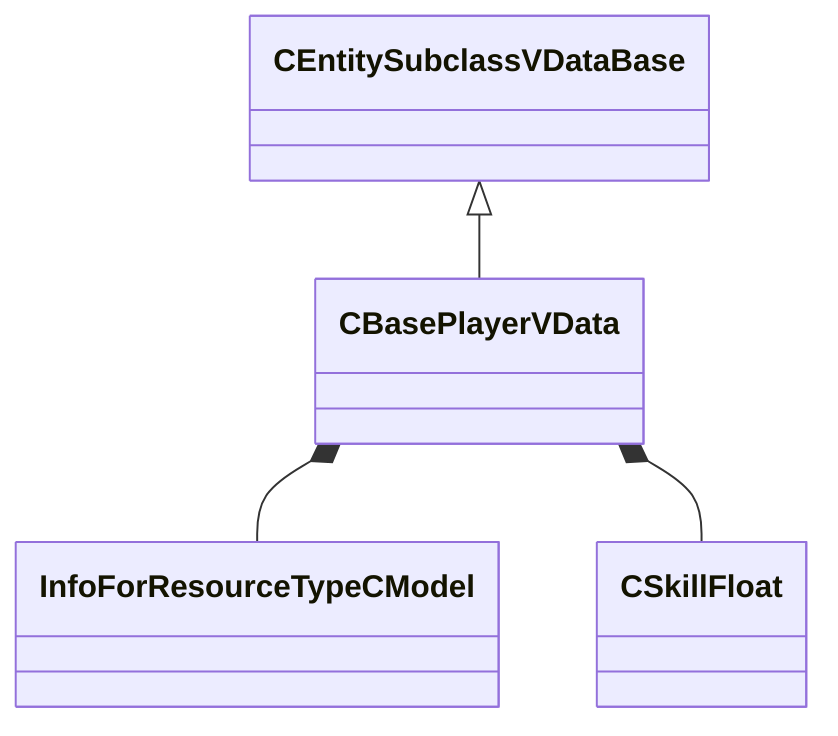

[Schemas](../../schemas.md) / [server](../server.md) / CBasePlayerVData

# CBasePlayerVData

**Kind:** class · **Size:** 600 bytes (`0x258`) · **Align:** 8 · **Module:** server

**Inherits from:** [CEntitySubclassVDataBase](../server/CEntitySubclassVDataBase.md)

**Relationships:**

## Memory layout

15 fields (15 declared here, 0 inherited). Offsets are absolute from the object base.

| Offset | Field | Type | From | Annotations |
|--------|-------|------|------|-------------|
| `0x28` | `m_sModelName` | CResourceNameTyped< CWeakHandle< [InfoForResourceTypeCModel](../resourcesystem/InfoForResourceTypeCModel.md) > > |  | `MPropertyProvidesEditContextString ToolEditContext_ID_VMDL` |
| `0x108` | `m_sModelNameAg2Override` | CResourceNameTyped< CWeakHandle< [InfoForResourceTypeCModel](../resourcesystem/InfoForResourceTypeCModel.md) > > |  | `MPropertyProvidesEditContextString ToolEditContext_ID_VMDL` |
| `0x1e8` | `m_flHeadDamageMultiplier` | [CSkillFloat](../server/CSkillFloat.md) |  |  |
| `0x1f8` | `m_flChestDamageMultiplier` | [CSkillFloat](../server/CSkillFloat.md) |  |  |
| `0x208` | `m_flStomachDamageMultiplier` | [CSkillFloat](../server/CSkillFloat.md) |  |  |
| `0x218` | `m_flArmDamageMultiplier` | [CSkillFloat](../server/CSkillFloat.md) |  |  |
| `0x228` | `m_flLegDamageMultiplier` | [CSkillFloat](../server/CSkillFloat.md) |  |  |
| `0x238` | `m_flHoldBreathTime` | float32 |  | `MPropertyGroupName Water` |
| `0x23c` | `m_flDrowningDamageInterval` | float32 |  | `MPropertyDescription Seconds between drowning ticks` `MPropertyGroupName Water` |
| `0x240` | `m_nDrowningDamageInitial` | int32 |  | `MPropertyDescription Amount of damage done on the first drowning tick (+1 each subsequent interval)` `MPropertyGroupName Water` |
| `0x244` | `m_nDrowningDamageMax` | int32 |  | `MPropertyDescription Max damage done by a drowning tick` `MPropertyGroupName Water` |
| `0x248` | `m_nWaterSpeed` | int32 |  | `MPropertyGroupName Water` |
| `0x24c` | `m_flUseRange` | float32 |  | `MPropertyGroupName Use` |
| `0x250` | `m_flUseAngleTolerance` | float32 |  | `MPropertyGroupName Use` |
| `0x254` | `m_flCrouchTime` | float32 |  | `MPropertyDescription Time to move between crouch and stand` `MPropertyGroupName Crouch` |

KV3 class defaults

<pre>{
	&quot;_class&quot;: &quot;CBasePlayerVData&quot;,
	&quot;m_sModelName&quot;: &quot;&quot;,
	&quot;m_sModelNameAg2Override&quot;: &quot;&quot;,
	&quot;m_flHeadDamageMultiplier&quot;: 3.000000,
	&quot;m_flChestDamageMultiplier&quot;: 1.000000,
	&quot;m_flStomachDamageMultiplier&quot;: 1.000000,
	&quot;m_flArmDamageMultiplier&quot;: 1.000000,
	&quot;m_flLegDamageMultiplier&quot;: 1.000000,
	&quot;m_flHoldBreathTime&quot;: 15.000000,
	&quot;m_flDrowningDamageInterval&quot;: 1.000000,
	&quot;m_nDrowningDamageInitial&quot;: 10,
	&quot;m_nDrowningDamageMax&quot;: 10,
	&quot;m_nWaterSpeed&quot;: 100,
	&quot;m_flUseRange&quot;: 55.000000,
	&quot;m_flUseAngleTolerance&quot;: 45.000000,
	&quot;m_flCrouchTime&quot;: 0.400000
}</pre>

