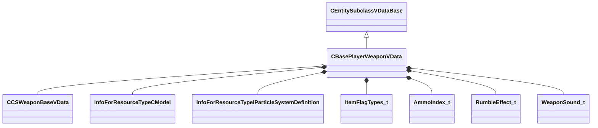

[Schemas](../../schemas.md) / [server](../server.md) / CBasePlayerWeaponVData

# CBasePlayerWeaponVData

> Source: **Build 25000182** · 2026-08-28 · `windows-x86_64` · schema `0.10.0`

**Kind:** class · **Size:** 1312 bytes (`0x520`) · **Align:** 8 · **Module:** server

**Twin:** [CBasePlayerWeaponVData (client)](../client/CBasePlayerWeaponVData.md)

**Inherits from:** [CEntitySubclassVDataBase](../server/CEntitySubclassVDataBase.md)

**Derived by:** [CCSWeaponBaseVData](../server/CCSWeaponBaseVData.md)

**Relationships:**

## Memory layout

32 fields (32 declared here, 0 inherited). Offsets are absolute from the object base.

| Offset | Field | Type | From | Annotations |
|--------|-------|------|------|-------------|
| `0x28` | `m_szWorldModel` | CResourceNameTyped< CWeakHandle< [InfoForResourceTypeCModel](../resourcesystem/InfoForResourceTypeCModel.md) > > |  | `MPropertyDescription Model used on the ground or held by an entity` `MPropertyProvidesEditContextString ToolEditContext_ID_VMDL` `MPropertyStartGroup Visuals` |
| `0x108` | `m_szWorldModelAg2Override` | CResourceNameTyped< CWeakHandle< [InfoForResourceTypeCModel](../resourcesystem/InfoForResourceTypeCModel.md) > > |  | `MPropertyDescription Model used on the ground or held by an entity` `MPropertyProvidesEditContextString ToolEditContext_ID_VMDL` |
| `0x1e8` | `m_sToolsOnlyOwnerModelName` | CResourceNameTyped< CWeakHandle< [InfoForResourceTypeCModel](../resourcesystem/InfoForResourceTypeCModel.md) > > |  | `MPropertyDescription Model used by the tools only to populate comboboxes for things like animgraph parameter pickers` |
| `0x2c8` | `m_bBuiltRightHanded` | bool |  | `MPropertyDescription Was the weapon was built right-handed?` |
| `0x2c9` | `m_bAllowFlipping` | bool |  | `MPropertyDescription Allows flipping the model, regardless of whether it is built left or right handed` |
| `0x2d0` | `m_sMuzzleAttachment` | CAttachmentNameSymbolWithStorage |  | `MPropertyDescription Attachment to fire bullets from` |
| `0x2f0` | `m_szMuzzleFlashParticle` | CResourceNameTyped< CWeakHandle< [InfoForResourceTypeIParticleSystemDefinition](../resourcesystem/InfoForResourceTypeIParticleSystemDefinition.md) > > |  | `MPropertyDescription Effect when firing this weapon` |
| `0x3d0` | `m_szMuzzleFlashParticleConfig` | CUtlString |  | `MPropertyAttributeEditor ParticleConfigName()` `MPropertyDescription Effect Config for Muzzle Flash - if set, will use this config specified in the particle effect, using whatever CP configuration is specified there, vdata muzzleflash attachment will be ignored` `MPropertyEditContextOverrideKey ToolEditContext_ID_VPCF` |
| `0x3d8` | `m_szBarrelSmokeParticle` | CResourceNameTyped< CWeakHandle< [InfoForResourceTypeIParticleSystemDefinition](../resourcesystem/InfoForResourceTypeIParticleSystemDefinition.md) > > |  | `MPropertyDescription Barrel smoke after firing this weapon` |
| `0x4b8` | `m_nMuzzleSmokeShotThreshold` | uint8 |  | `MPropertyDescription Barrel smoke shot threshold to create smoke` |
| `0x4bc` | `m_flMuzzleSmokeTimeout` | float32 |  | `MPropertyDescription Barrel smoke shot timeout` |
| `0x4c0` | `m_flMuzzleSmokeDecrementRate` | float32 |  | `MPropertyDescription Barrel smoke decrement rate when not firing` |
| `0x4c4` | `m_bGenerateMuzzleLight` | bool |  |  |
| `0x4c5` | `m_bLinkedCooldowns` | bool |  | `MPropertyDescription Should both primary and secondary attacks be cooled down together (so cooling down primary attack would cooldown both primary + secondary attacks)?` `MPropertyStartGroup Behavior` |
| `0x4c6` | `m_iFlags` | [ItemFlagTypes_t](../server/ItemFlagTypes_t.md) |  |  |
| `0x4c8` | `m_iWeight` | int32 |  | `MPropertyDescription This value used to determine this weapon's importance in autoselection` |
| `0x4cc` | `m_bAutoSwitchTo` | bool |  | `MPropertyDescription Whether this weapon is safe to automatically switch to (should be false for eg. explosives that can the player may accidentally hurt themselves with)` `MPropertyFriendlyName Safe To Auto-Switch To` |
| `0x4cd` | `m_bAutoSwitchFrom` | bool |  | `MPropertyFriendlyName Safe To Auto-Switch Away From` |
| `0x4ce` | `m_nPrimaryAmmoType` | [AmmoIndex_t](../server/AmmoIndex_t.md) |  | `MPropertyAttributeEditor VDataChoice( scripts/ammo.vdata )` `MPropertyCustomFGDType string` `MPropertyStartGroup Ammo` |
| `0x4cf` | `m_nSecondaryAmmoType` | [AmmoIndex_t](../server/AmmoIndex_t.md) |  | `MPropertyAttributeEditor VDataChoice( scripts/ammo.vdata )` `MPropertyCustomFGDType string` |
| `0x4d0` | `m_iMaxClip1` | int32 |  | `MPropertyAttributeRange 0 255` `MPropertyDescription How many bullets this gun can fire before it reloads (0 if no clip)` `MPropertyFriendlyName Primary Clip Size` |
| `0x4d4` | `m_iMaxClip2` | int32 |  | `MPropertyAttributeRange 0 255` `MPropertyDescription How many secondary bullets this gun can fire before it reloads (0 if no clip)` `MPropertyFriendlyName Secondary Clip Size` |
| `0x4d8` | `m_iDefaultClip1` | int32 |  | `MPropertyAttributeRange -1 255` `MPropertyDescription Primary Initial Clip (-1 means use clip size)` |
| `0x4dc` | `m_iDefaultClip2` | int32 |  | `MPropertyAttributeRange -1 255` `MPropertyDescription Secondary Initial Clip (-1 means use clip size)` |
| `0x4e0` | `m_bReserveAmmoAsClips` | bool |  | `MPropertyDescription Indicates whether to treat reserve ammo as clips (reloads) instead of raw bullets` |
| `0x4e1` | `m_bTreatAsSingleClip` | bool |  | `MPropertyDescription Regardless of ammo position, we'll always use clip1 as where our bullets come from` |
| `0x4e2` | `m_bKeepLoadedAmmo` | bool |  | `MPropertyDescription Indicates whether to keep any loaded ammo in the weapon on reload` |
| `0x4e4` | `m_iRumbleEffect` | [RumbleEffect_t](../server/RumbleEffect_t.md) |  | `MPropertyStartGroup UI` |
| `0x4e8` | `m_flDropSpeed` | float32 |  |  |
| `0x4ec` | `m_iSlot` | int32 |  | `MPropertyDescription Which 'column' to display this weapon in the HUD` `MPropertyFriendlyName HUD Bucket` |
| `0x4f0` | `m_iPosition` | int32 |  | `MPropertyDescription Which 'row' to display this weapon in the HUD` `MPropertyFriendlyName HUD Bucket Position` |
| `0x4f8` | `m_aShootSounds` | CUtlOrderedMap< [WeaponSound_t](../server/WeaponSound_t.md), CSoundEventName > |  | `MPropertyStartGroup Sounds` |

KV3 class defaults

<pre>{
	&quot;_class&quot;: &quot;CBasePlayerWeaponVData&quot;,
	&quot;m_szWorldModel&quot;: &quot;&quot;,
	&quot;m_szWorldModelAg2Override&quot;: &quot;&quot;,
	&quot;m_sToolsOnlyOwnerModelName&quot;: &quot;&quot;,
	&quot;m_bBuiltRightHanded&quot;: true,
	&quot;m_bAllowFlipping&quot;: true,
	&quot;m_sMuzzleAttachment&quot;: &quot;muzzle&quot;,
	&quot;m_szMuzzleFlashParticle&quot;: &quot;&quot;,
	&quot;m_szMuzzleFlashParticleConfig&quot;: &quot;&quot;,
	&quot;m_szBarrelSmokeParticle&quot;: &quot;&quot;,
	&quot;m_nMuzzleSmokeShotThreshold&quot;: 4,
	&quot;m_flMuzzleSmokeTimeout&quot;: 0.250000,
	&quot;m_flMuzzleSmokeDecrementRate&quot;: 1.000000,
	&quot;m_bGenerateMuzzleLight&quot;: true,
	&quot;m_bLinkedCooldowns&quot;: false,
	&quot;m_iFlags&quot;: &quot;&quot;,
	&quot;m_iWeight&quot;: 0,
	&quot;m_bAutoSwitchTo&quot;: true,
	&quot;m_bAutoSwitchFrom&quot;: true,
	&quot;m_nPrimaryAmmoType&quot;: &quot;&quot;,
	&quot;m_nSecondaryAmmoType&quot;: &quot;&quot;,
	&quot;m_iMaxClip1&quot;: 0,
	&quot;m_iMaxClip2&quot;: 0,
	&quot;m_iDefaultClip1&quot;: -1,
	&quot;m_iDefaultClip2&quot;: -1,
	&quot;m_bReserveAmmoAsClips&quot;: false,
	&quot;m_bTreatAsSingleClip&quot;: false,
	&quot;m_bKeepLoadedAmmo&quot;: false,
	&quot;m_iRumbleEffect&quot;: &quot;RUMBLE_INVALID&quot;,
	&quot;m_flDropSpeed&quot;: 300.000000,
	&quot;m_iSlot&quot;: 0,
	&quot;m_iPosition&quot;: 0,
	&quot;m_aShootSounds&quot;:
	{
	}
}</pre>

