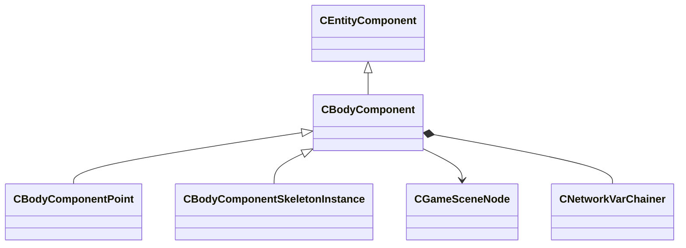

[Schemas](../../schemas.md) / [server](../server.md) / CBodyComponent

# CBodyComponent

> Source: **Build 25000182** · 2026-08-28 · `windows-x86_64` · schema `0.10.0`

**Kind:** class · **Size:** 120 bytes (`0x78`) · **Align:** n/a (unspecified) · **Module:** server

**Twin:** [CBodyComponent (client)](../client/CBodyComponent.md)

**Inherits from:** [CEntityComponent](../entity2/CEntityComponent.md)

**Derived by:** [CBodyComponentPoint](../server/CBodyComponentPoint.md), [CBodyComponentSkeletonInstance](../server/CBodyComponentSkeletonInstance.md)

**Relationships:**

## Memory layout

2 fields (2 declared here, 0 inherited). Offsets are absolute from the object base.

| Offset | Field | Type | From | Annotations |
|--------|-------|------|------|-------------|
| `0x8` | `m_pSceneNode` | [CGameSceneNode](../server/CGameSceneNode.md)* |  | `MNotSaved` |
| `0x48` | `__m_pChainEntity` | [CNetworkVarChainer](../entity2/CNetworkVarChainer.md) |  | `MNotSaved` |

KV3 class defaults

<pre>{
}</pre>

