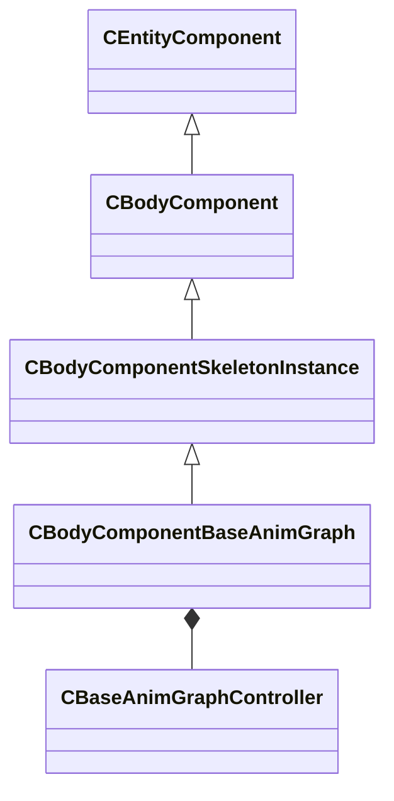

[Schemas](../../schemas.md) / [server](../server.md) / CBodyComponentBaseAnimGraph

# CBodyComponentBaseAnimGraph

> Source: **Build 25000182** · 2026-08-28 · `windows-x86_64` · schema `0.10.0`

**Kind:** class · **Size:** 2864 bytes (`0xb30`) · **Align:** n/a (unspecified) · **Module:** server

**Twin:** [CBodyComponentBaseAnimGraph (client)](../client/CBodyComponentBaseAnimGraph.md)

**Inherits from:** [CBodyComponentSkeletonInstance](../server/CBodyComponentSkeletonInstance.md)

**Relationships:**

## Memory layout

4 fields (1 declared here, 3 inherited). Offsets are absolute from the object base.

| Offset | Field | Type | From | Annotations |
|--------|-------|------|------|-------------|
| `0x8` | `m_pSceneNode` | [CGameSceneNode](../server/CGameSceneNode.md)* | [CBodyComponent](../server/CBodyComponent.md) | `MNotSaved` |
| `0x48` | `__m_pChainEntity` | [CNetworkVarChainer](../entity2/CNetworkVarChainer.md) | [CBodyComponent](../server/CBodyComponent.md) | `MNotSaved` |
| `0x80` | `m_skeletonInstance` | [CSkeletonInstance](../server/CSkeletonInstance.md) | [CBodyComponentSkeletonInstance](../server/CBodyComponentSkeletonInstance.md) |  |
| `0x4e0` | `m_animationController` | [CBaseAnimGraphController](../server/CBaseAnimGraphController.md) |  |  |
