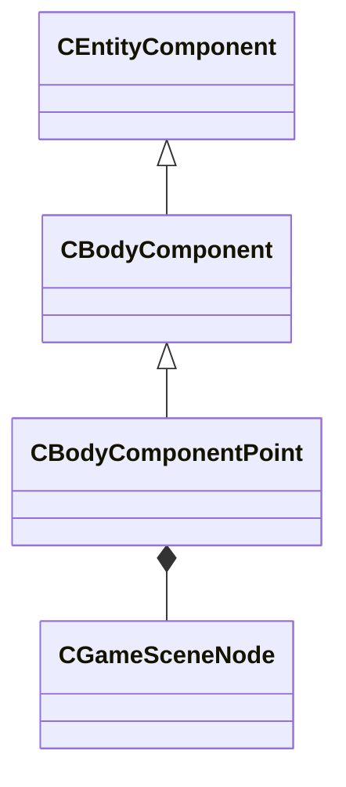

[Schemas](../../schemas.md) / [server](../server.md) / CBodyComponentPoint

# CBodyComponentPoint

**Kind:** class · **Size:** 400 bytes (`0x190`) · **Align:** 255 · **Module:** server

**Inherits from:** [CBodyComponent](../server/CBodyComponent.md)

**Relationships:**

## Memory layout

3 fields (1 declared here, 2 inherited). Offsets are absolute from the object base.

| Offset | Field | Type | From | Annotations |
|--------|-------|------|------|-------------|
| `0x8` | `m_pSceneNode` | [CGameSceneNode](../server/CGameSceneNode.md)* | [CBodyComponent](../server/CBodyComponent.md) | `MNotSaved` |
| `0x48` | `__m_pChainEntity` | [CNetworkVarChainer](../entity2/CNetworkVarChainer.md) | [CBodyComponent](../server/CBodyComponent.md) | `MNotSaved` |
| `0x80` | `m_sceneNode` | [CGameSceneNode](../server/CGameSceneNode.md) |  |  |
