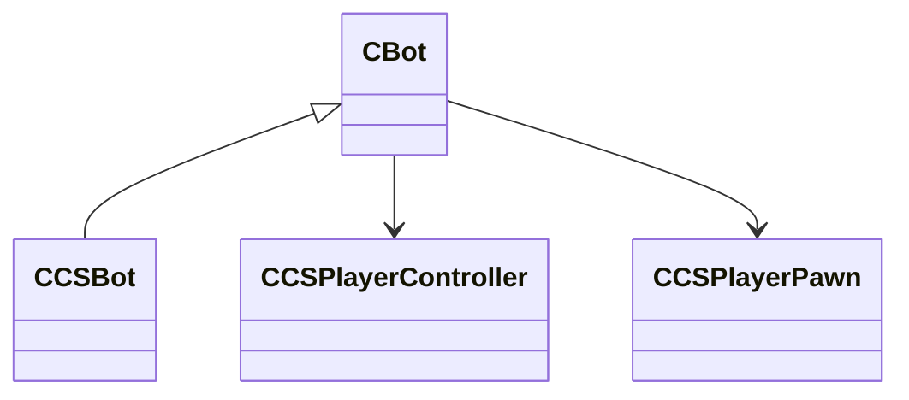

[Schemas](../../schemas.md) / [server](../server.md) / CBot

# CBot

**Kind:** class · **Size:** 256 bytes (`0x100`) · **Align:** 255 · **Module:** server

**Derived by:** [CCSBot](../server/CCSBot.md)

**Relationships:**

## Memory layout

13 fields (13 declared here, 0 inherited). Offsets are absolute from the object base.

| Offset | Field | Type | From | Annotations |
|--------|-------|------|------|-------------|
| `0x10` | `m_pController` | [CCSPlayerController](../server/CCSPlayerController.md)* |  |  |
| `0x18` | `m_pPlayer` | [CCSPlayerPawn](../server/CCSPlayerPawn.md)* |  |  |
| `0x20` | `m_bHasSpawned` | bool |  |  |
| `0x24` | `m_id` | uint32 |  |  |
| `0xc0` | `m_isRunning` | bool |  |  |
| `0xc1` | `m_isCrouching` | bool |  |  |
| `0xc4` | `m_forwardSpeed` | float32 |  |  |
| `0xc8` | `m_leftSpeed` | float32 |  |  |
| `0xcc` | `m_verticalSpeed` | float32 |  |  |
| `0xd0` | `m_buttonFlags` | uint64 |  |  |
| `0xd8` | `m_jumpTimestamp` | float32 |  |  |
| `0xdc` | `m_viewForward` | Vector |  |  |
| `0xf8` | `m_postureStackIndex` | int32 |  |  |
