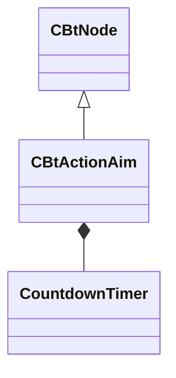

[Schemas](../../schemas.md) / [server](../server.md) / CBtActionAim

# CBtActionAim

> Source: **Build 25000182** · 2026-08-28 · `windows-x86_64` · schema `0.10.0`

**Kind:** class · **Size:** 248 bytes (`0xf8`) · **Align:** n/a (unspecified) · **Module:** server

**Inherits from:** [CBtNode](../server/CBtNode.md)

**Relationships:**

## Memory layout

12 fields (12 declared here, 0 inherited). Offsets are absolute from the object base.

| Offset | Field | Type | From | Annotations |
|--------|-------|------|------|-------------|
| `0x68` | `m_szSensorInputKey` | CUtlString |  |  |
| `0x80` | `m_szAimReadyKey` | CUtlString |  |  |
| `0x88` | `m_flZoomCooldownTimestamp` | float32 |  |  |
| `0x8c` | `m_bDoneAiming` | bool |  |  |
| `0x90` | `m_flLerpStartTime` | float32 |  |  |
| `0x94` | `m_flNextLookTargetLerpTime` | float32 |  |  |
| `0x98` | `m_flPenaltyReductionRatio` | float32 |  |  |
| `0x9c` | `m_NextLookTarget` | QAngle |  |  |
| `0xa8` | `m_AimTimer` | [CountdownTimer](../server/CountdownTimer.md) |  |  |
| `0xc0` | `m_SniperHoldTimer` | [CountdownTimer](../server/CountdownTimer.md) |  |  |
| `0xd8` | `m_FocusIntervalTimer` | [CountdownTimer](../server/CountdownTimer.md) |  |  |
| `0xf0` | `m_bAcquired` | bool |  |  |
