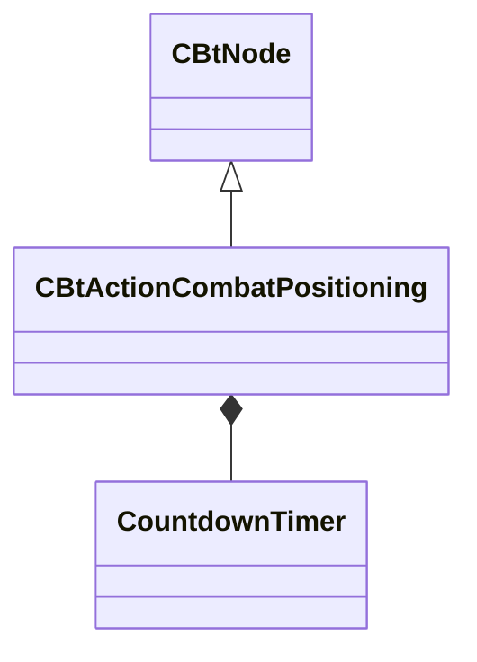

[Schemas](../../schemas.md) / [server](../server.md) / CBtActionCombatPositioning

# CBtActionCombatPositioning

**Kind:** class · **Size:** 176 bytes (`0xb0`) · **Align:** 255 · **Module:** server

**Inherits from:** [CBtNode](../server/CBtNode.md)

**Relationships:**

## Memory layout

4 fields (4 declared here, 0 inherited). Offsets are absolute from the object base.

| Offset | Field | Type | From | Annotations |
|--------|-------|------|------|-------------|
| `0x68` | `m_szSensorInputKey` | CUtlString |  |  |
| `0x80` | `m_szIsAttackingKey` | CUtlString |  |  |
| `0x88` | `m_ActionTimer` | [CountdownTimer](../server/CountdownTimer.md) |  |  |
| `0xa0` | `m_bCrouching` | bool |  |  |
