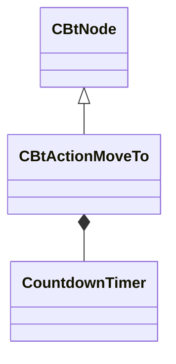

[Schemas](../../schemas.md) / [server](../server.md) / CBtActionMoveTo

# CBtActionMoveTo

> Source: **Build 25000182** · 2026-08-28 · `windows-x86_64` · schema `0.10.0`

**Kind:** class · **Size:** 232 bytes (`0xe8`) · **Align:** n/a (unspecified) · **Module:** server

**Inherits from:** [CBtNode](../server/CBtNode.md)

**Relationships:**

## Memory layout

14 fields (14 declared here, 0 inherited). Offsets are absolute from the object base.

| Offset | Field | Type | From | Annotations |
|--------|-------|------|------|-------------|
| `0x60` | `m_szDestinationInputKey` | CUtlString |  |  |
| `0x68` | `m_szHidingSpotInputKey` | CUtlString |  |  |
| `0x70` | `m_szThreatInputKey` | CUtlString |  |  |
| `0x78` | `m_vecDestination` | VectorWS |  |  |
| `0x84` | `m_bAutoLookAdjust` | bool |  |  |
| `0x85` | `m_bComputePath` | bool |  |  |
| `0x88` | `m_flDamagingAreasPenaltyCost` | float32 |  |  |
| `0x90` | `m_CheckApproximateCornersTimer` | [CountdownTimer](../server/CountdownTimer.md) |  |  |
| `0xa8` | `m_CheckHighPriorityItem` | [CountdownTimer](../server/CountdownTimer.md) |  |  |
| `0xc0` | `m_RepathTimer` | [CountdownTimer](../server/CountdownTimer.md) |  |  |
| `0xd8` | `m_flArrivalEpsilon` | float32 |  |  |
| `0xdc` | `m_flAdditionalArrivalEpsilon2D` | float32 |  |  |
| `0xe0` | `m_flHidingSpotCheckDistanceThreshold` | float32 |  |  |
| `0xe4` | `m_flNearestAreaDistanceThreshold` | float32 |  |  |
