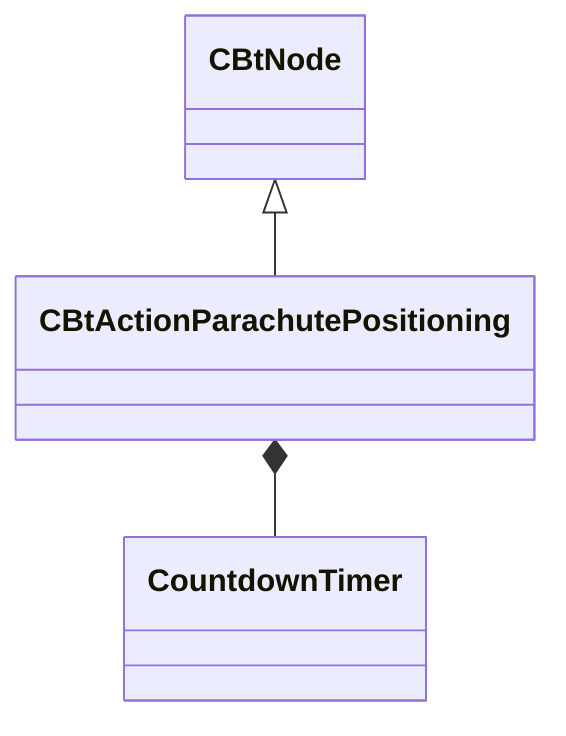

[Schemas](../../schemas.md) / [server](../server.md) / CBtActionParachutePositioning

# CBtActionParachutePositioning

> Source: **Build 26334290** · 2026-10-30 · `windows-x86_64` · schema `0.13.0`

**Kind:** class · **Size:** 120 bytes (`0x78`) · **Align:** n/a (unspecified) · **Module:** server

**Inherits from:** [CBtNode](../server/CBtNode.md)

**Relationships:**

```mermaid
classDiagram
    CBtNode <|-- CBtActionParachutePositioning
    CBtActionParachutePositioning *-- CountdownTimer
```

## Memory layout

1 field (1 declared here, 0 inherited). Offsets are absolute from the object base.

| Offset | Field | Type | From | Annotations |
|--------|-------|------|------|-------------|
| `0x58` | `m_ActionTimer` | [CountdownTimer](../server/CountdownTimer.md) |  |  |
