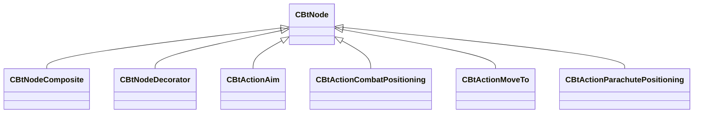

[Schemas](../../schemas.md) / [server](../server.md) / CBtNode

# CBtNode

**Kind:** class · **Size:** 88 bytes (`0x58`) · **Align:** 255 · **Module:** server

**Derived by:** [CBtActionAim](../server/CBtActionAim.md), [CBtActionCombatPositioning](../server/CBtActionCombatPositioning.md), [CBtActionMoveTo](../server/CBtActionMoveTo.md), [CBtActionParachutePositioning](../server/CBtActionParachutePositioning.md), [CBtNodeComposite](../server/CBtNodeComposite.md), [CBtNodeDecorator](../server/CBtNodeDecorator.md)

**Relationships:**

