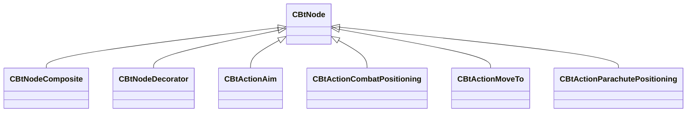

[Schemas](../../schemas.md) / [server](../server.md) / CBtNode

# CBtNode

> Source: **Build 25000182** · 2026-08-28 · `windows-x86_64` · schema `0.10.0`

**Kind:** class · **Size:** 88 bytes (`0x58`) · **Align:** n/a (unspecified) · **Module:** server

**Derived by:** [CBtActionAim](../server/CBtActionAim.md), [CBtActionCombatPositioning](../server/CBtActionCombatPositioning.md), [CBtActionMoveTo](../server/CBtActionMoveTo.md), [CBtActionParachutePositioning](../server/CBtActionParachutePositioning.md), [CBtNodeComposite](../server/CBtNodeComposite.md), [CBtNodeDecorator](../server/CBtNodeDecorator.md)

**Relationships:**

## Memory layout

No schema-visible fields (88 bytes of opaque storage).
