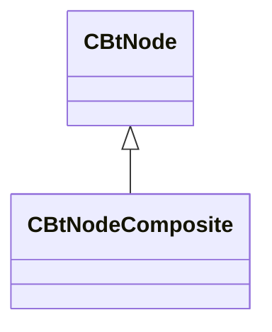

[Schemas](../../schemas.md) / [server](../server.md) / CBtNodeComposite

# CBtNodeComposite

**Kind:** class · **Size:** 88 bytes (`0x58`) · **Align:** 255 · **Module:** server

**Inherits from:** [CBtNode](../server/CBtNode.md)

**Relationships:**

