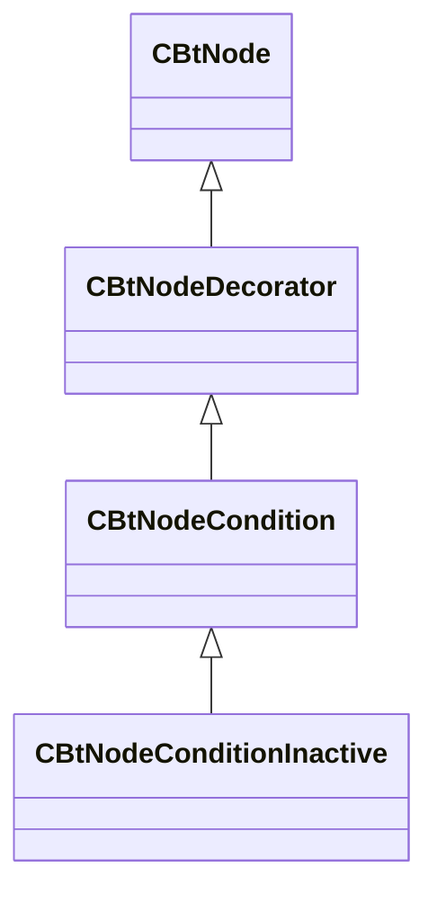

[Schemas](../../schemas.md) / [server](../server.md) / CBtNodeCondition

# CBtNodeCondition

**Kind:** class · **Size:** 96 bytes (`0x60`) · **Align:** 255 · **Module:** server

**Inherits from:** [CBtNodeDecorator](../server/CBtNodeDecorator.md)

**Derived by:** [CBtNodeConditionInactive](../server/CBtNodeConditionInactive.md)

**Relationships:**

## Memory layout

1 fields (1 declared here, 0 inherited). Offsets are absolute from the object base.

| Offset | Field | Type | From | Annotations |
|--------|-------|------|------|-------------|
| `0x58` | `m_bNegated` | bool |  |  |
