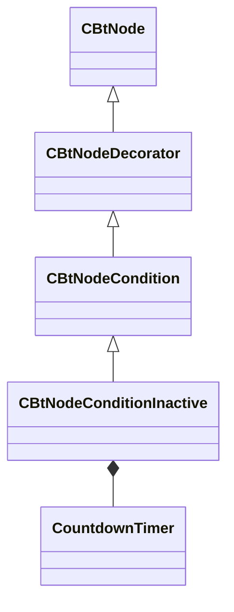

[Schemas](../../schemas.md) / [server](../server.md) / CBtNodeConditionInactive

# CBtNodeConditionInactive

**Kind:** class · **Size:** 152 bytes (`0x98`) · **Align:** 255 · **Module:** server

**Inherits from:** [CBtNodeCondition](../server/CBtNodeCondition.md)

**Relationships:**

## Memory layout

4 fields (3 declared here, 1 inherited). Offsets are absolute from the object base.

| Offset | Field | Type | From | Annotations |
|--------|-------|------|------|-------------|
| `0x58` | `m_bNegated` | bool | [CBtNodeCondition](../server/CBtNodeCondition.md) |  |
| `0x78` | `m_flRoundStartThresholdSeconds` | float32 |  |  |
| `0x7c` | `m_flSensorInactivityThresholdSeconds` | float32 |  |  |
| `0x80` | `m_SensorInactivityTimer` | [CountdownTimer](../server/CountdownTimer.md) |  |  |
