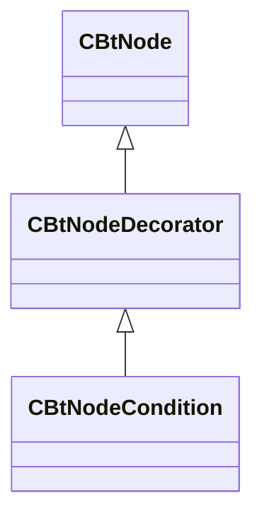

[Schemas](../../schemas.md) / [server](../server.md) / CBtNodeDecorator

# CBtNodeDecorator

> Source: **Build 25000182** · 2026-08-28 · `windows-x86_64` · schema `0.10.0`

**Kind:** class · **Size:** 88 bytes (`0x58`) · **Align:** n/a (unspecified) · **Module:** server

**Inherits from:** [CBtNode](../server/CBtNode.md)

**Derived by:** [CBtNodeCondition](../server/CBtNodeCondition.md)

**Relationships:**

## Memory layout

No schema-visible fields (88 bytes of opaque storage).
