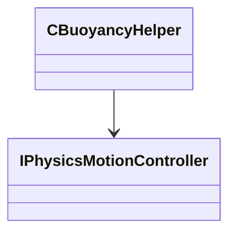

[Schemas](../../schemas.md) / [server](../server.md) / CBuoyancyHelper

# CBuoyancyHelper

> Source: **Build 25000182** · 2026-08-28 · `windows-x86_64` · schema `0.10.0`

**Kind:** class · **Size:** 280 bytes (`0x118`) · **Align:** 8 · **Module:** server

**Twin:** [CBuoyancyHelper (client)](../client/CBuoyancyHelper.md)

**Relationships:**

## Memory layout

11 fields (11 declared here, 0 inherited). Offsets are absolute from the object base.

| Offset | Field | Type | From | Annotations |
|--------|-------|------|------|-------------|
| `0x8` | `m_pController` | [IPhysicsMotionController](../vphysics2/IPhysicsMotionController.md)* |  | `MPhysPtr` |
| `0x18` | `m_nFluidType` | CUtlStringToken |  |  |
| `0x1c` | `m_flFluidDensity` | float32 |  |  |
| `0x20` | `m_flNeutrallyBuoyantGravity` | float32 |  |  |
| `0x24` | `m_flNeutrallyBuoyantLinearDamping` | float32 |  |  |
| `0x28` | `m_flNeutrallyBuoyantAngularDamping` | float32 |  |  |
| `0x2c` | `m_bNeutrallyBuoyant` | bool |  |  |
| `0x30` | `m_vecFractionOfWheelSubmergedForWheelFriction` | CUtlVector< float32 > |  |  |
| `0x48` | `m_vecWheelFrictionScales` | CUtlVector< float32 > |  |  |
| `0x60` | `m_vecFractionOfWheelSubmergedForWheelDrag` | CUtlVector< float32 > |  |  |
| `0x78` | `m_vecWheelDrag` | CUtlVector< float32 > |  |  |

KV3 class defaults

<pre>{
	&quot;_class&quot;: &quot;CBuoyancyHelper&quot;,
	&quot;m_nFluidType&quot;: &quot;&quot;,
	&quot;m_flFluidDensity&quot;: 1.000000,
	&quot;m_flNeutrallyBuoyantGravity&quot;: 0.000000,
	&quot;m_flNeutrallyBuoyantLinearDamping&quot;: 0.000000,
	&quot;m_flNeutrallyBuoyantAngularDamping&quot;: 0.000000,
	&quot;m_bNeutrallyBuoyant&quot;: false,
	&quot;m_vecFractionOfWheelSubmergedForWheelFriction&quot;:
	[
	],
	&quot;m_vecWheelFrictionScales&quot;:
	[
	],
	&quot;m_vecFractionOfWheelSubmergedForWheelDrag&quot;:
	[
	],
	&quot;m_vecWheelDrag&quot;:
	[
	]
}</pre>

