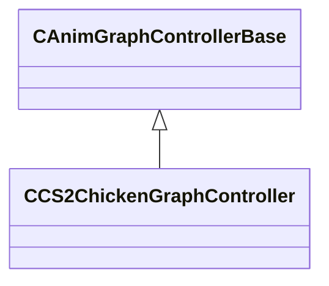

[Schemas](../../schemas.md) / [server](../server.md) / CCS2ChickenGraphController

# CCS2ChickenGraphController

> Source: **Build 25000182** · 2026-08-28 · `windows-x86_64` · schema `0.10.0`

**Kind:** class · **Size:** 320 bytes (`0x140`) · **Align:** 8 · **Module:** server

**Inherits from:** [CAnimGraphControllerBase](../server/CAnimGraphControllerBase.md)

**Relationships:**

## Memory layout

10 fields (9 declared here, 1 inherited). Offsets are absolute from the object base.

| Offset | Field | Type | From | Annotations |
|--------|-------|------|------|-------------|
| `0x10` | `m_hExternalGraph` | [ExternalAnimGraphHandle_t](../server/ExternalAnimGraphHandle_t.md) | [CAnimGraphControllerBase](../server/CAnimGraphControllerBase.md) |  |
| `0x88` | `m_action` | CAnimGraph2ParamOptionalRef< CGlobalSymbol > |  |  |
| `0xa0` | `m_bActionReset` | CAnimGraph2ParamAutoResetOptionalRef |  |  |
| `0xc0` | `m_idleVariation` | CAnimGraph2ParamOptionalRef< float32 > |  |  |
| `0xd8` | `m_runVariation` | CAnimGraph2ParamOptionalRef< float32 > |  |  |
| `0xf0` | `m_panicVariation` | CAnimGraph2ParamOptionalRef< float32 > |  |  |
| `0x108` | `m_squatVariation` | CAnimGraph2ParamOptionalRef< float32 > |  |  |
| `0x120` | `m_bInWater` | CAnimGraph2ParamOptionalRef< bool > |  |  |
| `0x138` | `m_bHasActionCompletedEvent` | bool |  |  |
| `0x139` | `m_bWaitingForCompletedEvent` | bool |  |  |

KV3 class defaults

<pre>{
	&quot;_class&quot;: &quot;CCS2ChickenGraphController&quot;,
	&quot;m_hExternalGraph&quot;: 4294967295,
	&quot;m_action&quot;: null,
	&quot;m_bActionReset&quot;: null,
	&quot;m_idleVariation&quot;: null,
	&quot;m_runVariation&quot;: null,
	&quot;m_panicVariation&quot;: null,
	&quot;m_squatVariation&quot;: null,
	&quot;m_bInWater&quot;: null,
	&quot;m_bHasActionCompletedEvent&quot;: false,
	&quot;m_bWaitingForCompletedEvent&quot;: false
}</pre>

