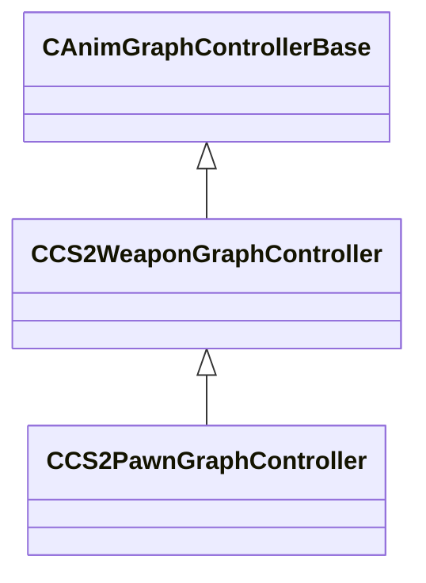

[Schemas](../../schemas.md) / [server](../server.md) / CCS2WeaponGraphController

# CCS2WeaponGraphController

**Kind:** class · **Size:** 1416 bytes (`0x588`) · **Align:** 8 · **Module:** server

**Inherits from:** [CAnimGraphControllerBase](../server/CAnimGraphControllerBase.md)

**Derived by:** [CCS2PawnGraphController](../server/CCS2PawnGraphController.md)

**Relationships:**

## Memory layout

21 fields (20 declared here, 1 inherited). Offsets are absolute from the object base.

| Offset | Field | Type | From | Annotations |
|--------|-------|------|------|-------------|
| `0x10` | `m_hExternalGraph` | [ExternalAnimGraphHandle_t](../server/ExternalAnimGraphHandle_t.md) | [CAnimGraphControllerBase](../server/CAnimGraphControllerBase.md) |  |
| `0x88` | `m_action` | CAnimGraph2ParamOptionalRef< CGlobalSymbol > |  |  |
| `0xa0` | `m_bActionReset` | CAnimGraph2ParamOptionalRef< bool > |  |  |
| `0xb8` | `m_flWeaponActionSpeedScale` | CAnimGraph2ParamOptionalRef< float32 > |  |  |
| `0xd0` | `m_weaponCategory` | CAnimGraph2ParamOptionalRef< CGlobalSymbol > |  |  |
| `0xe8` | `m_weaponType` | CAnimGraph2ParamOptionalRef< CGlobalSymbol > |  |  |
| `0x100` | `m_weaponExtraInfo` | CAnimGraph2ParamOptionalRef< CGlobalSymbol > |  |  |
| `0x118` | `m_flWeaponAmmo` | CAnimGraph2ParamOptionalRef< float32 > |  |  |
| `0x130` | `m_flWeaponAmmoMax` | CAnimGraph2ParamOptionalRef< float32 > |  |  |
| `0x148` | `m_flWeaponAmmoReserve` | CAnimGraph2ParamOptionalRef< float32 > |  |  |
| `0x160` | `m_bWeaponIsSilenced` | CAnimGraph2ParamOptionalRef< bool > |  |  |
| `0x178` | `m_flWeaponIronsightAmount` | CAnimGraph2ParamOptionalRef< float32 > |  |  |
| `0x190` | `m_bIsUsingLegacyModel` | CAnimGraph2ParamOptionalRef< bool > |  |  |
| `0x1a8` | `m_idleVariation` | CAnimGraph2ParamOptionalRef< float32 > |  |  |
| `0x1c0` | `m_deployVariation` | CAnimGraph2ParamOptionalRef< float32 > |  |  |
| `0x1d8` | `m_attackType` | CAnimGraph2ParamOptionalRef< CGlobalSymbol > |  |  |
| `0x1f0` | `m_attackThrowStrength` | CAnimGraph2ParamOptionalRef< float32 > |  |  |
| `0x208` | `m_flAttackVariation` | CAnimGraph2ParamOptionalRef< float32 > |  |  |
| `0x220` | `m_inspectVariation` | CAnimGraph2ParamOptionalRef< float32 > |  |  |
| `0x238` | `m_inspectExtraInfo` | CAnimGraph2ParamOptionalRef< CGlobalSymbol > |  |  |
| `0x250` | `m_reloadStage` | CAnimGraph2ParamOptionalRef< CGlobalSymbol > |  |  |

KV3 class defaults

<pre>{
	&quot;_class&quot;: &quot;CCS2WeaponGraphController&quot;,
	&quot;m_hExternalGraph&quot;: 4294967295,
	&quot;m_action&quot;: null,
	&quot;m_bActionReset&quot;: null,
	&quot;m_flWeaponActionSpeedScale&quot;: null,
	&quot;m_weaponCategory&quot;: null,
	&quot;m_weaponType&quot;: null,
	&quot;m_weaponExtraInfo&quot;: null,
	&quot;m_flWeaponAmmo&quot;: null,
	&quot;m_flWeaponAmmoMax&quot;: null,
	&quot;m_flWeaponAmmoReserve&quot;: null,
	&quot;m_bWeaponIsSilenced&quot;: null,
	&quot;m_flWeaponIronsightAmount&quot;: null,
	&quot;m_bIsUsingLegacyModel&quot;: null,
	&quot;m_idleVariation&quot;: null,
	&quot;m_deployVariation&quot;: null,
	&quot;m_attackType&quot;: null,
	&quot;m_attackThrowStrength&quot;: null,
	&quot;m_flAttackVariation&quot;: null,
	&quot;m_inspectVariation&quot;: null,
	&quot;m_inspectExtraInfo&quot;: null,
	&quot;m_reloadStage&quot;: null
}</pre>

