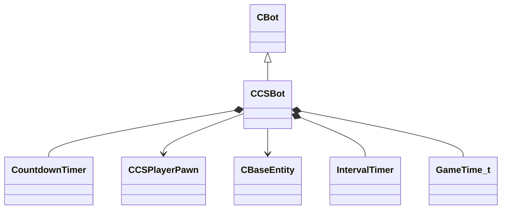

[Schemas](../../schemas.md) / [server](../server.md) / CCSBot

# CCSBot

> Source: **Build 25000182** · 2026-08-28 · `windows-x86_64` · schema `0.10.0`

**Kind:** class · **Size:** 24128 bytes (`0x5e40`) · **Align:** n/a (unspecified) · **Module:** server

**Inherits from:** [CBot](../server/CBot.md)

**Relationships:**

## Memory layout

153 fields (140 declared here, 13 inherited). Offsets are absolute from the object base.

| Offset | Field | Type | From | Annotations |
|--------|-------|------|------|-------------|
| `0x10` | `m_pController` | [CCSPlayerController](../server/CCSPlayerController.md)* | [CBot](../server/CBot.md) |  |
| `0x18` | `m_pPlayer` | [CCSPlayerPawn](../server/CCSPlayerPawn.md)* | [CBot](../server/CBot.md) |  |
| `0x20` | `m_bHasSpawned` | bool | [CBot](../server/CBot.md) |  |
| `0x24` | `m_id` | uint32 | [CBot](../server/CBot.md) |  |
| `0xc0` | `m_isRunning` | bool | [CBot](../server/CBot.md) |  |
| `0xc1` | `m_isCrouching` | bool | [CBot](../server/CBot.md) |  |
| `0xc4` | `m_forwardSpeed` | float32 | [CBot](../server/CBot.md) |  |
| `0xc8` | `m_leftSpeed` | float32 | [CBot](../server/CBot.md) |  |
| `0xcc` | `m_verticalSpeed` | float32 | [CBot](../server/CBot.md) |  |
| `0xd0` | `m_buttonFlags` | uint64 | [CBot](../server/CBot.md) |  |
| `0xd8` | `m_jumpTimestamp` | float32 | [CBot](../server/CBot.md) |  |
| `0xdc` | `m_viewForward` | Vector | [CBot](../server/CBot.md) |  |
| `0xf8` | `m_postureStackIndex` | int32 | [CBot](../server/CBot.md) |  |
| `0x108` | `m_eyePosition` | VectorWS |  |  |
| `0x114` | `m_name` | char[64] |  |  |
| `0x154` | `m_combatRange` | float32 |  |  |
| `0x158` | `m_isRogue` | bool |  |  |
| `0x160` | `m_rogueTimer` | [CountdownTimer](../server/CountdownTimer.md) |  |  |
| `0x17c` | `m_diedLastRound` | bool |  |  |
| `0x180` | `m_safeTime` | float32 |  |  |
| `0x184` | `m_wasSafe` | bool |  |  |
| `0x18c` | `m_blindFire` | bool |  |  |
| `0x190` | `m_surpriseTimer` | [CountdownTimer](../server/CountdownTimer.md) |  |  |
| `0x1a8` | `m_bAllowActive` | bool |  |  |
| `0x1a9` | `m_isFollowing` | bool |  |  |
| `0x1ac` | `m_leader` | CHandle< [CCSPlayerPawn](../server/CCSPlayerPawn.md) > |  |  |
| `0x1b0` | `m_followTimestamp` | float32 |  |  |
| `0x1b4` | `m_allowAutoFollowTime` | float32 |  |  |
| `0x1b8` | `m_hurryTimer` | [CountdownTimer](../server/CountdownTimer.md) |  |  |
| `0x1d0` | `m_alertTimer` | [CountdownTimer](../server/CountdownTimer.md) |  |  |
| `0x1e8` | `m_sneakTimer` | [CountdownTimer](../server/CountdownTimer.md) |  |  |
| `0x200` | `m_panicTimer` | [CountdownTimer](../server/CountdownTimer.md) |  |  |
| `0x5c8` | `m_stateTimestamp` | float32 |  |  |
| `0x5cc` | `m_isAttacking` | bool |  |  |
| `0x5cd` | `m_isOpeningDoor` | bool |  |  |
| `0x5d4` | `m_taskEntity` | CHandle< [CBaseEntity](../server/CBaseEntity.md) > |  |  |
| `0x5e4` | `m_goalPosition` | VectorWS |  |  |
| `0x5f0` | `m_goalEntity` | CHandle< [CBaseEntity](../server/CBaseEntity.md) > |  |  |
| `0x5f4` | `m_avoid` | CHandle< [CBaseEntity](../server/CBaseEntity.md) > |  |  |
| `0x5f8` | `m_avoidTimestamp` | float32 |  |  |
| `0x5fc` | `m_isStopping` | bool |  |  |
| `0x5fd` | `m_hasVisitedEnemySpawn` | bool |  |  |
| `0x600` | `m_stillTimer` | [IntervalTimer](../server/IntervalTimer.md) |  |  |
| `0x610` | `m_bEyeAnglesUnderPathFinderControl` | bool |  |  |
| `0x4f08` | `m_pathIndex` | int32 |  |  |
| `0x4f0c` | `m_areaEnteredTimestamp` | [GameTime_t](../entity2/GameTime_t.md) |  |  |
| `0x4f10` | `m_repathTimer` | [CountdownTimer](../server/CountdownTimer.md) |  |  |
| `0x4f28` | `m_avoidFriendTimer` | [CountdownTimer](../server/CountdownTimer.md) |  |  |
| `0x4f40` | `m_isFriendInTheWay` | bool |  |  |
| `0x4f48` | `m_politeTimer` | [CountdownTimer](../server/CountdownTimer.md) |  |  |
| `0x4f60` | `m_isWaitingBehindFriend` | bool |  |  |
| `0x4f8c` | `m_pathLadderEnd` | float32 |  |  |
| `0x4fd8` | `m_mustRunTimer` | [CountdownTimer](../server/CountdownTimer.md) |  |  |
| `0x4ff0` | `m_waitTimer` | [CountdownTimer](../server/CountdownTimer.md) |  |  |
| `0x5008` | `m_updateTravelDistanceTimer` | [CountdownTimer](../server/CountdownTimer.md) |  |  |
| `0x5020` | `m_playerTravelDistance` | float32[64] |  |  |
| `0x5120` | `m_travelDistancePhase` | uint8 |  |  |
| `0x52b8` | `m_hostageEscortCount` | uint8 |  |  |
| `0x52bc` | `m_hostageEscortCountTimestamp` | float32 |  |  |
| `0x52c0` | `m_desiredTeam` | int32 |  |  |
| `0x52c4` | `m_hasJoined` | bool |  |  |
| `0x52c5` | `m_isWaitingForHostage` | bool |  |  |
| `0x52c8` | `m_inhibitWaitingForHostageTimer` | [CountdownTimer](../server/CountdownTimer.md) |  |  |
| `0x52e0` | `m_waitForHostageTimer` | [CountdownTimer](../server/CountdownTimer.md) |  |  |
| `0x52f8` | `m_noisePosition` | VectorWS |  |  |
| `0x5304` | `m_noiseTravelDistance` | float32 |  |  |
| `0x5308` | `m_noiseTimestamp` | float32 |  |  |
| `0x5310` | `m_noiseSource` | [CCSPlayerPawn](../server/CCSPlayerPawn.md)* |  |  |
| `0x5328` | `m_noiseBendTimer` | [CountdownTimer](../server/CountdownTimer.md) |  |  |
| `0x5340` | `m_bentNoisePosition` | VectorWS |  |  |
| `0x534c` | `m_bendNoisePositionValid` | bool |  |  |
| `0x5350` | `m_lookAroundStateTimestamp` | float32 |  |  |
| `0x5354` | `m_lookAheadAngle` | float32 |  |  |
| `0x5358` | `m_lookUpAngle` | float32 |  |  |
| `0x535c` | `m_forwardAngle` | float32 |  |  |
| `0x5360` | `m_inhibitLookAroundTimestamp` | float32 |  |  |
| `0x5368` | `m_lookAtSpot` | VectorWS |  |  |
| `0x5378` | `m_lookAtSpotDuration` | float32 |  |  |
| `0x537c` | `m_lookAtSpotTimestamp` | float32 |  |  |
| `0x5380` | `m_lookAtSpotAngleTolerance` | float32 |  |  |
| `0x5384` | `m_lookAtSpotClearIfClose` | bool |  |  |
| `0x5385` | `m_lookAtSpotAttack` | bool |  |  |
| `0x5388` | `m_lookAtDesc` | char* |  |  |
| `0x5390` | `m_peripheralTimestamp` | float32 |  |  |
| `0x5518` | `m_approachPointCount` | uint8 |  |  |
| `0x551c` | `m_approachPointViewPosition` | VectorWS |  |  |
| `0x5528` | `m_viewSteadyTimer` | [IntervalTimer](../server/IntervalTimer.md) |  |  |
| `0x5540` | `m_tossGrenadeTimer` | [CountdownTimer](../server/CountdownTimer.md) |  |  |
| `0x5560` | `m_isAvoidingGrenade` | [CountdownTimer](../server/CountdownTimer.md) |  |  |
| `0x5580` | `m_spotCheckTimestamp` | float32 |  |  |
| `0x5988` | `m_checkedHidingSpotCount` | int32 |  |  |
| `0x598c` | `m_lookPitch` | float32 |  |  |
| `0x5990` | `m_lookPitchVel` | float32 |  |  |
| `0x5994` | `m_lookYaw` | float32 |  |  |
| `0x5998` | `m_lookYawVel` | float32 |  |  |
| `0x599c` | `m_targetSpot` | VectorWS |  |  |
| `0x59a8` | `m_targetSpotVelocity` | Vector |  |  |
| `0x59b4` | `m_targetSpotPredicted` | VectorWS |  |  |
| `0x59c0` | `m_aimError` | QAngle |  |  |
| `0x59cc` | `m_aimGoal` | QAngle |  |  |
| `0x59d8` | `m_targetSpotTime` | [GameTime_t](../entity2/GameTime_t.md) |  |  |
| `0x59dc` | `m_aimFocus` | float32 |  |  |
| `0x59e0` | `m_aimFocusInterval` | float32 |  |  |
| `0x59e4` | `m_aimFocusNextUpdate` | [GameTime_t](../entity2/GameTime_t.md) |  |  |
| `0x59f0` | `m_ignoreEnemiesTimer` | [CountdownTimer](../server/CountdownTimer.md) |  |  |
| `0x5a08` | `m_enemy` | CHandle< [CCSPlayerPawn](../server/CCSPlayerPawn.md) > |  |  |
| `0x5a0c` | `m_isEnemyVisible` | bool |  |  |
| `0x5a0d` | `m_visibleEnemyParts` | uint8 |  |  |
| `0x5a10` | `m_lastEnemyPosition` | VectorWS |  |  |
| `0x5a1c` | `m_lastSawEnemyTimestamp` | float32 |  |  |
| `0x5a20` | `m_firstSawEnemyTimestamp` | float32 |  |  |
| `0x5a24` | `m_currentEnemyAcquireTimestamp` | float32 |  |  |
| `0x5a28` | `m_enemyDeathTimestamp` | float32 |  |  |
| `0x5a2c` | `m_friendDeathTimestamp` | float32 |  |  |
| `0x5a30` | `m_isLastEnemyDead` | bool |  |  |
| `0x5a34` | `m_nearbyEnemyCount` | int32 |  |  |
| `0x5c40` | `m_bomber` | CHandle< [CCSPlayerPawn](../server/CCSPlayerPawn.md) > |  |  |
| `0x5c44` | `m_nearbyFriendCount` | int32 |  |  |
| `0x5c48` | `m_closestVisibleFriend` | CHandle< [CCSPlayerPawn](../server/CCSPlayerPawn.md) > |  |  |
| `0x5c4c` | `m_closestVisibleHumanFriend` | CHandle< [CCSPlayerPawn](../server/CCSPlayerPawn.md) > |  |  |
| `0x5c50` | `m_attentionInterval` | [IntervalTimer](../server/IntervalTimer.md) |  |  |
| `0x5c60` | `m_attacker` | CHandle< [CCSPlayerPawn](../server/CCSPlayerPawn.md) > |  |  |
| `0x5c64` | `m_attackedTimestamp` | float32 |  |  |
| `0x5c68` | `m_burnedByFlamesTimer` | [IntervalTimer](../server/IntervalTimer.md) |  |  |
| `0x5c78` | `m_lastVictimID` | int32 |  |  |
| `0x5c7c` | `m_isAimingAtEnemy` | bool |  |  |
| `0x5c7d` | `m_isRapidFiring` | bool |  |  |
| `0x5c80` | `m_equipTimer` | [IntervalTimer](../server/IntervalTimer.md) |  |  |
| `0x5c90` | `m_zoomTimer` | [CountdownTimer](../server/CountdownTimer.md) |  |  |
| `0x5ca8` | `m_fireWeaponTimestamp` | [GameTime_t](../entity2/GameTime_t.md) |  |  |
| `0x5cb0` | `m_lookForWeaponsOnGroundTimer` | [CountdownTimer](../server/CountdownTimer.md) |  |  |
| `0x5cc8` | `m_bIsSleeping` | bool |  |  |
| `0x5cc9` | `m_isEnemySniperVisible` | bool |  |  |
| `0x5cd0` | `m_sawEnemySniperTimer` | [CountdownTimer](../server/CountdownTimer.md) |  |  |
| `0x5d88` | `m_enemyQueueIndex` | uint8 |  |  |
| `0x5d89` | `m_enemyQueueCount` | uint8 |  |  |
| `0x5d8a` | `m_enemyQueueAttendIndex` | uint8 |  |  |
| `0x5d8b` | `m_isStuck` | bool |  |  |
| `0x5d8c` | `m_stuckTimestamp` | [GameTime_t](../entity2/GameTime_t.md) |  |  |
| `0x5d90` | `m_stuckSpot` | VectorWS |  |  |
| `0x5da0` | `m_wiggleTimer` | [CountdownTimer](../server/CountdownTimer.md) |  |  |
| `0x5db8` | `m_stuckJumpTimer` | [CountdownTimer](../server/CountdownTimer.md) |  |  |
| `0x5dd0` | `m_nextCleanupCheckTimestamp` | [GameTime_t](../entity2/GameTime_t.md) |  |  |
| `0x5dd4` | `m_avgVel` | float32[10] |  |  |
| `0x5dfc` | `m_avgVelIndex` | int32 |  |  |
| `0x5e00` | `m_avgVelCount` | int32 |  |  |
| `0x5e04` | `m_lastOrigin` | VectorWS |  |  |
| `0x5e14` | `m_lastRadioRecievedTimestamp` | float32 |  |  |
| `0x5e18` | `m_lastRadioSentTimestamp` | float32 |  |  |
| `0x5e1c` | `m_radioSubject` | CHandle< [CCSPlayerPawn](../server/CCSPlayerPawn.md) > |  |  |
| `0x5e20` | `m_radioPosition` | VectorWS |  |  |
| `0x5e2c` | `m_voiceEndTimestamp` | float32 |  |  |
| `0x5e38` | `m_lastValidReactionQueueFrame` | int32 |  |  |
