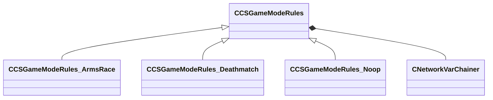

[Schemas](../../schemas.md) / [server](../server.md) / CCSGameModeRules

# CCSGameModeRules

> Source: **Build 25000182** · 2026-08-28 · `windows-x86_64` · schema `0.10.0`

**Kind:** class · **Size:** 48 bytes (`0x30`) · **Align:** 8 · **Module:** server

**Twin:** [CCSGameModeRules (client)](../client/CCSGameModeRules.md)

**Derived by:** [CCSGameModeRules_ArmsRace](../server/CCSGameModeRules_ArmsRace.md), [CCSGameModeRules_Deathmatch](../server/CCSGameModeRules_Deathmatch.md), [CCSGameModeRules_Noop](../server/CCSGameModeRules_Noop.md)

**Relationships:**

## Memory layout

1 field (1 declared here, 0 inherited). Offsets are absolute from the object base.

| Offset | Field | Type | From | Annotations |
|--------|-------|------|------|-------------|
| `0x8` | `__m_pChainEntity` | [CNetworkVarChainer](../entity2/CNetworkVarChainer.md) |  | `MNotSaved` |
