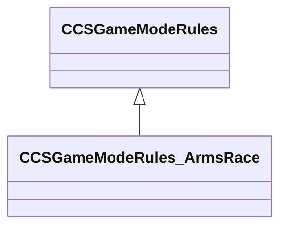

[Schemas](../../schemas.md) / [server](../server.md) / CCSGameModeRules_ArmsRace

# CCSGameModeRules_ArmsRace

> Source: **Build 25000182** · 2026-08-28 · `windows-x86_64` · schema `0.10.0`

**Kind:** class · **Size:** 136 bytes (`0x88`) · **Align:** 8 · **Module:** server

**Twin:** [CCSGameModeRules_ArmsRace (client)](../client/CCSGameModeRules_ArmsRace.md)

**Inherits from:** [CCSGameModeRules](../server/CCSGameModeRules.md)

**Relationships:**

## Memory layout

2 fields (1 declared here, 1 inherited). Offsets are absolute from the object base.

| Offset | Field | Type | From | Annotations |
|--------|-------|------|------|-------------|
| `0x8` | `__m_pChainEntity` | [CNetworkVarChainer](../entity2/CNetworkVarChainer.md) | [CCSGameModeRules](../server/CCSGameModeRules.md) | `MNotSaved` |
| `0x30` | `m_WeaponSequence` | CNetworkUtlVectorBase< CUtlString > |  |  |
