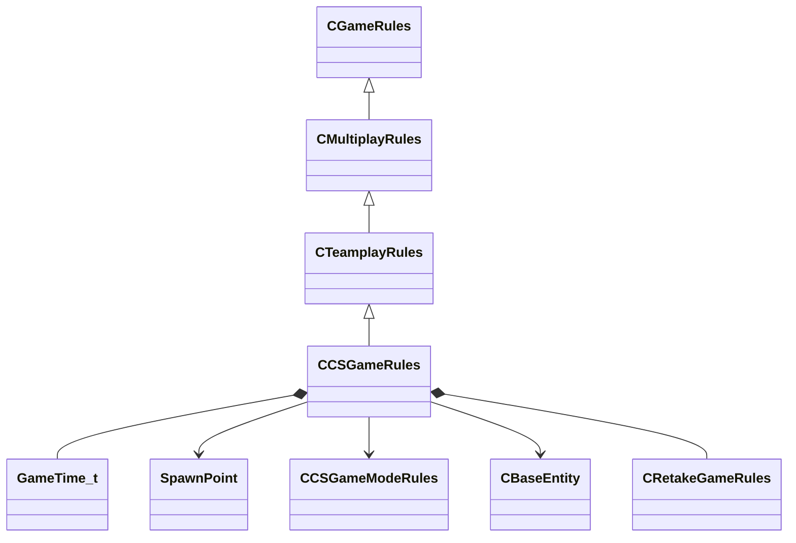

[Schemas](../../schemas.md) / [server](../server.md) / CCSGameRules

# CCSGameRules

Singleton entity that holds all CS2 match-level state: phase, round timer, team time-outs, map layout flags, match stats, and end-of-round information. Accessible via the CCSGameRulesProxy entity on the client.

> 📝 Many fields here are the ground truth for demo-parsing tools (e.g. demoinfocs-golang).  Round phase transitions are driven by m_gamePhase and m_bFreezePeriod / m_bWarmupPeriod.

**Kind:** class · **Size:** 70728 bytes (`0x11448`) · **Align:** 255 · **Module:** server

**Inherits from:** [CTeamplayRules](../server/CTeamplayRules.md)

**Relationships:**

## Memory layout

197 fields (189 declared here, 8 inherited). Offsets are absolute from the object base.

| Offset | Field | Type | From | Annotations |
|--------|-------|------|------|-------------|
| `0x8` | `__m_pChainEntity` | [CNetworkVarChainer](../entity2/CNetworkVarChainer.md) | [CGameRules](../server/CGameRules.md) | `MNotSaved` |
| `0x30` | `m_szQuestName` | char[128] | [CGameRules](../server/CGameRules.md) |  |
| `0xb0` | `m_nQuestPhase` | int32 | [CGameRules](../server/CGameRules.md) |  |
| `0xb4` | `m_nLastMatchTime` | uint32 | [CGameRules](../server/CGameRules.md) |  |
| `0xb8` | `m_nLastMatchTime_MatchID64` | uint64 | [CGameRules](../server/CGameRules.md) |  |
| `0xc0` | `m_nTotalPausedTicks` | int32 | [CGameRules](../server/CGameRules.md) |  |
| `0xc4` | `m_nPauseStartTick` | int32 | [CGameRules](../server/CGameRules.md) |  |
| `0xc8` | `m_bGamePaused` | bool | [CGameRules](../server/CGameRules.md) |  |
| `0xd8` | `m_bFreezePeriod` | bool |  | True during the buy phase (freeze time) at the start of each round. *Players cannot move while this is true; buy menus open automatically.* |
| `0xd9` | `m_bWarmupPeriod` | bool |  | True while the pre-match warmup is active. |
| `0xdc` | `m_fWarmupPeriodEnd` | [GameTime_t](../entity2/GameTime_t.md) |  | GameTime at which the warmup period ends and the first round begins. |
| `0xe0` | `m_fWarmupPeriodStart` | [GameTime_t](../entity2/GameTime_t.md) |  | GameTime at which the current warmup period started. |
| `0xe4` | `m_bTerroristTimeOutActive` | bool |  | True while the Terrorist team's tactical time-out is in progress. |
| `0xe5` | `m_bCTTimeOutActive` | bool |  | True while the Counter-Terrorist team's tactical time-out is in progress. |
| `0xe8` | `m_flTerroristTimeOutRemaining` | float32 |  | Seconds remaining in the active Terrorist time-out. |
| `0xec` | `m_flCTTimeOutRemaining` | float32 |  | Seconds remaining in the active CT time-out. |
| `0xf0` | `m_nTerroristTimeOuts` | int32 |  | Number of tactical time-outs the T-side has used so far in the match. |
| `0xf4` | `m_nCTTimeOuts` | int32 |  | Number of tactical time-outs the CT-side has used so far in the match. |
| `0xf8` | `m_bTechnicalTimeOut` | bool |  | True during a technical pause (admin-issued, not team time-out). |
| `0xf9` | `m_bMatchWaitingForResume` | bool |  | True when the match is paused and waiting for both teams to confirm resumption. |
| `0xfc` | `m_iFreezeTime` | int32 |  | Freeze-time duration in seconds (mirrors mp_freezetime convar value). |
| `0x100` | `m_iRoundTime` | int32 |  | Round time limit in seconds (mirrors mp_roundtime_* convar value). |
| `0x104` | `m_fMatchStartTime` | float32 |  | Unix-epoch float of when the match (not the round) began. |
| `0x108` | `m_fRoundStartTime` | [GameTime_t](../entity2/GameTime_t.md) |  | GameTime at which the current round's freeze time ended and play started. |
| `0x10c` | `m_flRestartRoundTime` | [GameTime_t](../entity2/GameTime_t.md) |  | GameTime at which the current round will be force-restarted by the server (0 = no pending restart). |
| `0x110` | `m_bGameRestart` | bool |  | True in the brief window between a restart being triggered and the new round spawning. |
| `0x114` | `m_flGameStartTime` | float32 |  | GameTime at which the first live round of the match started (after all warmup/knife rounds). |
| `0x118` | `m_timeUntilNextPhaseStarts` | float32 |  | Countdown in seconds until the next phase (round, half, overtime) begins; drives the on-screen timer. |
| `0x11c` | `m_gamePhase` | int32 |  | Game-phase enum: 1 = First Half, 2 = Second Half, 3 = Pre-overtime, 4 = Overtime, 5 = Game Over. *Triggers OnGamePhaseChanged callback on clients.* |
| `0x120` | `m_totalRoundsPlayed` | int32 |  | Total number of rounds completed since the match started (all phases combined). |
| `0x124` | `m_nRoundsPlayedThisPhase` | int32 |  | Number of rounds played in the current phase (half/overtime period). |
| `0x128` | `m_nOvertimePlaying` | int32 |  | Number of overtime periods played so far (0 = regulation). |
| `0x12c` | `m_iHostagesRemaining` | int32 |  | Number of hostages that have not yet been rescued or killed. |
| `0x130` | `m_bAnyHostageReached` | bool |  | True once any hostage has reached the rescue zone this round. |
| `0x131` | `m_bMapHasBombTarget` | bool |  | True when the map has at least one bomb-plant zone (bombsite entity). |
| `0x132` | `m_bMapHasRescueZone` | bool |  | True when the map has at least one hostage rescue zone. |
| `0x133` | `m_bMapHasBuyZone` | bool |  | True when the map has at least one buy zone. |
| `0x134` | `m_bIsQueuedMatchmaking` | bool |  | True when the server is running a matchmaking (Valve-hosted) game rather than a community server. |
| `0x138` | `m_nQueuedMatchmakingMode` | int32 |  | Matchmaking mode identifier (0 = casual, 1 = competitive, etc.). |
| `0x13c` | `m_bIsValveDS` | bool |  | True when the server is an official Valve dedicated server. |
| `0x13d` | `m_bLogoMap` | bool |  | True when the server is running a workshop or demo map that does not count for match records. |
| `0x13e` | `m_bPlayAllStepSoundsOnServer` | bool |  |  |
| `0x140` | `m_iSpectatorSlotCount` | int32 |  | Number of spectator slots available on this server. |
| `0x144` | `m_MatchDevice` | int32 |  | Platform/device identifier for the match (used by Valve matchmaking for stats reporting). |
| `0x148` | `m_bHasMatchStarted` | bool |  | True from the moment the first live round begins; remains true until the match ends. |
| `0x14c` | `m_nNextMapInMapgroup` | int32 |  | Index within the server's map-group of the map that will be played next. |
| `0x150` | `m_szTournamentEventName` | char[512] |  | Display name of the tournament/event shown in the HUD scoreboard (up to 512 bytes). |
| `0x350` | `m_szTournamentEventStage` | char[512] |  | Stage label for the tournament event (e.g. 'Grand Final', 'Quarterfinal'). |
| `0x550` | `m_szMatchStatTxt` | char[512] |  | Match-stats summary text displayed in the scoreboard (tournament use). |
| `0x750` | `m_szTournamentPredictionsTxt` | char[512] |  |  |
| `0x950` | `m_nTournamentPredictionsPct` | int32 |  |  |
| `0x954` | `m_flCMMItemDropRevealStartTime` | [GameTime_t](../entity2/GameTime_t.md) |  | GameTime at which the post-match item-drop reveal animation begins. |
| `0x958` | `m_flCMMItemDropRevealEndTime` | [GameTime_t](../entity2/GameTime_t.md) |  | GameTime at which the post-match item-drop reveal animation ends. |
| `0x95c` | `m_bIsDroppingItems` | bool |  | True while the post-match item-drop animation is playing. |
| `0x95d` | `m_bIsQuestEligible` | bool |  | True when the current match is eligible for operation mission progress. |
| `0x95e` | `m_bIsHltvActive` | bool |  | True when at least one GOTV/HLTV spectator slot is connected. |
| `0x95f` | `m_bBombPlanted` | bool |  | True while the planted bomb entity is active and ticking. |
| `0x960` | `m_arrProhibitedItemIndices` | uint16[100] |  | Array of up to 100 item-definition indices that are prohibited from being used in this match (e.g. tournament bans). |
| `0xa28` | `m_arrTournamentActiveCasterAccounts` | uint32[4] |  |  |
| `0xa38` | `m_numBestOfMaps` | int32 |  | Best-of-N series length configured for this match (e.g. 1, 3, 5). |
| `0xa3c` | `m_nHalloweenMaskListSeed` | int32 |  |  |
| `0xa40` | `m_bBombDropped` | bool |  | True while the bomb (C4) is lying on the ground, not carried by any player. |
| `0xa44` | `m_iRoundWinStatus` | int32 |  | Which team won the most-recently completed round (0 = not over, 2 = Terrorist win, 3 = CT win). |
| `0xa48` | `m_eRoundWinReason` | int32 |  | RoundWinReason_t enum: 1 = target bombed, 7 = bomb defused, 8 = all T killed, 9 = hostage rescued, etc. |
| `0xa4c` | `m_bTCantBuy` | bool |  | True when the Terrorist team is currently locked out of purchasing weapons. |
| `0xa4d` | `m_bCTCantBuy` | bool |  | True when the Counter-Terrorist team is currently locked out of purchasing weapons. |
| `0xa50` | `m_iMatchStats_RoundResults` | int32[30] |  | Array of 30 round-result codes (one per round slot) used to fill the scoreboard half-time panel. |
| `0xac8` | `m_iMatchStats_PlayersAlive_CT` | int32[30] |  | Array of 30 values – number of CT players alive at the end of each round. |
| `0xb40` | `m_iMatchStats_PlayersAlive_T` | int32[30] |  | Array of 30 values – number of T players alive at the end of each round. |
| `0xbb8` | `m_TeamRespawnWaveTimes` | float32[32] |  |  |
| `0xc38` | `m_flNextRespawnWave` | [GameTime_t](../entity2/GameTime_t.md)[32] |  |  |
| `0xcb8` | `m_vMinimapMins` | VectorWS |  | World-space minimum corner of the minimap bounding box. |
| `0xcc4` | `m_vMinimapMaxs` | VectorWS |  | World-space maximum corner of the minimap bounding box. |
| `0xcd0` | `m_MinimapVerticalSectionHeights` | float32[8] |  | Array of 8 height values dividing the map into vertical sections for the radar's floor-switching feature. |
| `0xcf0` | `m_ullLocalMatchID` | uint64 |  |  |
| `0xcf8` | `m_nEndMatchMapGroupVoteTypes` | int32[10] |  | Array of 10 vote-type codes for the end-of-match map vote options. |
| `0xd20` | `m_nEndMatchMapGroupVoteOptions` | int32[10] |  | Array of 10 map-group option indices corresponding to the vote types. |
| `0xd48` | `m_nEndMatchMapVoteWinner` | int32 |  | Index of the winning map-vote option (-1 while voting is in progress). |
| `0xd4c` | `m_iNumConsecutiveCTLoses` | int32 |  | Number of consecutive rounds the CT side has lost; drives the loss-bonus economy. |
| `0xd50` | `m_iNumConsecutiveTerroristLoses` | int32 |  | Number of consecutive rounds the T side has lost; drives the loss-bonus economy. |
| `0xd70` | `m_bHasHostageBeenTouched` | bool |  |  |
| `0xd74` | `m_flIntermissionStartTime` | [GameTime_t](../entity2/GameTime_t.md) |  |  |
| `0xd78` | `m_flIntermissionEndTime` | [GameTime_t](../entity2/GameTime_t.md) |  |  |
| `0xd7c` | `m_bLevelInitialized` | bool |  |  |
| `0xd80` | `m_iTotalRoundsPlayed` | int32 |  |  |
| `0xd84` | `m_iUnBalancedRounds` | int32 |  |  |
| `0xd88` | `m_endMatchOnRoundReset` | bool |  |  |
| `0xd89` | `m_endMatchOnThink` | bool |  |  |
| `0xd8c` | `m_iNumTerrorist` | int32 |  |  |
| `0xd90` | `m_iNumCT` | int32 |  |  |
| `0xd94` | `m_iNumSpawnableTerrorist` | int32 |  |  |
| `0xd98` | `m_iNumSpawnableCT` | int32 |  |  |
| `0xda0` | `m_arrSelectedHostageSpawnIndices` | CUtlVector< int32 > |  |  |
| `0xdb8` | `m_nSpawnPointsRandomSeed` | int32 |  |  |
| `0xdbc` | `m_bFirstConnected` | bool |  |  |
| `0xdbd` | `m_bCompleteReset` | bool |  |  |
| `0xdbe` | `m_bPickNewTeamsOnReset` | bool |  |  |
| `0xdbf` | `m_bScrambleTeamsOnRestart` | bool |  |  |
| `0xdc0` | `m_bSwapTeamsOnRestart` | bool |  |  |
| `0xdc8` | `m_nEndMatchTiedVotes` | CUtlVector< int32 > |  |  |
| `0xde4` | `m_bNeedToAskPlayersForContinueVote` | bool |  |  |
| `0xde8` | `m_numQueuedMatchmakingAccounts` | uint32 |  |  |
| `0xdec` | `m_fAvgPlayerRank` | float32 |  |  |
| `0xdf0` | `m_pQueuedMatchmakingReservationString` | char* |  |  |
| `0xdf8` | `m_numTotalTournamentDrops` | uint32 |  |  |
| `0xdfc` | `m_numSpectatorsCountMax` | uint32 |  |  |
| `0xe00` | `m_numSpectatorsCountMaxTV` | uint32 |  |  |
| `0xe04` | `m_numSpectatorsCountMaxLnk` | uint32 |  |  |
| `0xe10` | `m_nCTsAliveAtFreezetimeEnd` | int32 |  |  |
| `0xe14` | `m_nTerroristsAliveAtFreezetimeEnd` | int32 |  |  |
| `0xe18` | `m_bForceTeamChangeSilent` | bool |  |  |
| `0xe19` | `m_bLoadingRoundBackupData` | bool |  |  |
| `0xe50` | `m_nMatchInfoShowType` | int32 |  |  |
| `0xe54` | `m_flMatchInfoDecidedTime` | float32 |  |  |
| `0xe70` | `mTeamDMLastWinningTeamNumber` | int32 |  |  |
| `0xe74` | `mTeamDMLastThinkTime` | float32 |  |  |
| `0xe78` | `m_flTeamDMLastAnnouncementTime` | float32 |  |  |
| `0xe7c` | `m_iAccountTerrorist` | int32 |  |  |
| `0xe80` | `m_iAccountCT` | int32 |  |  |
| `0xe84` | `m_iSpawnPointCount_Terrorist` | int32 |  |  |
| `0xe88` | `m_iSpawnPointCount_CT` | int32 |  |  |
| `0xe8c` | `m_iMaxNumTerrorists` | int32 |  |  |
| `0xe90` | `m_iMaxNumCTs` | int32 |  |  |
| `0xe94` | `m_iLoserBonusMostRecentTeam` | int32 |  |  |
| `0xe98` | `m_tmNextPeriodicThink` | float32 |  |  |
| `0xe9c` | `m_bVoiceWonMatchBragFired` | bool |  |  |
| `0xea0` | `m_fWarmupNextChatNoticeTime` | float32 |  |  |
| `0xea8` | `m_iHostagesRescued` | int32 |  |  |
| `0xeac` | `m_iHostagesTouched` | int32 |  |  |
| `0xeb0` | `m_flNextHostageAnnouncement` | float32 |  |  |
| `0xeb4` | `m_bNoTerroristsKilled` | bool |  |  |
| `0xeb5` | `m_bNoCTsKilled` | bool |  |  |
| `0xeb6` | `m_bNoEnemiesKilled` | bool |  |  |
| `0xeb7` | `m_bCanDonateWeapons` | bool |  |  |
| `0xebc` | `m_firstKillTime` | float32 |  |  |
| `0xec4` | `m_firstBloodTime` | float32 |  |  |
| `0xee0` | `m_hostageWasInjured` | bool |  |  |
| `0xee1` | `m_hostageWasKilled` | bool |  |  |
| `0xef0` | `m_bVoteCalled` | bool |  |  |
| `0xef1` | `m_bServerVoteOnReset` | bool |  |  |
| `0xef4` | `m_flVoteCheckThrottle` | float32 |  |  |
| `0xef8` | `m_bBuyTimeEnded` | bool |  |  |
| `0xefc` | `m_nLastFreezeEndBeep` | int32 |  |  |
| `0xf00` | `m_bTargetBombed` | bool |  |  |
| `0xf01` | `m_bBombDefused` | bool |  |  |
| `0xf02` | `m_bMapHasBombZone` | bool |  |  |
| `0xf50` | `m_vecMainCTSpawnPos` | VectorWS |  |  |
| `0xf60` | `m_CTSpawnPointsMasterList` | CUtlVector< CHandle< [SpawnPoint](../server/SpawnPoint.md) > > |  |  |
| `0xf78` | `m_TerroristSpawnPointsMasterList` | CUtlVector< CHandle< [SpawnPoint](../server/SpawnPoint.md) > > |  |  |
| `0xf90` | `m_bRespawningAllRespawnablePlayers` | bool |  |  |
| `0xf94` | `m_iNextCTSpawnPoint` | int32 |  |  |
| `0xf98` | `m_flCTSpawnPointUsedTime` | float32 |  |  |
| `0xf9c` | `m_iNextTerroristSpawnPoint` | int32 |  |  |
| `0xfa0` | `m_flTerroristSpawnPointUsedTime` | float32 |  |  |
| `0xfa8` | `m_CTSpawnPoints` | CUtlVector< CHandle< [SpawnPoint](../server/SpawnPoint.md) > > |  |  |
| `0xfc0` | `m_TerroristSpawnPoints` | CUtlVector< CHandle< [SpawnPoint](../server/SpawnPoint.md) > > |  |  |
| `0xfd8` | `m_bIsUnreservedGameServer` | bool |  |  |
| `0xfdc` | `m_fAutobalanceDisplayTime` | float32 |  |  |
| `0x1018` | `m_bAllowWeaponSwitch` | bool |  |  |
| `0x1019` | `m_bRoundTimeWarningTriggered` | bool |  |  |
| `0x101c` | `m_phaseChangeAnnouncementTime` | [GameTime_t](../entity2/GameTime_t.md) |  |  |
| `0x1020` | `m_fNextUpdateTeamClanNamesTime` | float32 |  |  |
| `0x1024` | `m_flLastThinkTime` | [GameTime_t](../entity2/GameTime_t.md) |  |  |
| `0x1028` | `m_fAccumulatedRoundOffDamage` | float32 |  |  |
| `0x102c` | `m_nShorthandedBonusLastEvalRound` | int32 |  |  |
| `0x1078` | `m_nMatchAbortedEarlyReason` | int32 |  | Reason code for an early match abort (0 = not aborted, non-zero codes map to abandonment reasons). |
| `0x107c` | `m_bHasTriggeredRoundStartMusic` | bool |  |  |
| `0x107d` | `m_bSwitchingTeamsAtRoundReset` | bool |  |  |
| `0x1098` | `m_pGameModeRules` | [CCSGameModeRules](../server/CCSGameModeRules.md)* |  | Polymorphic pointer to CCSGameModeRules (sub-classed for Arms Race, Deathmatch, etc.). *Use the MNetworkPolymorphic annotation when decoding; concrete types: CCSGameModeRules_ArmsRace, _Deathmatch, _Noop.* |
| `0x10a0` | `m_BtGlobalBlackboard` | KeyValues3 |  |  |
| `0x1138` | `m_hPlayerResource` | CHandle< [CBaseEntity](../server/CBaseEntity.md) > |  |  |
| `0x1140` | `m_RetakeRules` | [CRetakeGameRules](../server/CRetakeGameRules.md) |  | CRetakeGameRules struct holding all Retakes-mode specific state. |
| `0x1330` | `m_arrTeamUniqueKillWeaponsMatch` | CUtlVector< int32 >[4] |  |  |
| `0x1390` | `m_bTeamLastKillUsedUniqueWeaponMatch` | bool[4] |  |  |
| `0x13b8` | `m_nMatchEndCount` | uint8 |  | Incremented each time a match-end event fires; clients trigger their match-end UI on the change. |
| `0x13bc` | `m_nTTeamIntroVariant` | int32 |  | Variant index for the Terrorist team intro cinematic sequence. |
| `0x13c0` | `m_nCTTeamIntroVariant` | int32 |  | Variant index for the CT team intro cinematic sequence. |
| `0x13c4` | `m_bTeamIntroPeriod` | bool |  | True while the pre-round team-intro cinematic is playing. |
| `0x13c8` | `m_fTeamIntroPeriodEnd` | [GameTime_t](../entity2/GameTime_t.md) |  |  |
| `0x13cc` | `m_bPlayedTeamIntroVO` | bool |  |  |
| `0x13d0` | `m_iRoundEndWinnerTeam` | int32 |  | Team number of the team that won the most-recently ended round. |
| `0x13d4` | `m_eRoundEndReason` | int32 |  | RoundEndReason_t enum describing how the round ended (bomb exploded, time ran out, all enemies eliminated, etc.). |
| `0x13d8` | `m_bRoundEndShowTimerDefend` | bool |  | True when the end-of-round panel should show a 'defend' timer countdown. |
| `0x13dc` | `m_iRoundEndTimerTime` | int32 |  | Remaining time in seconds shown in the round-end countdown panel. |
| `0x13e0` | `m_sRoundEndFunFactToken` | CUtlString |  | Localization token for the fun-fact string shown in the round-end panel. |
| `0x13e8` | `m_iRoundEndFunFactPlayerSlot` | CPlayerSlot |  | Player slot of the player featured in the fun-fact message. |
| `0x13ec` | `m_iRoundEndFunFactData1` | int32 |  | First numeric argument substituted into the fun-fact localization string. |
| `0x13f0` | `m_iRoundEndFunFactData2` | int32 |  | Second numeric argument substituted into the fun-fact localization string. |
| `0x13f4` | `m_iRoundEndFunFactData3` | int32 |  | Third numeric argument substituted into the fun-fact localization string. |
| `0x13f8` | `m_sRoundEndMessage` | CUtlString |  | Custom message string displayed in the round-end overlay (tournament use). |
| `0x1400` | `m_iRoundEndPlayerCount` | int32 |  |  |
| `0x1404` | `m_bRoundEndNoMusic` | bool |  | True when the end-of-round music stinger should be suppressed. |
| `0x1408` | `m_iRoundEndLegacy` | int32 |  |  |
| `0x140c` | `m_nRoundEndCount` | uint8 |  | Incremented each time a round-end event fires; clients trigger round-end UI on the change. |
| `0x1410` | `m_iRoundStartRoundNumber` | int32 |  | The round number associated with the most-recent round-start event. |
| `0x1414` | `m_nRoundStartCount` | uint8 |  | Incremented each time a round-start event fires; clients initialize per-round state on the change. |
| `0x5420` | `m_flLastPerfSampleTime` | float64 |  |  |
