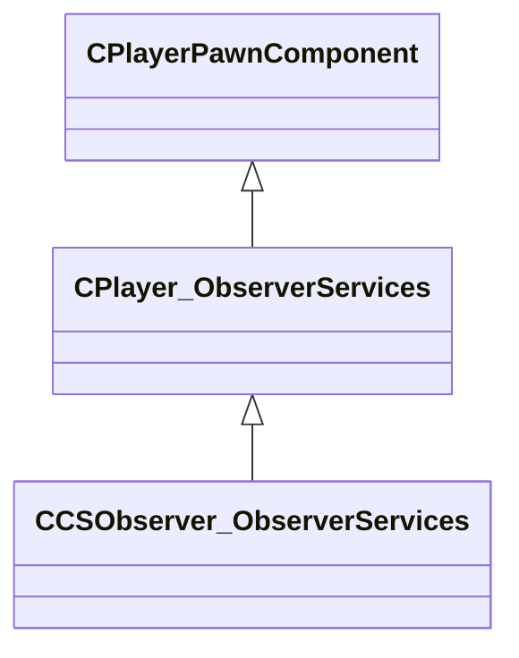

[Schemas](../../schemas.md) / [server](../server.md) / CCSObserver_ObserverServices

# CCSObserver_ObserverServices

**Kind:** class · **Size:** 128 bytes (`0x80`) · **Align:** 255 · **Module:** server

**Inherits from:** [CPlayer_ObserverServices](../server/CPlayer_ObserverServices.md)

**Relationships:**

## Memory layout

8 fields (0 declared here, 8 inherited). Offsets are absolute from the object base.

| Offset | Field | Type | From | Annotations |
|--------|-------|------|------|-------------|
| `0x8` | `__m_pChainEntity` | [CNetworkVarChainer](../entity2/CNetworkVarChainer.md) | [CPlayerPawnComponent](../server/CPlayerPawnComponent.md) | `MNotSaved` |
| `0x30` | `m_pComponentGraphController` | [CAnimGraphControllerPtr](../server/CAnimGraphControllerPtr.md) | [CPlayerPawnComponent](../server/CPlayerPawnComponent.md) |  |
| `0x48` | `m_iObserverMode` | uint8 | [CPlayer_ObserverServices](../server/CPlayer_ObserverServices.md) |  |
| `0x4c` | `m_hObserverTarget` | CHandle< [C_BaseEntity](../client/C_BaseEntity.md) > | [CPlayer_ObserverServices](../server/CPlayer_ObserverServices.md) |  |
| `0x50` | `m_iObserverLastMode` | [ObserverMode_t](../server/ObserverMode_t.md) | [CPlayer_ObserverServices](../server/CPlayer_ObserverServices.md) |  |
| `0x54` | `m_bForcedObserverMode` | bool | [CPlayer_ObserverServices](../server/CPlayer_ObserverServices.md) |  |
| `0x58` | `m_flObserverChaseDistance` | float32 | [CPlayer_ObserverServices](../server/CPlayer_ObserverServices.md) | `MNotSaved` |
| `0x5c` | `m_flObserverChaseDistanceCalcTime` | [GameTime_t](../entity2/GameTime_t.md) | [CPlayer_ObserverServices](../server/CPlayer_ObserverServices.md) | `MNotSaved` |
