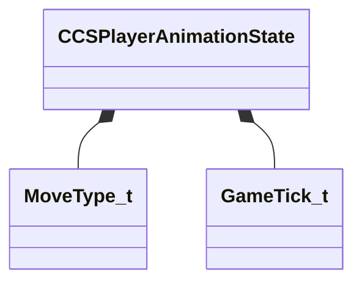

[Schemas](../../schemas.md) / [server](../server.md) / CCSPlayerAnimationState

# CCSPlayerAnimationState

**Kind:** class · **Size:** 224 bytes (`0xe0`) · **Align:** 255 · **Module:** server

**Relationships:**

## Memory layout

16 fields (16 declared here, 0 inherited). Offsets are absolute from the object base.

| Offset | Field | Type | From | Annotations |
|--------|-------|------|------|-------------|
| `0x18` | `m_currentMoveType` | [CCSPlayerAnimationState](../server/CCSPlayerAnimationState.md)::[MoveType_t](../server/MoveType_t.md) |  |  |
| `0x19` | `m_groundMoveState` | [CCSPlayerAnimationState](../server/CCSPlayerAnimationState.md)::GroundMoveState_t |  |  |
| `0x1a` | `m_groundActionDirection` | [CCSPlayerAnimationState](../server/CCSPlayerAnimationState.md)::Direction_t |  |  |
| `0x1b` | `m_airAction` | [CCSPlayerAnimationState](../server/CCSPlayerAnimationState.md)::AirAction_t |  |  |
| `0x1c` | `m_bWasOnGroundLastUpdate` | bool |  |  |
| `0x1d` | `m_bWasStationaryLastUpdate` | bool |  |  |
| `0x20` | `m_actionStartTick` | [GameTick_t](../entity2/GameTick_t.md) |  |  |
| `0x24` | `m_staticAimTimerStartTick` | [GameTick_t](../entity2/GameTick_t.md) |  |  |
| `0x28` | `m_plantAndTurnStartTick` | [GameTick_t](../entity2/GameTick_t.md) |  |  |
| `0x2c` | `m_flTurnOnSpotAngle` | float32 |  |  |
| `0x30` | `m_flPreviousAimYaw` | float32 |  |  |
| `0x34` | `m_flPreviousHorizontalSpeed` | float32 |  |  |
| `0x38` | `m_flFootIKOffsetLeft` | float32 |  |  |
| `0x3c` | `m_flFootIKOffsetRight` | float32 |  |  |
| `0x40` | `m_flWeaponDropPercentageDueToMovement` | float32 |  |  |
| `0x44` | `m_flWeaponDropSmoothDampVelocity` | float32 |  |  |
