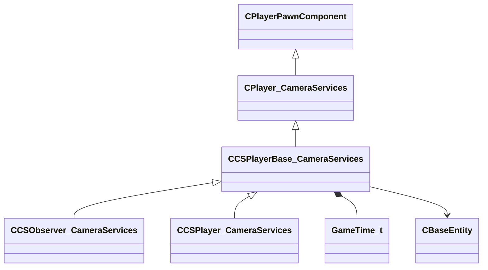

[Schemas](../../schemas.md) / [server](../server.md) / CCSPlayerBase_CameraServices

# CCSPlayerBase_CameraServices

> Source: **Build 25000182** · 2026-08-28 · `windows-x86_64` · schema `0.10.0`

**Kind:** class · **Size:** 432 bytes (`0x1b0`) · **Align:** n/a (unspecified) · **Module:** server

**Twin:** [CCSPlayerBase_CameraServices (client)](../client/CCSPlayerBase_CameraServices.md)

**Inherits from:** [CPlayer_CameraServices](../server/CPlayer_CameraServices.md)

**Derived by:** [CCSObserver_CameraServices](../server/CCSObserver_CameraServices.md), [CCSPlayer_CameraServices](../server/CCSPlayer_CameraServices.md)

**Relationships:**

## Memory layout

21 fields (7 declared here, 14 inherited). Offsets are absolute from the object base.

| Offset | Field | Type | From | Annotations |
|--------|-------|------|------|-------------|
| `0x8` | `__m_pChainEntity` | [CNetworkVarChainer](../entity2/CNetworkVarChainer.md) | [CPlayerPawnComponent](../server/CPlayerPawnComponent.md) | `MNotSaved` |
| `0x30` | `m_pComponentGraphController` | [CAnimGraphControllerPtr](../server/CAnimGraphControllerPtr.md) | [CPlayerPawnComponent](../server/CPlayerPawnComponent.md) |  |
| `0x48` | `m_vecCsViewPunchAngle` | QAngle | [CPlayer_CameraServices](../server/CPlayer_CameraServices.md) |  |
| `0x54` | `m_nCsViewPunchAngleTick` | [GameTick_t](../entity2/GameTick_t.md) | [CPlayer_CameraServices](../server/CPlayer_CameraServices.md) |  |
| `0x58` | `m_flCsViewPunchAngleTickRatio` | float32 | [CPlayer_CameraServices](../server/CPlayer_CameraServices.md) |  |
| `0x60` | `m_PlayerFog` | fogplayerparams_t | [CPlayer_CameraServices](../server/CPlayer_CameraServices.md) |  |
| `0xa0` | `m_hColorCorrectionCtrl` | CHandle< [CColorCorrection](../server/CColorCorrection.md) > | [CPlayer_CameraServices](../server/CPlayer_CameraServices.md) |  |
| `0xa4` | `m_hViewEntity` | CHandle< [CBaseEntity](../server/CBaseEntity.md) > | [CPlayer_CameraServices](../server/CPlayer_CameraServices.md) |  |
| `0xa8` | `m_hTonemapController` | CHandle< [CTonemapController2](../server/CTonemapController2.md) > | [CPlayer_CameraServices](../server/CPlayer_CameraServices.md) |  |
| `0xb0` | `m_audio` | audioparams_t | [CPlayer_CameraServices](../server/CPlayer_CameraServices.md) |  |
| `0x128` | `m_PostProcessingVolumes` | CNetworkUtlVectorBase< CHandle< [CPostProcessingVolume](../server/CPostProcessingVolume.md) > > | [CPlayer_CameraServices](../server/CPlayer_CameraServices.md) |  |
| `0x140` | `m_flOldPlayerZ` | float32 | [CPlayer_CameraServices](../server/CPlayer_CameraServices.md) |  |
| `0x144` | `m_flOldPlayerViewOffsetZ` | float32 | [CPlayer_CameraServices](../server/CPlayer_CameraServices.md) |  |
| `0x160` | `m_hTriggerSoundscapeList` | CUtlVector< CHandle< [CEnvSoundscapeTriggerable](../server/CEnvSoundscapeTriggerable.md) > > | [CPlayer_CameraServices](../server/CPlayer_CameraServices.md) |  |
| `0x178` | `m_iFOV` | uint32 |  |  |
| `0x17c` | `m_iFOVStart` | uint32 |  |  |
| `0x180` | `m_flFOVTime` | [GameTime_t](../entity2/GameTime_t.md) |  |  |
| `0x184` | `m_flFOVRate` | float32 |  |  |
| `0x188` | `m_hZoomOwner` | CHandle< [CBaseEntity](../server/CBaseEntity.md) > |  |  |
| `0x190` | `m_hTriggerFogList` | CUtlVector< CHandle< [CBaseEntity](../server/CBaseEntity.md) > > |  |  |
| `0x1a8` | `m_hLastFogTrigger` | CHandle< [CBaseEntity](../server/CBaseEntity.md) > |  |  |
