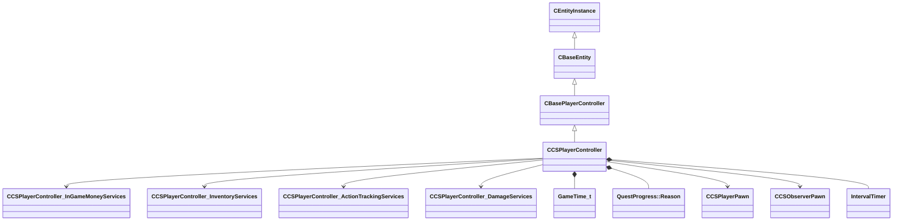

[Schemas](../../schemas.md) / [server](../server.md) / CCSPlayerController

# CCSPlayerController

> Source: **Build 25000182** · 2026-08-28 · `windows-x86_64` · schema `0.10.0`

The server-side controller entity for a CS2 player.  One CCSPlayerController exists per connected client for the lifetime of the connection; it persists across rounds.  The controller owns a CCSPlayerPawn (the physical in-world representation) which may be recreated each round.

> 📝 The controller / pawn split mirrors the Source 2 architecture described in the HL2SDK: a lightweight controller manages session-level state (score, team, competitive rank) while the pawn carries per-round physics and animation state.  Demo parsers should track m_hPlayerPawn to find the corresponding pawn entity handle each round.

**Kind:** class · **Size:** 2728 bytes (`0xaa8`) · **Align:** 8 · **Module:** server

**Twin:** [CCSPlayerController (client)](../client/CCSPlayerController.md)

**Inherits from:** [CBasePlayerController](../server/CBasePlayerController.md)

**Relationships:**

## Memory layout

205 fields (92 declared here, 113 inherited). Offsets are absolute from the object base.

| Offset | Field | Type | From | Annotations |
|--------|-------|------|------|-------------|
| `0x8` | `m_iszPrivateVScripts` | CUtlSymbolLarge | [CEntityInstance](../entity2/CEntityInstance.md) |  |
| `0x10` | `m_pEntity` | [CEntityIdentity](../entity2/CEntityIdentity.md)* | [CEntityInstance](../entity2/CEntityInstance.md) | CEntityIdentity pointer: the entity's identity record (name, class, handle, flags). |
| `0x28` | `m_CScriptComponent` | [CScriptComponent](../entity2/CScriptComponent.md)* | [CEntityInstance](../entity2/CEntityInstance.md) | VScript component attached to the entity, when scripted. |
| `0x30` | `m_CBodyComponent` | [CBodyComponent](../server/CBodyComponent.md)* | [CBaseEntity](../server/CBaseEntity.md) |  |
| `0x38` | `m_NetworkTransmitComponent` | [CNetworkTransmitComponent](../server/CNetworkTransmitComponent.md) | [CBaseEntity](../server/CBaseEntity.md) |  |
| `0x248` | `m_aThinkFunctions` | CUtlVector< thinkfunc_t > | [CBaseEntity](../server/CBaseEntity.md) |  |
| `0x260` | `m_iCurrentThinkContext` | int32 | [CBaseEntity](../server/CBaseEntity.md) | `MNotSaved` |
| `0x264` | `m_nLastThinkTick` | [GameTick_t](../entity2/GameTick_t.md) | [CBaseEntity](../server/CBaseEntity.md) |  |
| `0x268` | `m_bDisabledContextThinks` | bool | [CBaseEntity](../server/CBaseEntity.md) |  |
| `0x278` | `m_isSteadyState` | CTypedBitVec< 64 > | [CBaseEntity](../server/CBaseEntity.md) | `MNotSaved` |
| `0x280` | `m_lastNetworkChange` | float32 | [CBaseEntity](../server/CBaseEntity.md) | `MNotSaved` |
| `0x288` | `m_think` | BASEPTR | [CBaseEntity](../server/CBaseEntity.md) |  |
| `0x290` | `m_ResponseContexts` | CUtlVector< [ResponseContext_t](../server/ResponseContext_t.md) > | [CBaseEntity](../server/CBaseEntity.md) |  |
| `0x2a8` | `m_iszResponseContext` | CUtlSymbolLarge | [CBaseEntity](../server/CBaseEntity.md) |  |
| `0x2b0` | `m_pfnTouch` | ENTITYFUNCPTR | [CBaseEntity](../server/CBaseEntity.md) |  |
| `0x2b8` | `m_pfnUse` | USEPTR | [CBaseEntity](../server/CBaseEntity.md) |  |
| `0x2c0` | `m_pfnBlocked` | ENTITYFUNCPTR | [CBaseEntity](../server/CBaseEntity.md) |  |
| `0x2c8` | `m_pfnMoveDone` | BASEPTR | [CBaseEntity](../server/CBaseEntity.md) |  |
| `0x2d0` | `m_iHealth` | int32 | [CBaseEntity](../server/CBaseEntity.md) | Current health points of the entity. Serialised with the 'ClampHealth' encoder so values above max are clamped. *Sent only to the Player network group and LocalPlayerExclusive.* |
| `0x2d4` | `m_iMaxHealth` | int32 | [CBaseEntity](../server/CBaseEntity.md) | Maximum health points; used to normalise health bars in the HUD. |
| `0x2d8` | `m_lifeState` | uint8 | [CBaseEntity](../server/CBaseEntity.md) | LIFE_STATE enum: 0 = Alive, 1 = Dying, 2 = Dead, 3 = Respawnable, 4 = Discardbody. |
| `0x2dc` | `m_flDamageAccumulator` | float32 | [CBaseEntity](../server/CBaseEntity.md) |  |
| `0x2e0` | `m_bTakesDamage` | bool | [CBaseEntity](../server/CBaseEntity.md) |  |
| `0x2e8` | `m_nTakeDamageFlags` | [TakeDamageFlags_t](../server/TakeDamageFlags_t.md) | [CBaseEntity](../server/CBaseEntity.md) |  |
| `0x2f0` | `m_nPlatformType` | [EntityPlatformTypes_t](../server/EntityPlatformTypes_t.md) | [CBaseEntity](../server/CBaseEntity.md) |  |
| `0x2f2` | `m_MoveCollide` | [MoveCollide_t](../server/MoveCollide_t.md) | [CBaseEntity](../server/CBaseEntity.md) |  |
| `0x2f3` | `m_MoveType` | [MoveType_t](../server/MoveType_t.md) | [CBaseEntity](../server/CBaseEntity.md) |  |
| `0x2f4` | `m_nPreviouslySetMoveType` | [MoveType_t](../server/MoveType_t.md) | [CBaseEntity](../server/CBaseEntity.md) |  |
| `0x2f5` | `m_nActualMoveType` | [MoveType_t](../server/MoveType_t.md) | [CBaseEntity](../server/CBaseEntity.md) |  |
| `0x2f6` | `m_nWaterTouch` | uint8 | [CBaseEntity](../server/CBaseEntity.md) | `MNotSaved` |
| `0x2f7` | `m_nSlimeTouch` | uint8 | [CBaseEntity](../server/CBaseEntity.md) | `MNotSaved` |
| `0x2f8` | `m_bRestoreInHierarchy` | bool | [CBaseEntity](../server/CBaseEntity.md) |  |
| `0x300` | `m_target` | CUtlSymbolLarge | [CBaseEntity](../server/CBaseEntity.md) |  |
| `0x308` | `m_hDamageFilter` | CHandle< [CBaseFilter](../server/CBaseFilter.md) > | [CBaseEntity](../server/CBaseEntity.md) |  |
| `0x310` | `m_iszDamageFilterName` | CUtlSymbolLarge | [CBaseEntity](../server/CBaseEntity.md) |  |
| `0x318` | `m_flMoveDoneTime` | float32 | [CBaseEntity](../server/CBaseEntity.md) |  |
| `0x31c` | `m_nSubclassID` | CUtlStringToken | [CBaseEntity](../server/CBaseEntity.md) |  |
| `0x328` | `m_flAnimTime` | float32 | [CBaseEntity](../server/CBaseEntity.md) | Floating-point timestamp of the most-recent animation update; used by the client for animation interpolation. `MKV3TransferSaveOpsForField GetEngineTimeSaveRestoreOps` |
| `0x32c` | `m_flSimulationTime` | float32 | [CBaseEntity](../server/CBaseEntity.md) | Floating-point timestamp of the most-recent physics simulation step; used by the client for position interpolation. `MKV3TransferSaveOpsForField GetEngineTimeSaveRestoreOps` |
| `0x330` | `m_flCreateTime` | [GameTime_t](../entity2/GameTime_t.md) | [CBaseEntity](../server/CBaseEntity.md) |  |
| `0x334` | `m_bClientSideRagdoll` | bool | [CBaseEntity](../server/CBaseEntity.md) |  |
| `0x335` | `m_ubInterpolationFrame` | uint8 | [CBaseEntity](../server/CBaseEntity.md) |  |
| `0x338` | `m_vPrevVPhysicsUpdatePos` | VectorWS | [CBaseEntity](../server/CBaseEntity.md) |  |
| `0x344` | `m_iTeamNum` | uint8 | [CBaseEntity](../server/CBaseEntity.md) | Team number: 0 = Unassigned, 1 = Spectator, 2 = Terrorist, 3 = Counter-Terrorist. |
| `0x348` | `m_iGlobalname` | CUtlSymbolLarge | [CBaseEntity](../server/CBaseEntity.md) | `MSaveBehavior` |
| `0x350` | `m_iSentToClients` | int32 | [CBaseEntity](../server/CBaseEntity.md) | `MNotSaved` |
| `0x358` | `m_sUniqueHammerID` | CUtlString | [CBaseEntity](../server/CBaseEntity.md) |  |
| `0x360` | `m_spawnflags` | uint32 | [CBaseEntity](../server/CBaseEntity.md) |  |
| `0x364` | `m_nNextThinkTick` | [GameTick_t](../entity2/GameTick_t.md) | [CBaseEntity](../server/CBaseEntity.md) | Server tick on which the entity's Think() function will next execute (-1 = never). |
| `0x368` | `m_nSimulationTick` | int32 | [CBaseEntity](../server/CBaseEntity.md) | `MKV3TransferSaveOpsForField GetEngineTickSaveRestoreOps` |
| `0x370` | `m_OnKilled` | [CEntityIOOutput](../entity2/CEntityIOOutput.md) | [CBaseEntity](../server/CBaseEntity.md) |  |
| `0x388` | `m_fFlags` | uint32 | [CBaseEntity](../server/CBaseEntity.md) | Entity flags bitmask (FL_ONGROUND = 1, FL_DUCKING = 4, FL_INWATER = 8, FL_FROZEN = 0x200, etc.). |
| `0x38c` | `m_vecAbsVelocity` | Vector | [CBaseEntity](../server/CBaseEntity.md) |  |
| `0x398` | `m_vecVelocity` | [CNetworkVelocityVector](../server/CNetworkVelocityVector.md) | [CBaseEntity](../server/CBaseEntity.md) | Current world-space velocity vector of the entity. |
| `0x3c8` | `m_vecBaseVelocity` | Vector | [CBaseEntity](../server/CBaseEntity.md) | Additional world-space velocity contributed by moving platforms, conveyor belts, etc. |
| `0x3d4` | `m_nPushEnumCount` | int32 | [CBaseEntity](../server/CBaseEntity.md) | `MNotSaved` |
| `0x3d8` | `m_pCollision` | [CCollisionProperty](../server/CCollisionProperty.md)* | [CBaseEntity](../server/CBaseEntity.md) | `MNotSaved` |
| `0x3e0` | `m_hEffectEntity` | CHandle< [CBaseEntity](../server/CBaseEntity.md) > | [CBaseEntity](../server/CBaseEntity.md) |  |
| `0x3e4` | `m_hOwnerEntity` | CHandle< [CBaseEntity](../server/CBaseEntity.md) > | [CBaseEntity](../server/CBaseEntity.md) | CHandle to the entity that owns or spawned this entity (e.g. the thrower of a grenade). |
| `0x3e8` | `m_fEffects` | uint32 | [CBaseEntity](../server/CBaseEntity.md) | Effect flags bitmask (EF_NODRAW = 32, EF_NORECEIVESHADOW = 64, etc.). |
| `0x3ec` | `m_hGroundEntity` | CHandle< [CBaseEntity](../server/CBaseEntity.md) > | [CBaseEntity](../server/CBaseEntity.md) | CHandle to the entity this entity is standing on (INVALID_EHANDLE if airborne). |
| `0x3f0` | `m_nGroundBodyIndex` | int32 | [CBaseEntity](../server/CBaseEntity.md) |  |
| `0x3f4` | `m_flFriction` | float32 | [CBaseEntity](../server/CBaseEntity.md) | Surface friction multiplier (1.0 = normal; lower values make the entity slide more). |
| `0x3f8` | `m_flElasticity` | float32 | [CBaseEntity](../server/CBaseEntity.md) |  |
| `0x3fc` | `m_flGravityScale` | float32 | [CBaseEntity](../server/CBaseEntity.md) | Gravity scale multiplier (1.0 = normal; 0 = no gravity). |
| `0x400` | `m_flTimeScale` | float32 | [CBaseEntity](../server/CBaseEntity.md) | Time-scale multiplier applied to this entity's simulation (1.0 = real time; used by bullet time effects). |
| `0x404` | `m_flWaterLevel` | float32 | [CBaseEntity](../server/CBaseEntity.md) |  |
| `0x408` | `m_bGravityDisabled` | bool | [CBaseEntity](../server/CBaseEntity.md) |  |
| `0x409` | `m_bAnimatedEveryTick` | bool | [CBaseEntity](../server/CBaseEntity.md) | True when the entity's animation must be updated every server tick regardless of network interest. |
| `0x40c` | `m_flActualGravityScale` | float32 | [CBaseEntity](../server/CBaseEntity.md) |  |
| `0x410` | `m_bGravityActuallyDisabled` | bool | [CBaseEntity](../server/CBaseEntity.md) |  |
| `0x411` | `m_bDisableLowViolence` | bool | [CBaseEntity](../server/CBaseEntity.md) |  |
| `0x412` | `m_nWaterType` | uint8 | [CBaseEntity](../server/CBaseEntity.md) |  |
| `0x414` | `m_iEFlags` | int32 | [CBaseEntity](../server/CBaseEntity.md) |  |
| `0x418` | `m_OnUser1` | [CEntityIOOutput](../entity2/CEntityIOOutput.md) | [CBaseEntity](../server/CBaseEntity.md) |  |
| `0x430` | `m_OnUser2` | [CEntityIOOutput](../entity2/CEntityIOOutput.md) | [CBaseEntity](../server/CBaseEntity.md) |  |
| `0x448` | `m_OnUser3` | [CEntityIOOutput](../entity2/CEntityIOOutput.md) | [CBaseEntity](../server/CBaseEntity.md) |  |
| `0x460` | `m_OnUser4` | [CEntityIOOutput](../entity2/CEntityIOOutput.md) | [CBaseEntity](../server/CBaseEntity.md) |  |
| `0x478` | `m_iInitialTeamNum` | int32 | [CBaseEntity](../server/CBaseEntity.md) |  |
| `0x47c` | `m_flNavIgnoreUntilTime` | [GameTime_t](../entity2/GameTime_t.md) | [CBaseEntity](../server/CBaseEntity.md) |  |
| `0x480` | `m_vecAngVelocity` | QAngle | [CBaseEntity](../server/CBaseEntity.md) |  |
| `0x48c` | `m_bNetworkQuantizeOriginAndAngles` | bool | [CBaseEntity](../server/CBaseEntity.md) |  |
| `0x48d` | `m_bLagCompensate` | bool | [CBaseEntity](../server/CBaseEntity.md) |  |
| `0x490` | `m_pBlocker` | CHandle< [CBaseEntity](../server/CBaseEntity.md) > | [CBaseEntity](../server/CBaseEntity.md) |  |
| `0x494` | `m_flLocalTime` | float32 | [CBaseEntity](../server/CBaseEntity.md) |  |
| `0x498` | `m_flVPhysicsUpdateLocalTime` | float32 | [CBaseEntity](../server/CBaseEntity.md) |  |
| `0x49c` | `m_nBloodType` | [BloodType](../server/BloodType.md) | [CBaseEntity](../server/CBaseEntity.md) |  |
| `0x4a0` | `m_pPulseGraphInstance` | [CPulseGraphInstance_ServerEntity](../server/CPulseGraphInstance_ServerEntity.md)* | [CBaseEntity](../server/CBaseEntity.md) | `MKV3TransferSaveOpsForField GetPulseInstanceSaveRestoreOps` |
| `0x4b0` | `m_nInButtonsWhichAreToggles` | uint64 | [CBasePlayerController](../server/CBasePlayerController.md) | `MNotSaved` |
| `0x4b8` | `m_nTickBase` | uint32 | [CBasePlayerController](../server/CBasePlayerController.md) | Server tick number at the time of the most-recent usercmd from this client. *Only sent to the owning player (LocalPlayerExclusive). Used for lag compensation and prediction.* `MNotSaved` |
| `0x4e0` | `m_hPawn` | CHandle< [CBasePlayerPawn](../server/CBasePlayerPawn.md) > | [CBasePlayerController](../server/CBasePlayerController.md) | CHandle to the base pawn currently controlled by this controller. *For CS2 human players the concrete type is CCSPlayerPawn.  Use m_hPlayerPawn on CCSPlayerController for the typed handle.* |
| `0x4e4` | `m_bKnownTeamMismatch` | bool | [CBasePlayerController](../server/CBasePlayerController.md) |  |
| `0x4e8` | `m_nSplitScreenSlot` | CSplitScreenSlot | [CBasePlayerController](../server/CBasePlayerController.md) | `MNotSaved` |
| `0x4ec` | `m_hSplitOwner` | CHandle< [CBasePlayerController](../server/CBasePlayerController.md) > | [CBasePlayerController](../server/CBasePlayerController.md) | `MNotSaved` |
| `0x4f0` | `m_hSplitScreenPlayers` | CUtlVector< CHandle< [CBasePlayerController](../server/CBasePlayerController.md) > > | [CBasePlayerController](../server/CBasePlayerController.md) | `MNotSaved` |
| `0x508` | `m_bIsHLTV` | bool | [CBasePlayerController](../server/CBasePlayerController.md) |  |
| `0x50c` | `m_iConnected` | [PlayerConnectedState](../server/PlayerConnectedState.md) | [CBasePlayerController](../server/CBasePlayerController.md) | PlayerConnectedState enum – 0 = Disconnected, 1 = Connected, 2 = Connecting. `MNotSaved` |
| `0x510` | `m_iMostConnected` | [PlayerConnectedState](../server/PlayerConnectedState.md) | [CBasePlayerController](../server/CBasePlayerController.md) | `MNotSaved` |
| `0x514` | `m_iszPlayerName` | char[128] | [CBasePlayerController](../server/CBasePlayerController.md) | Display name of the player, as reported by Steam (up to 128 bytes, UTF-8). `MNotSaved` |
| `0x598` | `m_szNetworkIDString` | CUtlString | [CBasePlayerController](../server/CBasePlayerController.md) | `MNotSaved` |
| `0x5a0` | `m_fLerpTime` | float32 | [CBasePlayerController](../server/CBasePlayerController.md) | `MNotSaved` |
| `0x5a4` | `m_bLagCompensation` | bool | [CBasePlayerController](../server/CBasePlayerController.md) | `MNotSaved` |
| `0x5a5` | `m_bPredict` | bool | [CBasePlayerController](../server/CBasePlayerController.md) | `MNotSaved` |
| `0x5ac` | `m_bIsLowViolence` | bool | [CBasePlayerController](../server/CBasePlayerController.md) | `MNotSaved` |
| `0x5ad` | `m_bGamePaused` | bool | [CBasePlayerController](../server/CBasePlayerController.md) | `MNotSaved` |
| `0x6e8` | `m_iIgnoreGlobalChat` | [ChatIgnoreType_t](../server/ChatIgnoreType_t.md) | [CBasePlayerController](../server/CBasePlayerController.md) | `MNotSaved` |
| `0x6ec` | `m_flLastPlayerTalkTime` | float32 | [CBasePlayerController](../server/CBasePlayerController.md) | `MKV3TransferSaveOpsForField GetEngineTimeSaveRestoreOps` |
| `0x6f0` | `m_flLastEntitySteadyState` | float32 | [CBasePlayerController](../server/CBasePlayerController.md) | `MNotSaved` |
| `0x6f4` | `m_nAvailableEntitySteadyState` | int32 | [CBasePlayerController](../server/CBasePlayerController.md) | `MNotSaved` |
| `0x6f8` | `m_bHasAnySteadyStateEnts` | bool | [CBasePlayerController](../server/CBasePlayerController.md) | `MNotSaved` |
| `0x708` | `m_steamID` | uint64 | [CBasePlayerController](../server/CBasePlayerController.md) | 64-bit Steam account ID (SteamID64) of the connected client. *Transmitted as a fixed64; only sent to the owning player and GOTV.* `MNotSaved` |
| `0x710` | `m_bNoClipEnabled` | bool | [CBasePlayerController](../server/CBasePlayerController.md) | True when sv_cheats noclip is active for this player. |
| `0x714` | `m_iDesiredFOV` | uint32 | [CBasePlayerController](../server/CBasePlayerController.md) | Field-of-view override requested by the player (0 = use server default). |
| `0x7e0` | `m_pInGameMoneyServices` | [CCSPlayerController_InGameMoneyServices](../server/CCSPlayerController_InGameMoneyServices.md)* |  |  |
| `0x7e8` | `m_pInventoryServices` | [CCSPlayerController_InventoryServices](../server/CCSPlayerController_InventoryServices.md)* |  |  |
| `0x7f0` | `m_pActionTrackingServices` | [CCSPlayerController_ActionTrackingServices](../server/CCSPlayerController_ActionTrackingServices.md)* |  |  |
| `0x7f8` | `m_pDamageServices` | [CCSPlayerController_DamageServices](../server/CCSPlayerController_DamageServices.md)* |  |  |
| `0x800` | `m_iPing` | uint32 |  | Player's current network round-trip latency, in milliseconds. *Smoothed by m_flSmoothedPing server-side; updated roughly every 5 s.* |
| `0x804` | `m_bHasCommunicationAbuseMute` | bool |  |  |
| `0x808` | `m_uiCommunicationMuteFlags` | uint32 |  |  |
| `0x810` | `m_szCrosshairCodes` | CUtlSymbolLarge |  | Encoded crosshair configuration string (same format as the cl_crosshair_reticle_* convars share-code). |
| `0x818` | `m_iPendingTeamNum` | uint8 |  | Team number the player will be moved to at the next team-change opportunity. |
| `0x81c` | `m_flForceTeamTime` | [GameTime_t](../entity2/GameTime_t.md) |  | GameTime after which team-forcing is no longer applied. |
| `0x820` | `m_iCompTeammateColor` | int32 |  |  |
| `0x824` | `m_bEverPlayedOnTeam` | bool |  | True once this player has played at least one round as a non-spectator. |
| `0x825` | `m_bAttemptedToGetColor` | bool |  |  |
| `0x828` | `m_iTeammatePreferredColor` | int32 |  |  |
| `0x82c` | `m_bTeamChanged` | bool |  |  |
| `0x82d` | `m_bInSwitchTeam` | bool |  |  |
| `0x82e` | `m_bHasSeenJoinGame` | bool |  |  |
| `0x82f` | `m_bJustBecameSpectator` | bool |  |  |
| `0x830` | `m_bSwitchTeamsOnNextRoundReset` | bool |  |  |
| `0x831` | `m_bRemoveAllItemsOnNextRoundReset` | bool |  |  |
| `0x834` | `m_flLastJoinTeamTime` | [GameTime_t](../entity2/GameTime_t.md) |  |  |
| `0x838` | `m_szClan` | CUtlSymbolLarge |  | Player's clan tag string, displayed next to the name in the scoreboard. |
| `0x840` | `m_iCoachingTeam` | int32 |  | Team number this player is coaching (0 if not coaching). |
| `0x848` | `m_nPlayerDominated` | uint64 |  | 64-bit bitmask; bit N set means this player is dominating player-slot N. |
| `0x850` | `m_nPlayerDominatingMe` | uint64 |  | 64-bit mask of player-slot bits that are currently dominating this player. |
| `0x858` | `m_iCompetitiveRanking` | int32 |  | Player's current Premier/Competitive numeric skill rating. |
| `0x85c` | `m_iCompetitiveWins` | int32 |  | Total number of ranked wins accumulated on this account. |
| `0x860` | `m_iCompetitiveRankType` | int8 |  | Rank type identifier (e.g. 0 = unranked, 11 = Premier, 12 = Competitive). |
| `0x864` | `m_iCompetitiveRankingPredicted_Win` | int32 |  | Predicted rating delta if the match ends in a win for this player. |
| `0x868` | `m_iCompetitiveRankingPredicted_Loss` | int32 |  | Predicted rating delta if the match ends in a loss. |
| `0x86c` | `m_iCompetitiveRankingPredicted_Tie` | int32 |  | Predicted rating delta if the match ends in a tie/draw. |
| `0x870` | `m_nEndMatchNextMapVote` | int32 |  | Index of the map this player has voted for in the end-of-match map vote. |
| `0x874` | `m_unActiveQuestId` | uint16 |  | Active operation mission ID for this player (0 if none active). |
| `0x878` | `m_rtActiveMissionPeriod` | uint32 |  |  |
| `0x87c` | `m_nQuestProgressReason` | [QuestProgress::Reason](../server/QuestProgress.Reason.md) |  | Reason code for the last quest-progress update sent to this player. |
| `0x880` | `m_unPlayerTvControlFlags` | uint32 |  |  |
| `0x8b0` | `m_iDraftIndex` | int32 |  |  |
| `0x8b4` | `m_msQueuedModeDisconnectionTimestamp` | uint32 |  |  |
| `0x8b8` | `m_uiAbandonRecordedReason` | uint32 |  |  |
| `0x8bc` | `m_eNetworkDisconnectionReason` | uint32 |  |  |
| `0x8c0` | `m_bCannotBeKicked` | bool |  |  |
| `0x8c1` | `m_bEverFullyConnected` | bool |  |  |
| `0x8c2` | `m_bAbandonAllowsSurrender` | bool |  |  |
| `0x8c3` | `m_bAbandonOffersInstantSurrender` | bool |  |  |
| `0x8c4` | `m_bDisconnection1MinWarningPrinted` | bool |  |  |
| `0x8c5` | `m_bScoreReported` | bool |  |  |
| `0x8c8` | `m_nDisconnectionTick` | int32 |  | Server tick at which this player disconnected (used for reconnect grace period). |
| `0x8d8` | `m_bControllingBot` | bool |  | True when this human controller has taken over a bot pawn. |
| `0x8d9` | `m_bHasControlledBotThisRound` | bool |  | True if the player took over a bot at any point this round. |
| `0x8da` | `m_bHasBeenControlledByPlayerThisRound` | bool |  |  |
| `0x8dc` | `m_nBotsControlledThisRound` | int32 |  |  |
| `0x8e0` | `m_bCanControlObservedBot` | bool |  | True when the player is allowed to take control of the bot they are spectating. |
| `0x8e4` | `m_hPlayerPawn` | CHandle< [CCSPlayerPawn](../server/CCSPlayerPawn.md) > |  | CHandle pointing to the player's active CCSPlayerPawn. *Becomes invalid (INVALID_EHANDLE) when the player is dead and their pawn has been removed.  Check m_bPawnIsAlive before dereferencing.* |
| `0x8e8` | `m_hObserverPawn` | CHandle< [CCSObserverPawn](../server/CCSObserverPawn.md) > |  | CHandle to the CCSObserverPawn when the player is spectating. *Valid only while the player is in spectator mode; otherwise INVALID_EHANDLE.* |
| `0x8ec` | `m_DesiredObserverMode` | int32 |  |  |
| `0x8f0` | `m_hDesiredObserverTarget` | CEntityHandle |  |  |
| `0x8f4` | `m_bPawnIsAlive` | bool |  | True while the player's pawn is alive and spawned. |
| `0x8f8` | `m_iPawnHealth` | uint32 |  | Current health of the pawn, networked to teammates and spectators. *Only sent to TeammateAndSpectatorExclusive group; enemies do not receive this.* |
| `0x8fc` | `m_iPawnArmor` | int32 |  | Current armor value of the pawn (0–100 for vest, 100+ for helmet). |
| `0x900` | `m_bPawnHasDefuser` | bool |  | True when the pawn is carrying a defuse kit. |
| `0x901` | `m_bPawnHasHelmet` | bool |  | True when the pawn has a full helmet (takes head-shot armor penalty into account). |
| `0x902` | `m_nPawnCharacterDefIndex` | uint16 |  | Item definition index of the character/agent skin equipped on the pawn. |
| `0x904` | `m_iPawnLifetimeStart` | int32 |  | Server tick on which the current pawn was spawned. |
| `0x908` | `m_iPawnLifetimeEnd` | int32 |  | Server tick on which the current pawn died (0 while still alive). |
| `0x90c` | `m_iPawnBotDifficulty` | int32 |  |  |
| `0x910` | `m_hOriginalControllerOfCurrentPawn` | CHandle< [CCSPlayerController](../server/CCSPlayerController.md) > |  | When a human takes over a bot, this holds a handle back to the original bot controller so the pawn can be returned after the human disconnects. |
| `0x914` | `m_iScore` | int32 |  | Lifetime score for this connection (frags minus team-kills, etc.). |
| `0x918` | `m_iRoundScore` | int32 |  |  |
| `0x91c` | `m_iRoundsWon` | int32 |  |  |
| `0x920` | `m_recentKillQueue` | uint8[8] |  | Circular buffer of the 8 most-recent enemy kills this round (pawn entity indices). *Used to determine domination/revenge streaks.* |
| `0x928` | `m_nFirstKill` | uint8 |  | Index within m_recentKillQueue of the oldest valid entry. |
| `0x929` | `m_nKillCount` | uint8 |  | Number of valid entries currently in m_recentKillQueue. |
| `0x92a` | `m_bMvpNoMusic` | bool |  | True when the MVP jingle should be suppressed for this player's MVP award. |
| `0x92c` | `m_eMvpReason` | int32 |  | Reason for the most recent MVP award (enum: 1 = most kills, 2 = bomb defuse, 3 = bomb plant, etc.). |
| `0x930` | `m_iMusicKitID` | int32 |  | Item definition index of the music kit active for this player. |
| `0x934` | `m_iMusicKitMVPs` | int32 |  | Number of MVPs awarded while this music kit has been equipped (affects music kit stat tracking). |
| `0x938` | `m_iMVPs` | int32 |  | Number of MVP stars the player has earned in the current match. |
| `0x93c` | `m_nUpdateCounter` | int32 |  |  |
| `0x940` | `m_flSmoothedPing` | float32 |  |  |
| `0x948` | `m_lastHeldVoteTimer` | [IntervalTimer](../server/IntervalTimer.md) |  |  |
| `0x960` | `m_bShowHints` | bool |  |  |
| `0x964` | `m_iNextTimeCheck` | int32 |  |  |
| `0x968` | `m_bJustDidTeamKill` | bool |  |  |
| `0x969` | `m_bPunishForTeamKill` | bool |  |  |
| `0x96a` | `m_bGaveTeamDamageWarning` | bool |  |  |
| `0x96b` | `m_bGaveTeamDamageWarningThisRound` | bool |  |  |
| `0x970` | `m_dblLastReceivedPacketPlatFloatTime` | float64 |  |  |
| `0x978` | `m_LastTeamDamageWarningTime` | [GameTime_t](../entity2/GameTime_t.md) |  |  |
| `0x97c` | `m_LastTimePlayerWasDisconnectedForPawnsRemove` | [GameTime_t](../entity2/GameTime_t.md) |  |  |
| `0x980` | `m_nSuspiciousHitCount` | uint32 |  |  |
| `0x984` | `m_nNonSuspiciousHitStreak` | uint32 |  |  |
| `0xa29` | `m_bFireBulletsSeedSynchronized` | bool |  | True once the client's bullet-fire PRNG seed has been synchronised with the server. *Only sent to the owning player (LocalPlayerExclusive).* |
