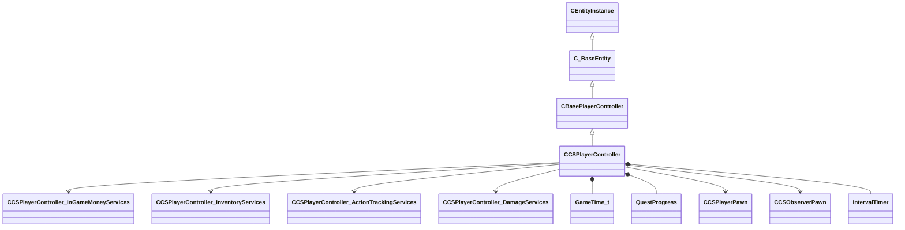

[Schemas](../../schemas.md) / [server](../server.md) / CCSPlayerController

# CCSPlayerController

The server-side controller entity for a CS2 player.  One CCSPlayerController exists per connected client for the lifetime of the connection; it persists across rounds.  The controller owns a CCSPlayerPawn (the physical in-world representation) which may be recreated each round.

> 📝 The controller / pawn split mirrors the Source 2 architecture described in the HL2SDK: a lightweight controller manages session-level state (score, team, competitive rank) while the pawn carries per-round physics and animation state.  Demo parsers should track m_hPlayerPawn to find the corresponding pawn entity handle each round.

**Kind:** class · **Size:** 2728 bytes (`0xaa8`) · **Align:** 8 · **Module:** server

**Inherits from:** [CBasePlayerController](../server/CBasePlayerController.md)

**Relationships:**

## Memory layout

194 fields (92 declared here, 102 inherited). Offsets are absolute from the object base.

| Offset | Field | Type | From | Annotations |
|--------|-------|------|------|-------------|
| `0x8` | `m_iszPrivateVScripts` | CUtlSymbolLarge | [CEntityInstance](../entity2/CEntityInstance.md) |  |
| `0x10` | `m_pEntity` | [CEntityIdentity](../entity2/CEntityIdentity.md)* | [CEntityInstance](../entity2/CEntityInstance.md) |  |
| `0x28` | `m_CScriptComponent` | [CScriptComponent](../entity2/CScriptComponent.md)* | [CEntityInstance](../entity2/CEntityInstance.md) |  |
| `0x30` | `m_CBodyComponent` | [CBodyComponent](../server/CBodyComponent.md)* | [C_BaseEntity](../client/C_BaseEntity.md) |  |
| `0x38` | `m_NetworkTransmitComponent` | [CNetworkTransmitComponent](../server/CNetworkTransmitComponent.md) | [C_BaseEntity](../client/C_BaseEntity.md) | `MNotSaved` |
| `0x328` | `m_nLastThinkTick` | [GameTick_t](../entity2/GameTick_t.md) | [C_BaseEntity](../client/C_BaseEntity.md) | `MNotSaved` |
| `0x330` | `m_pGameSceneNode` | [CGameSceneNode](../server/CGameSceneNode.md)* | [C_BaseEntity](../client/C_BaseEntity.md) | `MNotSaved` |
| `0x338` | `m_pRenderComponent` | [CRenderComponent](../server/CRenderComponent.md)* | [C_BaseEntity](../client/C_BaseEntity.md) | `MNotSaved` |
| `0x340` | `m_pCollision` | [CCollisionProperty](../server/CCollisionProperty.md)* | [C_BaseEntity](../client/C_BaseEntity.md) | `MNotSaved` |
| `0x348` | `m_iMaxHealth` | int32 | [C_BaseEntity](../client/C_BaseEntity.md) | `MNotSaved` |
| `0x34c` | `m_iHealth` | int32 | [C_BaseEntity](../client/C_BaseEntity.md) |  |
| `0x350` | `m_flDamageAccumulator` | float32 | [C_BaseEntity](../client/C_BaseEntity.md) | `MNotSaved` |
| `0x354` | `m_lifeState` | uint8 | [C_BaseEntity](../client/C_BaseEntity.md) | `MNotSaved` |
| `0x355` | `m_bTakesDamage` | bool | [C_BaseEntity](../client/C_BaseEntity.md) | `MNotSaved` |
| `0x358` | `m_nTakeDamageFlags` | [TakeDamageFlags_t](../!GlobalTypes/TakeDamageFlags_t.md) | [C_BaseEntity](../client/C_BaseEntity.md) | `MNotSaved` |
| `0x360` | `m_nPlatformType` | [EntityPlatformTypes_t](../!GlobalTypes/EntityPlatformTypes_t.md) | [C_BaseEntity](../client/C_BaseEntity.md) |  |
| `0x361` | `m_ubInterpolationFrame` | uint8 | [C_BaseEntity](../client/C_BaseEntity.md) | `MNotSaved` |
| `0x364` | `m_hSceneObjectController` | CHandle< [C_BaseEntity](../client/C_BaseEntity.md) > | [C_BaseEntity](../client/C_BaseEntity.md) |  |
| `0x368` | `m_nNoInterpolationTick` | int32 | [C_BaseEntity](../client/C_BaseEntity.md) | `MNotSaved` |
| `0x36c` | `m_nVisibilityNoInterpolationTick` | int32 | [C_BaseEntity](../client/C_BaseEntity.md) | `MNotSaved` |
| `0x370` | `m_flProxyRandomValue` | float32 | [C_BaseEntity](../client/C_BaseEntity.md) | `MNotSaved` |
| `0x374` | `m_iEFlags` | int32 | [C_BaseEntity](../client/C_BaseEntity.md) | `MNotSaved` |
| `0x378` | `m_nWaterType` | uint8 | [C_BaseEntity](../client/C_BaseEntity.md) | `MNotSaved` |
| `0x379` | `m_bInterpolateEvenWithNoModel` | bool | [C_BaseEntity](../client/C_BaseEntity.md) | `MNotSaved` |
| `0x37a` | `m_bPredictionEligible` | bool | [C_BaseEntity](../client/C_BaseEntity.md) | `MNotSaved` |
| `0x37b` | `m_bApplyLayerMatchIDToModel` | bool | [C_BaseEntity](../client/C_BaseEntity.md) | `MNotSaved` |
| `0x37c` | `m_tokLayerMatchID` | CUtlStringToken | [C_BaseEntity](../client/C_BaseEntity.md) | `MNotSaved` |
| `0x380` | `m_nSubclassID` | CUtlStringToken | [C_BaseEntity](../client/C_BaseEntity.md) |  |
| `0x390` | `m_nSimulationTick` | int32 | [C_BaseEntity](../client/C_BaseEntity.md) | `MNotSaved` |
| `0x394` | `m_iCurrentThinkContext` | int32 | [C_BaseEntity](../client/C_BaseEntity.md) | `MNotSaved` |
| `0x398` | `m_aThinkFunctions` | CUtlVector< thinkfunc_t > | [C_BaseEntity](../client/C_BaseEntity.md) | `MNotSaved` |
| `0x3b0` | `m_bDisabledContextThinks` | bool | [C_BaseEntity](../client/C_BaseEntity.md) |  |
| `0x3b4` | `m_flAnimTime` | float32 | [C_BaseEntity](../client/C_BaseEntity.md) | `MNotSaved` |
| `0x3b8` | `m_flSimulationTime` | float32 | [C_BaseEntity](../client/C_BaseEntity.md) | `MNotSaved` |
| `0x3bc` | `m_nSceneObjectOverrideFlags` | uint8 | [C_BaseEntity](../client/C_BaseEntity.md) |  |
| `0x3bd` | `m_bHasSuccessfullyInterpolated` | bool | [C_BaseEntity](../client/C_BaseEntity.md) | `MNotSaved` |
| `0x3be` | `m_bHasAddedVarsToInterpolation` | bool | [C_BaseEntity](../client/C_BaseEntity.md) | `MNotSaved` |
| `0x3bf` | `m_bRenderEvenWhenNotSuccessfullyInterpolated` | bool | [C_BaseEntity](../client/C_BaseEntity.md) | `MNotSaved` |
| `0x3c0` | `m_nInterpolationLatchDirtyFlags` | int32[2] | [C_BaseEntity](../client/C_BaseEntity.md) | `MNotSaved` |
| `0x3c8` | `m_ListEntry` | uint16[11] | [C_BaseEntity](../client/C_BaseEntity.md) | `MNotSaved` |
| `0x3e0` | `m_flCreateTime` | [GameTime_t](../entity2/GameTime_t.md) | [C_BaseEntity](../client/C_BaseEntity.md) | `MNotSaved` |
| `0x3e4` | `m_EntClientFlags` | uint16 | [C_BaseEntity](../client/C_BaseEntity.md) | `MNotSaved` |
| `0x3e6` | `m_bClientSideRagdoll` | bool | [C_BaseEntity](../client/C_BaseEntity.md) | `MNotSaved` |
| `0x3e7` | `m_iTeamNum` | uint8 | [C_BaseEntity](../client/C_BaseEntity.md) | `MNotSaved` |
| `0x3e8` | `m_spawnflags` | uint32 | [C_BaseEntity](../client/C_BaseEntity.md) |  |
| `0x3ec` | `m_nNextThinkTick` | [GameTick_t](../entity2/GameTick_t.md) | [C_BaseEntity](../client/C_BaseEntity.md) | `MNotSaved` |
| `0x3f4` | `m_fFlags` | uint32 | [C_BaseEntity](../client/C_BaseEntity.md) | `MSaveBehavior` |
| `0x3f8` | `m_vecAbsVelocity` | Vector | [C_BaseEntity](../client/C_BaseEntity.md) | `MNotSaved` |
| `0x404` | `m_vecServerVelocity` | [CNetworkVelocityVector](../server/CNetworkVelocityVector.md) | [C_BaseEntity](../client/C_BaseEntity.md) | `MNotSaved` |
| `0x430` | `m_vecVelocity` | [CNetworkVelocityVector](../server/CNetworkVelocityVector.md) | [C_BaseEntity](../client/C_BaseEntity.md) |  |
| `0x510` | `m_vecBaseVelocity` | Vector | [C_BaseEntity](../client/C_BaseEntity.md) | `MNotSaved` |
| `0x51c` | `m_hEffectEntity` | CHandle< [C_BaseEntity](../client/C_BaseEntity.md) > | [C_BaseEntity](../client/C_BaseEntity.md) | `MNotSaved` |
| `0x520` | `m_hOwnerEntity` | CHandle< [C_BaseEntity](../client/C_BaseEntity.md) > | [C_BaseEntity](../client/C_BaseEntity.md) |  |
| `0x524` | `m_MoveCollide` | [MoveCollide_t](../!GlobalTypes/MoveCollide_t.md) | [C_BaseEntity](../client/C_BaseEntity.md) | `MNotSaved` |
| `0x525` | `m_MoveType` | [MoveType_t](../!GlobalTypes/MoveType_t.md) | [C_BaseEntity](../client/C_BaseEntity.md) |  |
| `0x526` | `m_nActualMoveType` | [MoveType_t](../!GlobalTypes/MoveType_t.md) | [C_BaseEntity](../client/C_BaseEntity.md) |  |
| `0x528` | `m_flWaterLevel` | float32 | [C_BaseEntity](../client/C_BaseEntity.md) | `MNotSaved` |
| `0x52c` | `m_fEffects` | uint32 | [C_BaseEntity](../client/C_BaseEntity.md) | `MNotSaved` |
| `0x530` | `m_hGroundEntity` | CHandle< [C_BaseEntity](../client/C_BaseEntity.md) > | [C_BaseEntity](../client/C_BaseEntity.md) | `MNotSaved` |
| `0x534` | `m_nGroundBodyIndex` | int32 | [C_BaseEntity](../client/C_BaseEntity.md) | `MNotSaved` |
| `0x538` | `m_flFriction` | float32 | [C_BaseEntity](../client/C_BaseEntity.md) | `MNotSaved` |
| `0x53c` | `m_flElasticity` | float32 | [C_BaseEntity](../client/C_BaseEntity.md) | `MNotSaved` |
| `0x540` | `m_flGravityScale` | float32 | [C_BaseEntity](../client/C_BaseEntity.md) | `MNotSaved` |
| `0x544` | `m_flTimeScale` | float32 | [C_BaseEntity](../client/C_BaseEntity.md) | `MNotSaved` |
| `0x548` | `m_bAnimatedEveryTick` | bool | [C_BaseEntity](../client/C_BaseEntity.md) | `MNotSaved` |
| `0x549` | `m_bGravityDisabled` | bool | [C_BaseEntity](../client/C_BaseEntity.md) |  |
| `0x54c` | `m_flNavIgnoreUntilTime` | [GameTime_t](../entity2/GameTime_t.md) | [C_BaseEntity](../client/C_BaseEntity.md) | `MNotSaved` |
| `0x550` | `m_hThink` | uint16 | [C_BaseEntity](../client/C_BaseEntity.md) | `MNotSaved` |
| `0x560` | `m_fBBoxVisFlags` | uint8 | [C_BaseEntity](../client/C_BaseEntity.md) | `MNotSaved` |
| `0x564` | `m_flActualGravityScale` | float32 | [C_BaseEntity](../client/C_BaseEntity.md) |  |
| `0x568` | `m_bGravityActuallyDisabled` | bool | [C_BaseEntity](../client/C_BaseEntity.md) |  |
| `0x569` | `m_bPredictable` | bool | [C_BaseEntity](../client/C_BaseEntity.md) | `MNotSaved` |
| `0x56a` | `m_bRenderWithViewModels` | bool | [C_BaseEntity](../client/C_BaseEntity.md) |  |
| `0x56c` | `m_nFirstPredictableCommand` | int32 | [C_BaseEntity](../client/C_BaseEntity.md) | `MNotSaved` |
| `0x570` | `m_nLastPredictableCommand` | int32 | [C_BaseEntity](../client/C_BaseEntity.md) | `MNotSaved` |
| `0x574` | `m_hOldMoveParent` | CHandle< [C_BaseEntity](../client/C_BaseEntity.md) > | [C_BaseEntity](../client/C_BaseEntity.md) | `MNotSaved` |
| `0x578` | `m_Particles` | [CParticleProperty](../particleslib/CParticleProperty.md) | [C_BaseEntity](../client/C_BaseEntity.md) | `MNotSaved` |
| `0x5a8` | `m_vecAngVelocity` | QAngle | [C_BaseEntity](../client/C_BaseEntity.md) |  |
| `0x5b4` | `m_DataChangeEventRef` | int32 | [C_BaseEntity](../client/C_BaseEntity.md) | `MNotSaved` |
| `0x5b8` | `m_dependencies` | CUtlVector< CEntityHandle > | [C_BaseEntity](../client/C_BaseEntity.md) | `MNotSaved` |
| `0x5d0` | `m_nCreationTick` | int32 | [C_BaseEntity](../client/C_BaseEntity.md) | `MNotSaved` |
| `0x5e1` | `m_bAnimTimeChanged` | bool | [C_BaseEntity](../client/C_BaseEntity.md) | `MNotSaved` |
| `0x5e2` | `m_bSimulationTimeChanged` | bool | [C_BaseEntity](../client/C_BaseEntity.md) | `MNotSaved` |
| `0x5f0` | `m_sUniqueHammerID` | CUtlString | [C_BaseEntity](../client/C_BaseEntity.md) | `MNotSaved` |
| `0x5f8` | `m_nBloodType` | [BloodType](../!GlobalTypes/BloodType.md) | [C_BaseEntity](../client/C_BaseEntity.md) |  |
| `0x608` | `m_CommandContext` | [C_CommandContext](../client/C_CommandContext.md) | [CBasePlayerController](../server/CBasePlayerController.md) | `MNotSaved` |
| `0x6b0` | `m_nInButtonsWhichAreToggles` | uint64 | [CBasePlayerController](../server/CBasePlayerController.md) | `MNotSaved` |
| `0x6b8` | `m_nTickBase` | uint32 | [CBasePlayerController](../server/CBasePlayerController.md) | `MNotSaved` |
| `0x6bc` | `m_hPawn` | CHandle< [C_BasePlayerPawn](../client/C_BasePlayerPawn.md) > | [CBasePlayerController](../server/CBasePlayerController.md) |  |
| `0x6c0` | `m_bKnownTeamMismatch` | bool | [CBasePlayerController](../server/CBasePlayerController.md) |  |
| `0x6c4` | `m_hPredictedPawn` | CHandle< [C_BasePlayerPawn](../client/C_BasePlayerPawn.md) > | [CBasePlayerController](../server/CBasePlayerController.md) | `MNotSaved` |
| `0x6c8` | `m_nSplitScreenSlot` | CSplitScreenSlot | [CBasePlayerController](../server/CBasePlayerController.md) | `MNotSaved` |
| `0x6cc` | `m_hSplitOwner` | CHandle< [CBasePlayerController](../server/CBasePlayerController.md) > | [CBasePlayerController](../server/CBasePlayerController.md) | `MNotSaved` |
| `0x6d0` | `m_hSplitScreenPlayers` | CUtlVector< CHandle< [CBasePlayerController](../server/CBasePlayerController.md) > > | [CBasePlayerController](../server/CBasePlayerController.md) | `MNotSaved` |
| `0x6e8` | `m_bIsHLTV` | bool | [CBasePlayerController](../server/CBasePlayerController.md) |  |
| `0x6ec` | `m_iConnected` | [PlayerConnectedState](../!GlobalTypes/PlayerConnectedState.md) | [CBasePlayerController](../server/CBasePlayerController.md) | `MNotSaved` |
| `0x6f0` | `m_iMostConnected` | [PlayerConnectedState](../!GlobalTypes/PlayerConnectedState.md) | [CBasePlayerController](../server/CBasePlayerController.md) | `MNotSaved` |
| `0x6f4` | `m_iszPlayerName` | char[128] | [CBasePlayerController](../server/CBasePlayerController.md) | `MNotSaved` |
| `0x780` | `m_steamID` | uint64 | [CBasePlayerController](../server/CBasePlayerController.md) | `MNotSaved` |
| `0x788` | `m_bIsLocalPlayerController` | bool | [CBasePlayerController](../server/CBasePlayerController.md) | `MNotSaved` |
| `0x789` | `m_bNoClipEnabled` | bool | [CBasePlayerController](../server/CBasePlayerController.md) |  |
| `0x78c` | `m_iDesiredFOV` | uint32 | [CBasePlayerController](../server/CBasePlayerController.md) |  |
| `0x7e0` | `m_pInGameMoneyServices` | [CCSPlayerController_InGameMoneyServices](../server/CCSPlayerController_InGameMoneyServices.md)* |  |  |
| `0x7e8` | `m_pInventoryServices` | [CCSPlayerController_InventoryServices](../server/CCSPlayerController_InventoryServices.md)* |  |  |
| `0x7f0` | `m_pActionTrackingServices` | [CCSPlayerController_ActionTrackingServices](../server/CCSPlayerController_ActionTrackingServices.md)* |  |  |
| `0x7f8` | `m_pDamageServices` | [CCSPlayerController_DamageServices](../server/CCSPlayerController_DamageServices.md)* |  |  |
| `0x800` | `m_iPing` | uint32 |  | Player's current network round-trip latency, in milliseconds. *Smoothed by m_flSmoothedPing server-side; updated roughly every 5 s.* |
| `0x804` | `m_bHasCommunicationAbuseMute` | bool |  |  |
| `0x808` | `m_uiCommunicationMuteFlags` | uint32 |  |  |
| `0x810` | `m_szCrosshairCodes` | CUtlSymbolLarge |  | Encoded crosshair configuration string (same format as the cl_crosshair_reticle_* convars share-code). |
| `0x818` | `m_iPendingTeamNum` | uint8 |  | Team number the player will be moved to at the next team-change opportunity. |
| `0x81c` | `m_flForceTeamTime` | [GameTime_t](../entity2/GameTime_t.md) |  | GameTime after which team-forcing is no longer applied. |
| `0x820` | `m_iCompTeammateColor` | int32 |  |  |
| `0x824` | `m_bEverPlayedOnTeam` | bool |  | True once this player has played at least one round as a non-spectator. |
| `0x825` | `m_bAttemptedToGetColor` | bool |  |  |
| `0x828` | `m_iTeammatePreferredColor` | int32 |  |  |
| `0x82c` | `m_bTeamChanged` | bool |  |  |
| `0x82d` | `m_bInSwitchTeam` | bool |  |  |
| `0x82e` | `m_bHasSeenJoinGame` | bool |  |  |
| `0x82f` | `m_bJustBecameSpectator` | bool |  |  |
| `0x830` | `m_bSwitchTeamsOnNextRoundReset` | bool |  |  |
| `0x831` | `m_bRemoveAllItemsOnNextRoundReset` | bool |  |  |
| `0x834` | `m_flLastJoinTeamTime` | [GameTime_t](../entity2/GameTime_t.md) |  |  |
| `0x838` | `m_szClan` | CUtlSymbolLarge |  | Player's clan tag string, displayed next to the name in the scoreboard. |
| `0x840` | `m_iCoachingTeam` | int32 |  | Team number this player is coaching (0 if not coaching). |
| `0x848` | `m_nPlayerDominated` | uint64 |  | 64-bit bitmask; bit N set means this player is dominating player-slot N. |
| `0x850` | `m_nPlayerDominatingMe` | uint64 |  | 64-bit mask of player-slot bits that are currently dominating this player.
 |
| `0x858` | `m_iCompetitiveRanking` | int32 |  | Player's current Premier/Competitive numeric skill rating. |
| `0x85c` | `m_iCompetitiveWins` | int32 |  | Total number of ranked wins accumulated on this account. |
| `0x860` | `m_iCompetitiveRankType` | int8 |  | Rank type identifier (e.g. 0 = unranked, 11 = Premier, 12 = Competitive). |
| `0x864` | `m_iCompetitiveRankingPredicted_Win` | int32 |  | Predicted rating delta if the match ends in a win for this player. |
| `0x868` | `m_iCompetitiveRankingPredicted_Loss` | int32 |  | Predicted rating delta if the match ends in a loss. |
| `0x86c` | `m_iCompetitiveRankingPredicted_Tie` | int32 |  | Predicted rating delta if the match ends in a tie/draw. |
| `0x870` | `m_nEndMatchNextMapVote` | int32 |  | Index of the map this player has voted for in the end-of-match map vote. |
| `0x874` | `m_unActiveQuestId` | uint16 |  | Active operation mission ID for this player (0 if none active). |
| `0x878` | `m_rtActiveMissionPeriod` | uint32 |  |  |
| `0x87c` | `m_nQuestProgressReason` | [QuestProgress](../server/QuestProgress.md)::Reason |  | Reason code for the last quest-progress update sent to this player. |
| `0x880` | `m_unPlayerTvControlFlags` | uint32 |  |  |
| `0x8b0` | `m_iDraftIndex` | int32 |  |  |
| `0x8b4` | `m_msQueuedModeDisconnectionTimestamp` | uint32 |  |  |
| `0x8b8` | `m_uiAbandonRecordedReason` | uint32 |  |  |
| `0x8bc` | `m_eNetworkDisconnectionReason` | uint32 |  |  |
| `0x8c0` | `m_bCannotBeKicked` | bool |  |  |
| `0x8c1` | `m_bEverFullyConnected` | bool |  |  |
| `0x8c2` | `m_bAbandonAllowsSurrender` | bool |  |  |
| `0x8c3` | `m_bAbandonOffersInstantSurrender` | bool |  |  |
| `0x8c4` | `m_bDisconnection1MinWarningPrinted` | bool |  |  |
| `0x8c5` | `m_bScoreReported` | bool |  |  |
| `0x8c8` | `m_nDisconnectionTick` | int32 |  | Server tick at which this player disconnected (used for reconnect grace period). |
| `0x8d8` | `m_bControllingBot` | bool |  | True when this human controller has taken over a bot pawn. |
| `0x8d9` | `m_bHasControlledBotThisRound` | bool |  | True if the player took over a bot at any point this round. |
| `0x8da` | `m_bHasBeenControlledByPlayerThisRound` | bool |  |  |
| `0x8dc` | `m_nBotsControlledThisRound` | int32 |  |  |
| `0x8e0` | `m_bCanControlObservedBot` | bool |  | True when the player is allowed to take control of the bot they are spectating. |
| `0x8e4` | `m_hPlayerPawn` | CHandle< [CCSPlayerPawn](../server/CCSPlayerPawn.md) > |  | CHandle pointing to the player's active CCSPlayerPawn. *Becomes invalid (INVALID_EHANDLE) when the player is dead and their pawn has been removed.  Check m_bPawnIsAlive before dereferencing.
* |
| `0x8e8` | `m_hObserverPawn` | CHandle< [CCSObserverPawn](../server/CCSObserverPawn.md) > |  | CHandle to the CCSObserverPawn when the player is spectating. *Valid only while the player is in spectator mode; otherwise INVALID_EHANDLE.* |
| `0x8ec` | `m_DesiredObserverMode` | int32 |  |  |
| `0x8f0` | `m_hDesiredObserverTarget` | CEntityHandle |  |  |
| `0x8f4` | `m_bPawnIsAlive` | bool |  | True while the player's pawn is alive and spawned. |
| `0x8f8` | `m_iPawnHealth` | uint32 |  | Current health of the pawn, networked to teammates and spectators. *Only sent to TeammateAndSpectatorExclusive group; enemies do not receive this.* |
| `0x8fc` | `m_iPawnArmor` | int32 |  | Current armor value of the pawn (0–100 for vest, 100+ for helmet). |
| `0x900` | `m_bPawnHasDefuser` | bool |  | True when the pawn is carrying a defuse kit. |
| `0x901` | `m_bPawnHasHelmet` | bool |  | True when the pawn has a full helmet (takes head-shot armor penalty into account). |
| `0x902` | `m_nPawnCharacterDefIndex` | uint16 |  | Item definition index of the character/agent skin equipped on the pawn. |
| `0x904` | `m_iPawnLifetimeStart` | int32 |  | Server tick on which the current pawn was spawned. |
| `0x908` | `m_iPawnLifetimeEnd` | int32 |  | Server tick on which the current pawn died (0 while still alive). |
| `0x90c` | `m_iPawnBotDifficulty` | int32 |  |  |
| `0x910` | `m_hOriginalControllerOfCurrentPawn` | CHandle< [CCSPlayerController](../server/CCSPlayerController.md) > |  | When a human takes over a bot, this holds a handle back to the original bot controller so the pawn can be returned after the human disconnects.
 |
| `0x914` | `m_iScore` | int32 |  | Lifetime score for this connection (frags minus team-kills, etc.). |
| `0x918` | `m_iRoundScore` | int32 |  |  |
| `0x91c` | `m_iRoundsWon` | int32 |  |  |
| `0x920` | `m_recentKillQueue` | uint8[8] |  | Circular buffer of the 8 most-recent enemy kills this round (pawn entity indices). *Used to determine domination/revenge streaks.* |
| `0x928` | `m_nFirstKill` | uint8 |  | Index within m_recentKillQueue of the oldest valid entry. |
| `0x929` | `m_nKillCount` | uint8 |  | Number of valid entries currently in m_recentKillQueue. |
| `0x92a` | `m_bMvpNoMusic` | bool |  | True when the MVP jingle should be suppressed for this player's MVP award. |
| `0x92c` | `m_eMvpReason` | int32 |  | Reason for the most recent MVP award (enum: 1 = most kills, 2 = bomb defuse, 3 = bomb plant, etc.). |
| `0x930` | `m_iMusicKitID` | int32 |  | Item definition index of the music kit active for this player. |
| `0x934` | `m_iMusicKitMVPs` | int32 |  | Number of MVPs awarded while this music kit has been equipped (affects music kit stat tracking). |
| `0x938` | `m_iMVPs` | int32 |  | Number of MVP stars the player has earned in the current match. |
| `0x93c` | `m_nUpdateCounter` | int32 |  |  |
| `0x940` | `m_flSmoothedPing` | float32 |  |  |
| `0x948` | `m_lastHeldVoteTimer` | [IntervalTimer](../server/IntervalTimer.md) |  |  |
| `0x960` | `m_bShowHints` | bool |  |  |
| `0x964` | `m_iNextTimeCheck` | int32 |  |  |
| `0x968` | `m_bJustDidTeamKill` | bool |  |  |
| `0x969` | `m_bPunishForTeamKill` | bool |  |  |
| `0x96a` | `m_bGaveTeamDamageWarning` | bool |  |  |
| `0x96b` | `m_bGaveTeamDamageWarningThisRound` | bool |  |  |
| `0x970` | `m_dblLastReceivedPacketPlatFloatTime` | float64 |  |  |
| `0x978` | `m_LastTeamDamageWarningTime` | [GameTime_t](../entity2/GameTime_t.md) |  |  |
| `0x97c` | `m_LastTimePlayerWasDisconnectedForPawnsRemove` | [GameTime_t](../entity2/GameTime_t.md) |  |  |
| `0x980` | `m_nSuspiciousHitCount` | uint32 |  |  |
| `0x984` | `m_nNonSuspiciousHitStreak` | uint32 |  |  |
| `0xa29` | `m_bFireBulletsSeedSynchronized` | bool |  | True once the client's bullet-fire PRNG seed has been synchronised with the server. *Only sent to the owning player (LocalPlayerExclusive).* |
