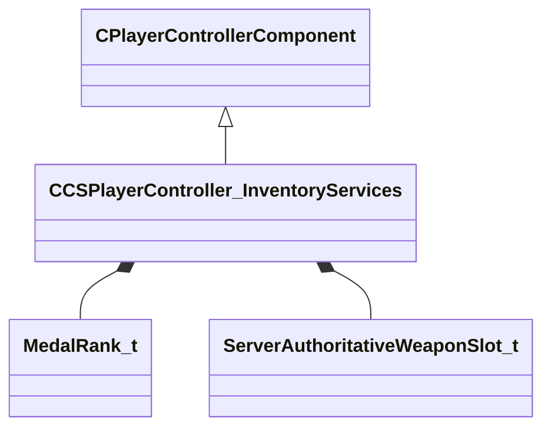

[Schemas](../../schemas.md) / [server](../server.md) / CCSPlayerController_InventoryServices

# CCSPlayerController_InventoryServices

Loadout and persona component of CCSPlayerController: equipped items, music kit, rank, and public-profile data.

**Kind:** class · **Size:** 4064 bytes (`0xfe0`) · **Align:** 255 · **Module:** server

**Inherits from:** [CPlayerControllerComponent](../server/CPlayerControllerComponent.md)

**Relationships:**

## Memory layout

11 fields (10 declared here, 1 inherited). Offsets are absolute from the object base.

| Offset | Field | Type | From | Annotations |
|--------|-------|------|------|-------------|
| `0x8` | `__m_pChainEntity` | [CNetworkVarChainer](../entity2/CNetworkVarChainer.md) | [CPlayerControllerComponent](../server/CPlayerControllerComponent.md) | `MNotSaved` |
| `0x40` | `m_unMusicID` | uint16 |  | Item id of the equipped music kit. |
| `0x44` | `m_rank` | [MedalRank_t](../server/MedalRank_t.md)[6] |  | Competitive rank / medal ids, indexed per game mode. |
| `0x5c` | `m_nPersonaDataPublicLevel` | int32 |  | Public profile (Steam persona) level. |
| `0x60` | `m_nPersonaDataPublicCommendsLeader` | int32 |  |  |
| `0x64` | `m_nPersonaDataPublicCommendsTeacher` | int32 |  |  |
| `0x68` | `m_nPersonaDataPublicCommendsFriendly` | int32 |  |  |
| `0x6c` | `m_nPersonaDataXpTrailLevel` | int32 |  |  |
| `0xf48` | `m_unEquippedPlayerSprayIDs` | uint32[1] |  |  |
| `0xf50` | `m_unCurrentLoadoutHash` | uint64 |  |  |
| `0xf58` | `m_vecServerAuthoritativeWeaponSlots` | CUtlVectorEmbeddedNetworkVar< [ServerAuthoritativeWeaponSlot_t](../server/ServerAuthoritativeWeaponSlot_t.md) > |  |  |
