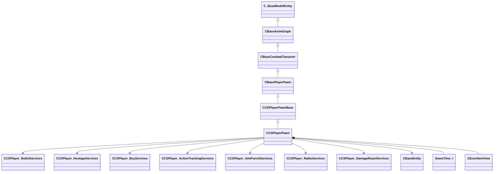

[Schemas](../../schemas.md) / [server](../server.md) / CCSPlayerPawn

# CCSPlayerPawn

The physical in-world representation of a CS2 player.  Carries per-round state: health, armor, position, animations, and weapon inventory.  A new CCSPlayerPawn is created each round on (re)spawn; the corresponding CCSPlayerController persists across rounds.

> 📝 Source 2 architecture separates the controller (session/connection state) from the pawn (physics/animation state).  Demo parsers must follow m_hController → CCSPlayerController to resolve name, team, and stats.

**Kind:** class · **Size:** 4992 bytes (`0x1380`) · **Align:** 16 · **Module:** server

**Inherits from:** [CCSPlayerPawnBase](../server/CCSPlayerPawnBase.md)

**Relationships:**

## Memory layout

301 fields (105 declared here, 196 inherited). Offsets are absolute from the object base.

| Offset | Field | Type | From | Annotations |
|--------|-------|------|------|-------------|
| `0x8` | `m_iszPrivateVScripts` | CUtlSymbolLarge | [CEntityInstance](../entity2/CEntityInstance.md) |  |
| `0x10` | `m_pEntity` | [CEntityIdentity](../entity2/CEntityIdentity.md)* | [CEntityInstance](../entity2/CEntityInstance.md) |  |
| `0x28` | `m_CScriptComponent` | [CScriptComponent](../entity2/CScriptComponent.md)* | [CEntityInstance](../entity2/CEntityInstance.md) |  |
| `0x30` | `m_CBodyComponent` | [CBodyComponent](../server/CBodyComponent.md)* | [C_BaseEntity](../client/C_BaseEntity.md) |  |
| `0x38` | `m_NetworkTransmitComponent` | [CNetworkTransmitComponent](../server/CNetworkTransmitComponent.md) | [C_BaseEntity](../client/C_BaseEntity.md) | `MNotSaved` |
| `0x328` | `m_nLastThinkTick` | [GameTick_t](../entity2/GameTick_t.md) | [C_BaseEntity](../client/C_BaseEntity.md) | `MNotSaved` |
| `0x330` | `m_pGameSceneNode` | [CGameSceneNode](../server/CGameSceneNode.md)* | [C_BaseEntity](../client/C_BaseEntity.md) | `MNotSaved` |
| `0x338` | `m_pRenderComponent` | [CRenderComponent](../server/CRenderComponent.md)* | [C_BaseEntity](../client/C_BaseEntity.md) | `MNotSaved` |
| `0x340` | `m_pCollision` | [CCollisionProperty](../server/CCollisionProperty.md)* | [C_BaseEntity](../client/C_BaseEntity.md) | `MNotSaved` |
| `0x348` | `m_iMaxHealth` | int32 | [C_BaseEntity](../client/C_BaseEntity.md) | `MNotSaved` |
| `0x34c` | `m_iHealth` | int32 | [C_BaseEntity](../client/C_BaseEntity.md) |  |
| `0x350` | `m_flDamageAccumulator` | float32 | [C_BaseEntity](../client/C_BaseEntity.md) | `MNotSaved` |
| `0x354` | `m_lifeState` | uint8 | [C_BaseEntity](../client/C_BaseEntity.md) | `MNotSaved` |
| `0x355` | `m_bTakesDamage` | bool | [C_BaseEntity](../client/C_BaseEntity.md) | `MNotSaved` |
| `0x358` | `m_nTakeDamageFlags` | [TakeDamageFlags_t](../!GlobalTypes/TakeDamageFlags_t.md) | [C_BaseEntity](../client/C_BaseEntity.md) | `MNotSaved` |
| `0x360` | `m_nPlatformType` | [EntityPlatformTypes_t](../!GlobalTypes/EntityPlatformTypes_t.md) | [C_BaseEntity](../client/C_BaseEntity.md) |  |
| `0x361` | `m_ubInterpolationFrame` | uint8 | [C_BaseEntity](../client/C_BaseEntity.md) | `MNotSaved` |
| `0x364` | `m_hSceneObjectController` | CHandle< [C_BaseEntity](../client/C_BaseEntity.md) > | [C_BaseEntity](../client/C_BaseEntity.md) |  |
| `0x368` | `m_nNoInterpolationTick` | int32 | [C_BaseEntity](../client/C_BaseEntity.md) | `MNotSaved` |
| `0x36c` | `m_nVisibilityNoInterpolationTick` | int32 | [C_BaseEntity](../client/C_BaseEntity.md) | `MNotSaved` |
| `0x370` | `m_flProxyRandomValue` | float32 | [C_BaseEntity](../client/C_BaseEntity.md) | `MNotSaved` |
| `0x374` | `m_iEFlags` | int32 | [C_BaseEntity](../client/C_BaseEntity.md) | `MNotSaved` |
| `0x378` | `m_nWaterType` | uint8 | [C_BaseEntity](../client/C_BaseEntity.md) | `MNotSaved` |
| `0x379` | `m_bInterpolateEvenWithNoModel` | bool | [C_BaseEntity](../client/C_BaseEntity.md) | `MNotSaved` |
| `0x37a` | `m_bPredictionEligible` | bool | [C_BaseEntity](../client/C_BaseEntity.md) | `MNotSaved` |
| `0x37b` | `m_bApplyLayerMatchIDToModel` | bool | [C_BaseEntity](../client/C_BaseEntity.md) | `MNotSaved` |
| `0x37c` | `m_tokLayerMatchID` | CUtlStringToken | [C_BaseEntity](../client/C_BaseEntity.md) | `MNotSaved` |
| `0x380` | `m_nSubclassID` | CUtlStringToken | [C_BaseEntity](../client/C_BaseEntity.md) |  |
| `0x390` | `m_nSimulationTick` | int32 | [C_BaseEntity](../client/C_BaseEntity.md) | `MNotSaved` |
| `0x394` | `m_iCurrentThinkContext` | int32 | [C_BaseEntity](../client/C_BaseEntity.md) | `MNotSaved` |
| `0x398` | `m_aThinkFunctions` | CUtlVector< thinkfunc_t > | [C_BaseEntity](../client/C_BaseEntity.md) | `MNotSaved` |
| `0x3b0` | `m_bDisabledContextThinks` | bool | [C_BaseEntity](../client/C_BaseEntity.md) |  |
| `0x3b4` | `m_flAnimTime` | float32 | [C_BaseEntity](../client/C_BaseEntity.md) | `MNotSaved` |
| `0x3b8` | `m_flSimulationTime` | float32 | [C_BaseEntity](../client/C_BaseEntity.md) | `MNotSaved` |
| `0x3bc` | `m_nSceneObjectOverrideFlags` | uint8 | [C_BaseEntity](../client/C_BaseEntity.md) |  |
| `0x3bd` | `m_bHasSuccessfullyInterpolated` | bool | [C_BaseEntity](../client/C_BaseEntity.md) | `MNotSaved` |
| `0x3be` | `m_bHasAddedVarsToInterpolation` | bool | [C_BaseEntity](../client/C_BaseEntity.md) | `MNotSaved` |
| `0x3bf` | `m_bRenderEvenWhenNotSuccessfullyInterpolated` | bool | [C_BaseEntity](../client/C_BaseEntity.md) | `MNotSaved` |
| `0x3c0` | `m_nInterpolationLatchDirtyFlags` | int32[2] | [C_BaseEntity](../client/C_BaseEntity.md) | `MNotSaved` |
| `0x3c8` | `m_ListEntry` | uint16[11] | [C_BaseEntity](../client/C_BaseEntity.md) | `MNotSaved` |
| `0x3e0` | `m_flCreateTime` | [GameTime_t](../entity2/GameTime_t.md) | [C_BaseEntity](../client/C_BaseEntity.md) | `MNotSaved` |
| `0x3e4` | `m_EntClientFlags` | uint16 | [C_BaseEntity](../client/C_BaseEntity.md) | `MNotSaved` |
| `0x3e6` | `m_bClientSideRagdoll` | bool | [C_BaseEntity](../client/C_BaseEntity.md) | `MNotSaved` |
| `0x3e7` | `m_iTeamNum` | uint8 | [C_BaseEntity](../client/C_BaseEntity.md) | `MNotSaved` |
| `0x3e8` | `m_spawnflags` | uint32 | [C_BaseEntity](../client/C_BaseEntity.md) |  |
| `0x3ec` | `m_nNextThinkTick` | [GameTick_t](../entity2/GameTick_t.md) | [C_BaseEntity](../client/C_BaseEntity.md) | `MNotSaved` |
| `0x3f4` | `m_fFlags` | uint32 | [C_BaseEntity](../client/C_BaseEntity.md) | `MSaveBehavior` |
| `0x3f8` | `m_vecAbsVelocity` | Vector | [C_BaseEntity](../client/C_BaseEntity.md) | `MNotSaved` |
| `0x404` | `m_vecServerVelocity` | [CNetworkVelocityVector](../server/CNetworkVelocityVector.md) | [C_BaseEntity](../client/C_BaseEntity.md) | `MNotSaved` |
| `0x430` | `m_vecVelocity` | [CNetworkVelocityVector](../server/CNetworkVelocityVector.md) | [C_BaseEntity](../client/C_BaseEntity.md) |  |
| `0x510` | `m_vecBaseVelocity` | Vector | [C_BaseEntity](../client/C_BaseEntity.md) | `MNotSaved` |
| `0x51c` | `m_hEffectEntity` | CHandle< [C_BaseEntity](../client/C_BaseEntity.md) > | [C_BaseEntity](../client/C_BaseEntity.md) | `MNotSaved` |
| `0x520` | `m_hOwnerEntity` | CHandle< [C_BaseEntity](../client/C_BaseEntity.md) > | [C_BaseEntity](../client/C_BaseEntity.md) |  |
| `0x524` | `m_MoveCollide` | [MoveCollide_t](../!GlobalTypes/MoveCollide_t.md) | [C_BaseEntity](../client/C_BaseEntity.md) | `MNotSaved` |
| `0x525` | `m_MoveType` | [MoveType_t](../!GlobalTypes/MoveType_t.md) | [C_BaseEntity](../client/C_BaseEntity.md) |  |
| `0x526` | `m_nActualMoveType` | [MoveType_t](../!GlobalTypes/MoveType_t.md) | [C_BaseEntity](../client/C_BaseEntity.md) |  |
| `0x528` | `m_flWaterLevel` | float32 | [C_BaseEntity](../client/C_BaseEntity.md) | `MNotSaved` |
| `0x52c` | `m_fEffects` | uint32 | [C_BaseEntity](../client/C_BaseEntity.md) | `MNotSaved` |
| `0x530` | `m_hGroundEntity` | CHandle< [C_BaseEntity](../client/C_BaseEntity.md) > | [C_BaseEntity](../client/C_BaseEntity.md) | `MNotSaved` |
| `0x534` | `m_nGroundBodyIndex` | int32 | [C_BaseEntity](../client/C_BaseEntity.md) | `MNotSaved` |
| `0x538` | `m_flFriction` | float32 | [C_BaseEntity](../client/C_BaseEntity.md) | `MNotSaved` |
| `0x53c` | `m_flElasticity` | float32 | [C_BaseEntity](../client/C_BaseEntity.md) | `MNotSaved` |
| `0x540` | `m_flGravityScale` | float32 | [C_BaseEntity](../client/C_BaseEntity.md) | `MNotSaved` |
| `0x544` | `m_flTimeScale` | float32 | [C_BaseEntity](../client/C_BaseEntity.md) | `MNotSaved` |
| `0x548` | `m_bAnimatedEveryTick` | bool | [C_BaseEntity](../client/C_BaseEntity.md) | `MNotSaved` |
| `0x549` | `m_bGravityDisabled` | bool | [C_BaseEntity](../client/C_BaseEntity.md) |  |
| `0x54c` | `m_flNavIgnoreUntilTime` | [GameTime_t](../entity2/GameTime_t.md) | [C_BaseEntity](../client/C_BaseEntity.md) | `MNotSaved` |
| `0x550` | `m_hThink` | uint16 | [C_BaseEntity](../client/C_BaseEntity.md) | `MNotSaved` |
| `0x560` | `m_fBBoxVisFlags` | uint8 | [C_BaseEntity](../client/C_BaseEntity.md) | `MNotSaved` |
| `0x564` | `m_flActualGravityScale` | float32 | [C_BaseEntity](../client/C_BaseEntity.md) |  |
| `0x568` | `m_bGravityActuallyDisabled` | bool | [C_BaseEntity](../client/C_BaseEntity.md) |  |
| `0x569` | `m_bPredictable` | bool | [C_BaseEntity](../client/C_BaseEntity.md) | `MNotSaved` |
| `0x56a` | `m_bRenderWithViewModels` | bool | [C_BaseEntity](../client/C_BaseEntity.md) |  |
| `0x56c` | `m_nFirstPredictableCommand` | int32 | [C_BaseEntity](../client/C_BaseEntity.md) | `MNotSaved` |
| `0x570` | `m_nLastPredictableCommand` | int32 | [C_BaseEntity](../client/C_BaseEntity.md) | `MNotSaved` |
| `0x574` | `m_hOldMoveParent` | CHandle< [C_BaseEntity](../client/C_BaseEntity.md) > | [C_BaseEntity](../client/C_BaseEntity.md) | `MNotSaved` |
| `0x578` | `m_Particles` | [CParticleProperty](../particleslib/CParticleProperty.md) | [C_BaseEntity](../client/C_BaseEntity.md) | `MNotSaved` |
| `0x5a8` | `m_vecAngVelocity` | QAngle | [C_BaseEntity](../client/C_BaseEntity.md) |  |
| `0x5b4` | `m_DataChangeEventRef` | int32 | [C_BaseEntity](../client/C_BaseEntity.md) | `MNotSaved` |
| `0x5b8` | `m_dependencies` | CUtlVector< CEntityHandle > | [C_BaseEntity](../client/C_BaseEntity.md) | `MNotSaved` |
| `0x5d0` | `m_nCreationTick` | int32 | [C_BaseEntity](../client/C_BaseEntity.md) | `MNotSaved` |
| `0x5e1` | `m_bAnimTimeChanged` | bool | [C_BaseEntity](../client/C_BaseEntity.md) | `MNotSaved` |
| `0x5e2` | `m_bSimulationTimeChanged` | bool | [C_BaseEntity](../client/C_BaseEntity.md) | `MNotSaved` |
| `0x5f0` | `m_sUniqueHammerID` | CUtlString | [C_BaseEntity](../client/C_BaseEntity.md) | `MNotSaved` |
| `0x5f8` | `m_nBloodType` | [BloodType](../!GlobalTypes/BloodType.md) | [C_BaseEntity](../client/C_BaseEntity.md) |  |
| `0x960` | `m_bForceServerRagdoll` | bool | [CBaseCombatCharacter](../server/CBaseCombatCharacter.md) |  |
| `0x968` | `m_hMyWearables` | CNetworkUtlVectorBase< CHandle< [CEconWearable](../server/CEconWearable.md) > > | [CBaseCombatCharacter](../server/CBaseCombatCharacter.md) | `MNotSaved` |
| `0x980` | `m_impactEnergyScale` | float32 | [CBaseCombatCharacter](../server/CBaseCombatCharacter.md) |  |
| `0x984` | `m_bApplyStressDamage` | bool | [CBaseCombatCharacter](../server/CBaseCombatCharacter.md) |  |
| `0x985` | `m_bDeathEventsDispatched` | bool | [CBaseCombatCharacter](../server/CBaseCombatCharacter.md) |  |
| `0x9c8` | `m_vecRelationships` | CUtlVector< [RelationshipOverride_t](../server/RelationshipOverride_t.md) > | [CBaseCombatCharacter](../server/CBaseCombatCharacter.md) |  |
| `0x9e0` | `m_strRelationships` | CUtlSymbolLarge | [CBaseCombatCharacter](../server/CBaseCombatCharacter.md) |  |
| `0x9e8` | `m_eHull` | [Hull_t](../!GlobalTypes/Hull_t.md) | [CBaseCombatCharacter](../server/CBaseCombatCharacter.md) |  |
| `0x9ec` | `m_nNavHullIdx` | uint32 | [CBaseCombatCharacter](../server/CBaseCombatCharacter.md) |  |
| `0x9f0` | `m_movementStats` | [CMovementStatsProperty](../server/CMovementStatsProperty.md) | [CBaseCombatCharacter](../server/CBaseCombatCharacter.md) |  |
| `0xa30` | `m_pWeaponServices` | [CPlayer_WeaponServices](../server/CPlayer_WeaponServices.md)* | [CBasePlayerPawn](../server/CBasePlayerPawn.md) |  |
| `0xa38` | `m_pItemServices` | [CPlayer_ItemServices](../server/CPlayer_ItemServices.md)* | [CBasePlayerPawn](../server/CBasePlayerPawn.md) |  |
| `0xa40` | `m_pAutoaimServices` | [CPlayer_AutoaimServices](../server/CPlayer_AutoaimServices.md)* | [CBasePlayerPawn](../server/CBasePlayerPawn.md) |  |
| `0xa48` | `m_pObserverServices` | [CPlayer_ObserverServices](../server/CPlayer_ObserverServices.md)* | [CBasePlayerPawn](../server/CBasePlayerPawn.md) |  |
| `0xa50` | `m_pWaterServices` | [CPlayer_WaterServices](../server/CPlayer_WaterServices.md)* | [CBasePlayerPawn](../server/CBasePlayerPawn.md) |  |
| `0xa58` | `m_pUseServices` | [CPlayer_UseServices](../server/CPlayer_UseServices.md)* | [CBasePlayerPawn](../server/CBasePlayerPawn.md) |  |
| `0xa60` | `m_pFlashlightServices` | [CPlayer_FlashlightServices](../server/CPlayer_FlashlightServices.md)* | [CBasePlayerPawn](../server/CBasePlayerPawn.md) |  |
| `0xa68` | `m_pCameraServices` | [CPlayer_CameraServices](../server/CPlayer_CameraServices.md)* | [CBasePlayerPawn](../server/CBasePlayerPawn.md) |  |
| `0xa70` | `m_pMovementServices` | [CPlayer_MovementServices](../server/CPlayer_MovementServices.md)* | [CBasePlayerPawn](../server/CBasePlayerPawn.md) |  |
| `0xa80` | `m_ServerViewAngleChanges` | CUtlVectorEmbeddedNetworkVar< [ViewAngleServerChange_t](../server/ViewAngleServerChange_t.md) > | [CBasePlayerPawn](../server/CBasePlayerPawn.md) | `MNotSaved` |
| `0xae8` | `v_angle` | QAngle | [CBasePlayerPawn](../server/CBasePlayerPawn.md) |  |
| `0xaf0` | `m_CRenderComponent` | [CRenderComponent](../server/CRenderComponent.md)* | [C_BaseModelEntity](../client/C_BaseModelEntity.md) | `MNotSaved` |
| `0xaf4` | `v_anglePrevious` | QAngle | [CBasePlayerPawn](../server/CBasePlayerPawn.md) |  |
| `0xaf8` | `m_CHitboxComponent` | [CHitboxComponent](../server/CHitboxComponent.md) | [C_BaseModelEntity](../client/C_BaseModelEntity.md) |  |
| `0xb00` | `m_iHideHUD` | uint32 | [CBasePlayerPawn](../server/CBasePlayerPawn.md) |  |
| `0xb08` | `m_skybox3d` | sky3dparams_t | [CBasePlayerPawn](../server/CBasePlayerPawn.md) |  |
| `0xb10` | `m_pChoreoComponent` | [CChoreoComponent](../server/CChoreoComponent.md)* | [C_BaseModelEntity](../client/C_BaseModelEntity.md) |  |
| `0xb18` | `m_nDestructiblePartInitialStateDestructed0` | [HitGroup_t](../!GlobalTypes/HitGroup_t.md) | [C_BaseModelEntity](../client/C_BaseModelEntity.md) |  |
| `0xb1c` | `m_nDestructiblePartInitialStateDestructed1` | [HitGroup_t](../!GlobalTypes/HitGroup_t.md) | [C_BaseModelEntity](../client/C_BaseModelEntity.md) |  |
| `0xb20` | `m_nDestructiblePartInitialStateDestructed2` | [HitGroup_t](../!GlobalTypes/HitGroup_t.md) | [C_BaseModelEntity](../client/C_BaseModelEntity.md) |  |
| `0xb24` | `m_nDestructiblePartInitialStateDestructed3` | [HitGroup_t](../!GlobalTypes/HitGroup_t.md) | [C_BaseModelEntity](../client/C_BaseModelEntity.md) |  |
| `0xb28` | `m_nDestructiblePartInitialStateDestructed4` | [HitGroup_t](../!GlobalTypes/HitGroup_t.md) | [C_BaseModelEntity](../client/C_BaseModelEntity.md) |  |
| `0xb2c` | `m_nDestructiblePartInitialStateDestructed0_PartIndex` | int32 | [C_BaseModelEntity](../client/C_BaseModelEntity.md) |  |
| `0xb30` | `m_nDestructiblePartInitialStateDestructed1_PartIndex` | int32 | [C_BaseModelEntity](../client/C_BaseModelEntity.md) |  |
| `0xb34` | `m_nDestructiblePartInitialStateDestructed2_PartIndex` | int32 | [C_BaseModelEntity](../client/C_BaseModelEntity.md) |  |
| `0xb38` | `m_nDestructiblePartInitialStateDestructed3_PartIndex` | int32 | [C_BaseModelEntity](../client/C_BaseModelEntity.md) |  |
| `0xb3c` | `m_nDestructiblePartInitialStateDestructed4_PartIndex` | int32 | [C_BaseModelEntity](../client/C_BaseModelEntity.md) |  |
| `0xb40` | `m_bDestructiblePartInitialStateDestructed0_GenerateBreakpieces` | bool | [C_BaseModelEntity](../client/C_BaseModelEntity.md) |  |
| `0xb41` | `m_bDestructiblePartInitialStateDestructed1_GenerateBreakpieces` | bool | [C_BaseModelEntity](../client/C_BaseModelEntity.md) |  |
| `0xb42` | `m_bDestructiblePartInitialStateDestructed2_GenerateBreakpieces` | bool | [C_BaseModelEntity](../client/C_BaseModelEntity.md) |  |
| `0xb43` | `m_bDestructiblePartInitialStateDestructed3_GenerateBreakpieces` | bool | [C_BaseModelEntity](../client/C_BaseModelEntity.md) |  |
| `0xb44` | `m_bDestructiblePartInitialStateDestructed4_GenerateBreakpieces` | bool | [C_BaseModelEntity](../client/C_BaseModelEntity.md) |  |
| `0xb48` | `m_pDestructiblePartsSystemComponent` | [CDestructiblePartsComponent](../server/CDestructiblePartsComponent.md)* | [C_BaseModelEntity](../client/C_BaseModelEntity.md) |  |
| `0xb98` | `m_fTimeLastHurt` | [GameTime_t](../entity2/GameTime_t.md) | [CBasePlayerPawn](../server/CBasePlayerPawn.md) |  |
| `0xb9c` | `m_flDeathTime` | [GameTime_t](../entity2/GameTime_t.md) | [CBasePlayerPawn](../server/CBasePlayerPawn.md) |  |
| `0xba0` | `m_fNextSuicideTime` | [GameTime_t](../entity2/GameTime_t.md) | [CBasePlayerPawn](../server/CBasePlayerPawn.md) | `MNotSaved` |
| `0xba4` | `m_fInitHUD` | bool | [CBasePlayerPawn](../server/CBasePlayerPawn.md) |  |
| `0xba8` | `m_pExpresser` | [CAI_Expresser](../server/CAI_Expresser.md)* | [CBasePlayerPawn](../server/CBasePlayerPawn.md) |  |
| `0xbb0` | `m_hController` | CHandle< [CBasePlayerController](../server/CBasePlayerController.md) > | [CBasePlayerPawn](../server/CBasePlayerPawn.md) |  |
| `0xbb4` | `m_hDefaultController` | CHandle< [CBasePlayerController](../server/CBasePlayerController.md) > | [CBasePlayerPawn](../server/CBasePlayerPawn.md) |  |
| `0xbbc` | `m_fHltvReplayDelay` | float32 | [CBasePlayerPawn](../server/CBasePlayerPawn.md) | `MNotSaved` |
| `0xbc0` | `m_fHltvReplayEnd` | float32 | [CBasePlayerPawn](../server/CBasePlayerPawn.md) | `MNotSaved` |
| `0xbc4` | `m_iHltvReplayEntity` | CEntityIndex | [CBasePlayerPawn](../server/CBasePlayerPawn.md) | `MNotSaved` |
| `0xbc8` | `m_sndOpvarLatchData` | CUtlVector< sndopvarlatchdata_t > | [CBasePlayerPawn](../server/CBasePlayerPawn.md) |  |
| `0xbf0` | `m_CTouchExpansionComponent` | [CTouchExpansionComponent](../server/CTouchExpansionComponent.md) | [CCSPlayerPawnBase](../server/CCSPlayerPawnBase.md) |  |
| `0xc40` | `m_pPingServices` | [CCSPlayer_PingServices](../server/CCSPlayer_PingServices.md)* | [CCSPlayerPawnBase](../server/CCSPlayerPawnBase.md) |  |
| `0xc48` | `m_blindUntilTime` | [GameTime_t](../entity2/GameTime_t.md) | [CCSPlayerPawnBase](../server/CCSPlayerPawnBase.md) |  |
| `0xc4c` | `m_blindStartTime` | [GameTime_t](../entity2/GameTime_t.md) | [CCSPlayerPawnBase](../server/CCSPlayerPawnBase.md) |  |
| `0xc50` | `m_iPlayerState` | [CSPlayerState](../!GlobalTypes/CSPlayerState.md) | [CCSPlayerPawnBase](../server/CCSPlayerPawnBase.md) |  |
| `0xc70` | `m_bInitModelEffects` | bool | [C_BaseModelEntity](../client/C_BaseModelEntity.md) | `MNotSaved` |
| `0xc71` | `m_bDoingModelEffects` | bool | [C_BaseModelEntity](../client/C_BaseModelEntity.md) | `MNotSaved` |
| `0xc74` | `m_iOldHealth` | int32 | [C_BaseModelEntity](../client/C_BaseModelEntity.md) | `MNotSaved` |
| `0xc78` | `m_nRenderMode` | [RenderMode_t](../!GlobalTypes/RenderMode_t.md) | [C_BaseModelEntity](../client/C_BaseModelEntity.md) |  |
| `0xc79` | `m_nRenderFX` | [RenderFx_t](../!GlobalTypes/RenderFx_t.md) | [C_BaseModelEntity](../client/C_BaseModelEntity.md) |  |
| `0xc7a` | `m_bAllowFadeInView` | bool | [C_BaseModelEntity](../client/C_BaseModelEntity.md) |  |
| `0xc98` | `m_clrRender` | Color | [C_BaseModelEntity](../client/C_BaseModelEntity.md) |  |
| `0xca0` | `m_vecRenderAttributes` | C_UtlVectorEmbeddedNetworkVar< [EntityRenderAttribute_t](../server/EntityRenderAttribute_t.md) > | [C_BaseModelEntity](../client/C_BaseModelEntity.md) |  |
| `0xd00` | `m_bRespawning` | bool | [CCSPlayerPawnBase](../server/CCSPlayerPawnBase.md) |  |
| `0xd01` | `m_bHasMovedSinceSpawn` | bool | [CCSPlayerPawnBase](../server/CCSPlayerPawnBase.md) |  |
| `0xd04` | `m_iNumSpawns` | int32 | [CCSPlayerPawnBase](../server/CCSPlayerPawnBase.md) |  |
| `0xd0c` | `m_flIdleTimeSinceLastAction` | float32 | [CCSPlayerPawnBase](../server/CCSPlayerPawnBase.md) |  |
| `0xd10` | `m_fNextRadarUpdateTime` | float32 | [CCSPlayerPawnBase](../server/CCSPlayerPawnBase.md) |  |
| `0xd14` | `m_flFlashDuration` | float32 | [CCSPlayerPawnBase](../server/CCSPlayerPawnBase.md) |  |
| `0xd18` | `m_flFlashMaxAlpha` | float32 | [CCSPlayerPawnBase](../server/CCSPlayerPawnBase.md) |  |
| `0xd1c` | `m_flProgressBarStartTime` | float32 | [CCSPlayerPawnBase](../server/CCSPlayerPawnBase.md) |  |
| `0xd20` | `m_iProgressBarDuration` | int32 | [CCSPlayerPawnBase](../server/CCSPlayerPawnBase.md) |  |
| `0xd20` | `m_bRenderToCubemaps` | bool | [C_BaseModelEntity](../client/C_BaseModelEntity.md) |  |
| `0xd21` | `m_bNoInterpolate` | bool | [C_BaseModelEntity](../client/C_BaseModelEntity.md) |  |
| `0xd24` | `m_hOriginalController` | CHandle< [CCSPlayerController](../server/CCSPlayerController.md) > | [CCSPlayerPawnBase](../server/CCSPlayerPawnBase.md) |  |
| `0xd28` | `m_Collision` | [CCollisionProperty](../server/CCollisionProperty.md) | [C_BaseModelEntity](../client/C_BaseModelEntity.md) |  |
| `0xd38` | `m_pBulletServices` | [CCSPlayer_BulletServices](../server/CCSPlayer_BulletServices.md)* |  | Pointer to CCSPlayer_BulletServices which tracks hit counts registered on the server. |
| `0xd40` | `m_pHostageServices` | [CCSPlayer_HostageServices](../server/CCSPlayer_HostageServices.md)* |  | Pointer to CCSPlayer_HostageServices which tracks which hostage entity this player is currently carrying. |
| `0xd48` | `m_pBuyServices` | [CCSPlayer_BuyServices](../server/CCSPlayer_BuyServices.md)* |  | Pointer to CCSPlayer_BuyServices which tracks sellback purchase history for the current round. |
| `0xd50` | `m_pActionTrackingServices` | [CCSPlayer_ActionTrackingServices](../server/CCSPlayer_ActionTrackingServices.md)* |  | Pointer to CCSPlayer_ActionTrackingServices which tracks weapon purchases and rescue state for stats/scoring. |
| `0xd58` | `m_pAimPunchServices` | [CCSPlayer_AimPunchServices](../server/CCSPlayer_AimPunchServices.md)* |  |  |
| `0xd60` | `m_pRadioServices` | [CCSPlayer_RadioServices](../server/CCSPlayer_RadioServices.md)* |  |  |
| `0xd68` | `m_pDamageReactServices` | [CCSPlayer_DamageReactServices](../server/CCSPlayer_DamageReactServices.md)* |  |  |
| `0xd70` | `m_nCharacterDefIndex` | uint16 |  |  |
| `0xd72` | `m_bHasFemaleVoice` | bool |  | True when the equipped agent skin uses a female voice pack. |
| `0xd78` | `m_strVOPrefix` | CUtlString |  |  |
| `0xd80` | `m_szLastPlaceName` | char[18] |  | Human-readable area/landmark name from the nav mesh where the player was last located (e.g. 'CTSpawn', 'BombsiteA'). |
| `0xde0` | `m_Glow` | [CGlowProperty](../server/CGlowProperty.md) | [C_BaseModelEntity](../client/C_BaseModelEntity.md) |  |
| `0xe38` | `m_flGlowBackfaceMult` | float32 | [C_BaseModelEntity](../client/C_BaseModelEntity.md) |  |
| `0xe3c` | `m_fadeMinDist` | float32 | [C_BaseModelEntity](../client/C_BaseModelEntity.md) |  |
| `0xe40` | `m_fadeMaxDist` | float32 | [C_BaseModelEntity](../client/C_BaseModelEntity.md) |  |
| `0xe44` | `m_flFadeScale` | float32 | [C_BaseModelEntity](../client/C_BaseModelEntity.md) |  |
| `0xe48` | `m_flShadowStrength` | float32 | [C_BaseModelEntity](../client/C_BaseModelEntity.md) |  |
| `0xe4c` | `m_nObjectCulling` | uint8 | [C_BaseModelEntity](../client/C_BaseModelEntity.md) |  |
| `0xe4d` | `m_nRequiredDecalRtEncoding` | [DecalRtEncoding_t](../!GlobalTypes/DecalRtEncoding_t.md) | [C_BaseModelEntity](../client/C_BaseModelEntity.md) |  |
| `0xe50` | `m_bodyGroupChoices` | CUtlOrderedMap< CGlobalSymbol, int32 > | [C_BaseModelEntity](../client/C_BaseModelEntity.md) |  |
| `0xe70` | `m_bInHostageResetZone` | bool |  |  |
| `0xe71` | `m_bInBuyZone` | bool |  | True while the player is standing inside a buy zone. |
| `0xe78` | `m_TouchingBuyZones` | CUtlVector< CHandle< [CBaseEntity](../server/CBaseEntity.md) > > |  |  |
| `0xe78` | `m_vecViewOffset` | [CNetworkViewOffsetVector](../server/CNetworkViewOffsetVector.md) | [C_BaseModelEntity](../client/C_BaseModelEntity.md) |  |
| `0xe90` | `m_bWasInBuyZone` | bool |  |  |
| `0xe91` | `m_bInHostageRescueZone` | bool |  | True while the player is inside a hostage rescue zone. |
| `0xe92` | `m_bInBombZone` | bool |  | True while the player is standing inside a bomb-plant zone (bombsite trigger). *m_nWhichBombZone indicates which site (0 = not in any, 1 = A, 2 = B).* |
| `0xe93` | `m_bWasInHostageRescueZone` | bool |  |  |
| `0xe94` | `m_iRetakesOffering` | int32 |  | Retakes-mode offering index: which weapon/utility load-out this player was offered for the retake. |
| `0xe98` | `m_iRetakesOfferingCard` | int32 |  | Card index the player selected in the retakes offering interface. |
| `0xe9c` | `m_bRetakesHasDefuseKit` | bool |  | True when the retakes system has granted this player a defuse kit for the retake round. |
| `0xe9d` | `m_bRetakesMVPLastRound` | bool |  | True if this player earned the retakes MVP award in the previous round. |
| `0xea0` | `m_iRetakesMVPBoostItem` | int32 |  | Item definition index of the bonus item awarded to the retakes MVP. |
| `0xea4` | `m_RetakesMVPBoostExtraUtility` | loadout_slot_t |  |  |
| `0xea8` | `m_flHealthShotBoostExpirationTime` | [GameTime_t](../entity2/GameTime_t.md) |  | GameTime at which the health-shot (medshot) movement speed boost expires. |
| `0xeac` | `m_flLandingTimeSeconds` | float32 |  |  |
| `0xeb0` | `m_bIsBuyMenuOpen` | bool |  | True while the player's buy menu is open. |
| `0xee8` | `m_lastLandTime` | [GameTime_t](../entity2/GameTime_t.md) |  |  |
| `0xeec` | `m_bOnGroundLastTick` | bool |  |  |
| `0xef0` | `m_iPlayerLocked` | int32 |  |  |
| `0xef8` | `m_flTimeOfLastInjury` | [GameTime_t](../entity2/GameTime_t.md) |  | GameTime of the most-recent damage event that reduced this player's health. |
| `0xefc` | `m_flNextSprayDecalTime` | [GameTime_t](../entity2/GameTime_t.md) |  |  |
| `0xf00` | `m_bNextSprayDecalTimeExpedited` | bool |  |  |
| `0xf04` | `m_nRagdollDamageBone` | int32 |  | Bone index of the last hit that caused a ragdoll impulse. |
| `0xf08` | `m_vRagdollDamageForce` | Vector |  | World-space impulse vector applied to the ragdoll bone on death. |
| `0xf14` | `m_szRagdollDamageWeaponName` | char[64] |  | Class name of the weapon that killed this player (used to select the correct death ragdoll). |
| `0xf54` | `m_bRagdollDamageHeadshot` | bool |  | True if the fatal blow was a headshot, used to trigger headshot-specific ragdoll animation. |
| `0xf58` | `m_vRagdollServerOrigin` | VectorWS |  | World-space position of the player's origin at the moment of death. |
| `0xf58` | `m_pClientAlphaProperty` | [CClientAlphaProperty](../client/CClientAlphaProperty.md)* | [C_BaseModelEntity](../client/C_BaseModelEntity.md) | `MNotSaved` |
| `0xf60` | `m_ClientOverrideTint` | Color | [C_BaseModelEntity](../client/C_BaseModelEntity.md) | `MNotSaved` |
| `0xf64` | `m_bUseClientOverrideTint` | bool | [C_BaseModelEntity](../client/C_BaseModelEntity.md) | `MNotSaved` |
| `0xf68` | `m_EconGloves` | [CEconItemView](../server/CEconItemView.md) |  | CEconItemView describing the glove skin equipped on this player. |
| `0xfa0` | `m_bvDisabledHitGroups` | uint32[1] | [C_BaseModelEntity](../client/C_BaseModelEntity.md) | `MKV3TransferSaveOpsForField GetHitgroupDisableListSaveRestoreOps` |
| `0xfb0` | `m_graphControllerManager` | [CAnimGraphControllerManager](../server/CAnimGraphControllerManager.md) | [CBaseAnimGraph](../server/CBaseAnimGraph.md) |  |
| `0x1048` | `m_pMainGraphController` | [CAnimGraphControllerPtr](../server/CAnimGraphControllerPtr.md) | [CBaseAnimGraph](../server/CBaseAnimGraph.md) |  |
| `0x1050` | `m_bInitiallyPopulateInterpHistory` | bool | [CBaseAnimGraph](../server/CBaseAnimGraph.md) |  |
| `0x1052` | `m_bSuppressAnimEventSounds` | bool | [CBaseAnimGraph](../server/CBaseAnimGraph.md) |  |
| `0x1058` | `m_OnLayerCycleUpdated` | CEntityOutputTemplate< float32 > | [CBaseAnimGraph](../server/CBaseAnimGraph.md) |  |
| `0x1078` | `m_OnExternalChoreoGraphChanged` | [CEntityIOOutput](../entity2/CEntityIOOutput.md) | [CBaseAnimGraph](../server/CBaseAnimGraph.md) |  |
| `0x1098` | `m_bAnimGraphUpdateEnabled` | bool | [CBaseAnimGraph](../server/CBaseAnimGraph.md) |  |
| `0x1099` | `m_bAnimationUpdateScheduled` | bool | [CBaseAnimGraph](../server/CBaseAnimGraph.md) | `MNotSaved` |
| `0x109c` | `m_vecForce` | Vector | [CBaseAnimGraph](../server/CBaseAnimGraph.md) | `MNotSaved` |
| `0x10a8` | `m_nForceBone` | int32 | [CBaseAnimGraph](../server/CBaseAnimGraph.md) | `MNotSaved` |
| `0x10b0` | `m_pClientsideRagdoll` | [CBaseAnimGraph](../server/CBaseAnimGraph.md)* | [CBaseAnimGraph](../server/CBaseAnimGraph.md) | `MNotSaved` |
| `0x10b8` | `m_bBuiltRagdoll` | bool | [CBaseAnimGraph](../server/CBaseAnimGraph.md) | `MNotSaved` |
| `0x10c8` | `m_pRagdollControl` | [IPhysicsRagdollControl](../vphysics2/IPhysicsRagdollControl.md)* | [CBaseAnimGraph](../server/CBaseAnimGraph.md) | `MPhysPtr` |
| `0x10d0` | `m_RagdollPose` | [PhysicsRagdollPose_t](../server/PhysicsRagdollPose_t.md) | [CBaseAnimGraph](../server/CBaseAnimGraph.md) |  |
| `0x1118` | `m_bRagdollEnabled` | bool | [CBaseAnimGraph](../server/CBaseAnimGraph.md) |  |
| `0x1119` | `m_bRagdollClientSide` | bool | [CBaseAnimGraph](../server/CBaseAnimGraph.md) | `MNotSaved` |
| `0x1128` | `m_bHasAnimatedMaterialAttributes` | bool | [CBaseAnimGraph](../server/CBaseAnimGraph.md) | `MNotSaved` |
| `0x1210` | `m_nEconGlovesChanged` | uint8 |  | Incremented each time the glove loadout changes, so the client can refresh the glove model. |
| `0x1214` | `m_qDeathEyeAngles` | QAngle |  | Eye angles at the moment of death, used to pose the ragdoll's head correctly. |
| `0x1220` | `m_bLeftHanded` | bool |  | True when the player has switched the weapon to the left hand (cl_lefthand 1). |
| `0x1224` | `m_fSwitchedHandednessTime` | [GameTime_t](../entity2/GameTime_t.md) |  | GameTime at which the player last toggled handedness (prevents rapid toggling). |
| `0x1228` | `m_flViewmodelOffsetX` | float32 |  | Custom viewmodel X offset in world units (cl_viewmodel_offset_x). |
| `0x122c` | `m_flViewmodelOffsetY` | float32 |  | Custom viewmodel Y offset in world units (cl_viewmodel_offset_y). |
| `0x1230` | `m_flViewmodelOffsetZ` | float32 |  | Custom viewmodel Z offset in world units (cl_viewmodel_offset_z). |
| `0x1234` | `m_flViewmodelFOV` | float32 |  | Custom viewmodel FOV in degrees (cl_viewmodel_fov; clamped to 60–68). |
| `0x1238` | `m_bIsWalking` | bool |  | True while the player is in walk mode (shift-walk / cl_showpos = 1 walking). |
| `0x123c` | `m_fLastGivenDefuserTime` | float32 |  |  |
| `0x1240` | `m_fLastGivenBombTime` | float32 |  |  |
| `0x1244` | `m_flDealtDamageToEnemyMostRecentTimestamp` | float32 |  |  |
| `0x1248` | `m_iDisplayHistoryBits` | uint32 |  |  |
| `0x124c` | `m_flLastAttackedTeammate` | float32 |  |  |
| `0x1250` | `m_allowAutoFollowTime` | [GameTime_t](../entity2/GameTime_t.md) |  |  |
| `0x1254` | `m_bResetArmorNextSpawn` | bool |  |  |
| `0x1258` | `m_nLastKillerIndex` | CEntityIndex |  | Entity index of the player or entity that last killed this pawn. |
| `0x1260` | `m_entitySpottedState` | [EntitySpottedState_t](../server/EntitySpottedState_t.md) |  | EntitySpottedState_t struct tracking which players have spotted (ESP-radar dot) this entity. *See also m_bSpotted and the spotted bitmask used by the minimap.* |
| `0x1278` | `m_nSpotRules` | int32 |  |  |
| `0x127c` | `m_bIsScoped` | bool |  | True while the player is looking through a weapon scope. |
| `0x127d` | `m_bResumeZoom` | bool |  | True when the scope should be re-engaged automatically after the next shot (AWP/SSG 08 bolt-action mechanic). |
| `0x127e` | `m_bIsDefusing` | bool |  | True while the player is actively defusing the planted bomb. |
| `0x127f` | `m_bIsGrabbingHostage` | bool |  | True while the player is picking up a hostage entity. |
| `0x1280` | `m_iBlockingUseActionInProgress` | [CSPlayerBlockingUseAction_t](../!GlobalTypes/CSPlayerBlockingUseAction_t.md) |  | CSPlayerBlockingUseAction_t enum indicating a use-action in progress that blocks other actions (e.g. defuse, hostage grab). |
| `0x1284` | `m_flEmitSoundTime` | [GameTime_t](../entity2/GameTime_t.md) |  | GameTime of the next footstep sound emission; controls footstep sound spacing. |
| `0x1288` | `m_bInNoDefuseArea` | bool |  | True when the player is in a location where defusing is not permitted. |
| `0x128c` | `m_iBombSiteIndex` | CEntityIndex |  |  |
| `0x1290` | `m_nWhichBombZone` | int32 |  | Indicates which bomb site the player is currently inside (0 = none, 1 = A, 2 = B). |
| `0x1294` | `m_bInBombZoneTrigger` | bool |  |  |
| `0x1295` | `m_bWasInBombZoneTrigger` | bool |  |  |
| `0x1298` | `m_iShotsFired` | int32 |  | Number of bullets fired since the player last stopped firing (resets when trigger is released or weapon changes). *Used to drive the walk-run bobbing animation state.* |
| `0x129c` | `m_flFlinchStack` | float32 |  | Accumulated flinch value from recent damage; drives the camera-shake magnitude. *Only sent to the owning player (LocalPlayerExclusive).* |
| `0x12a0` | `m_flVelocityModifier` | float32 |  | Multiplicative speed modifier applied on top of base movement speed (0.0–1.0 typically; reduced while injured or tased). |
| `0x12a4` | `m_vecTotalBulletForce` | Vector |  |  |
| `0x12b0` | `m_bWaitForNoAttack` | bool |  | True when the weapon's fire input must be fully released before the next shot is accepted (prevents auto-fire on re-deploy). |
| `0x12b4` | `m_ignoreLadderJumpTime` | float32 |  |  |
| `0x12b8` | `m_bKilledByHeadshot` | bool |  | True if the killing blow on this player was a headshot. |
| `0x12bc` | `m_LastHitBox` | int32 |  |  |
| `0x12c0` | `m_pBot` | [CCSBot](../server/CCSBot.md)* |  |  |
| `0x12c8` | `m_bBotAllowActive` | bool |  |  |
| `0x12cc` | `m_nLastPickupPriority` | int32 |  |  |
| `0x12d0` | `m_flLastPickupPriorityTime` | float32 |  |  |
| `0x12d4` | `m_ArmorValue` | int32 |  | Current armor HP (0–100). Combined-arms note: vest+helmet does not exceed 100 armor points. |
| `0x12d8` | `m_unCurrentEquipmentValue` | uint16 |  | Total buy value (in dollars) of equipment currently held by the player. |
| `0x12da` | `m_unRoundStartEquipmentValue` | uint16 |  | Equipment value at the start of the current round (after freeze-time buy phase ends). |
| `0x12dc` | `m_unFreezetimeEndEquipmentValue` | uint16 |  | Equipment value at the moment freeze time ended. |
| `0x12e0` | `m_iLastWeaponFireUsercmd` | int32 |  |  |
| `0x12e4` | `m_bIsSpawning` | bool |  |  |
| `0x12f0` | `m_iDeathFlags` | int32 |  |  |
| `0x12f4` | `m_bHasDeathInfo` | bool |  |  |
| `0x12f8` | `m_flDeathInfoTime` | float32 |  |  |
| `0x12fc` | `m_vecDeathInfoOrigin` | VectorWS |  |  |
| `0x1308` | `m_vecPlayerPatchEconIndices` | uint32[5] |  | Array of 5 item-definition indices for the agent patch slots (team patches worn on the uniform). |
| `0x131c` | `m_GunGameImmunityColor` | Color |  | Color applied to the player model while gun-game immunity is active. |
| `0x1320` | `m_grenadeParameterStashTime` | [GameTime_t](../entity2/GameTime_t.md) |  |  |
| `0x1324` | `m_bGrenadeParametersStashed` | bool |  |  |
| `0x1328` | `m_angStashedShootAngles` | QAngle |  |  |
| `0x1334` | `m_vecStashedGrenadeThrowPosition` | VectorWS |  |  |
| `0x1340` | `m_vecStashedGrenadeThrowPawnCenter` | VectorWS |  |  |
| `0x134c` | `m_vecStashedVelocity` | Vector |  |  |
| `0x1360` | `m_bCommittingSuicideOnTeamChange` | bool |  |  |
| `0x1361` | `m_wasNotKilledNaturally` | bool |  |  |
| `0x1364` | `m_fImmuneToGunGameDamageTime` | [GameTime_t](../entity2/GameTime_t.md) |  | GameTime until which the player is immune to damage in Gun Game / Arms Race mode. |
| `0x1368` | `m_bGunGameImmunity` | bool |  | True while the player has gun-game spawn immunity (brief invincibility after spawning in Arms Race mode). |
| `0x136c` | `m_fMolotovDamageTime` | float32 |  | GameTime at which molotov/incendiary damage will next be applied to this player. |
| `0x1370` | `m_angEyeAngles` | QAngle |  | Server-authoritative eye angles (pitch, yaw, roll) used for hit-box calculation and third-person rendering. *Encoded at full qangle_precise precision. The definitive source for a player's look direction.* |
