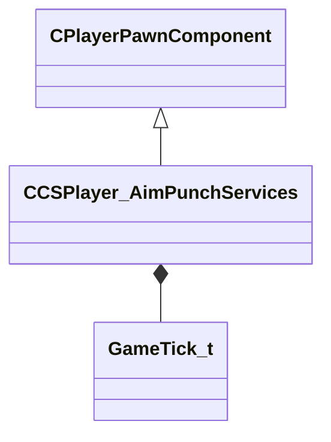

[Schemas](../../schemas.md) / [server](../server.md) / CCSPlayer_AimPunchServices

# CCSPlayer_AimPunchServices

> Source: **Build 25000182** · 2026-08-28 · `windows-x86_64` · schema `0.10.0`

**Kind:** class · **Size:** 232 bytes (`0xe8`) · **Align:** n/a (unspecified) · **Module:** server

**Twin:** [CCSPlayer_AimPunchServices (client)](../client/CCSPlayer_AimPunchServices.md)

**Inherits from:** [CPlayerPawnComponent](../server/CPlayerPawnComponent.md)

**Relationships:**

## Memory layout

8 fields (6 declared here, 2 inherited). Offsets are absolute from the object base.

| Offset | Field | Type | From | Annotations |
|--------|-------|------|------|-------------|
| `0x8` | `__m_pChainEntity` | [CNetworkVarChainer](../entity2/CNetworkVarChainer.md) | [CPlayerPawnComponent](../server/CPlayerPawnComponent.md) | `MNotSaved` |
| `0x30` | `m_pComponentGraphController` | [CAnimGraphControllerPtr](../server/CAnimGraphControllerPtr.md) | [CPlayerPawnComponent](../server/CPlayerPawnComponent.md) |  |
| `0x48` | `m_predictableBaseTick` | [GameTick_t](../entity2/GameTick_t.md) |  |  |
| `0x4c` | `m_predictableBaseTickInterpAmount` | float32 |  |  |
| `0x50` | `m_predictableBaseAngle` | QAngle |  |  |
| `0x5c` | `m_predictableBaseAngleVel` | QAngle |  |  |
| `0xa0` | `m_unpredictableBaseTick` | [GameTick_t](../entity2/GameTick_t.md) |  |  |
| `0xa4` | `m_unpredictableBaseAngle` | QAngle |  |  |
