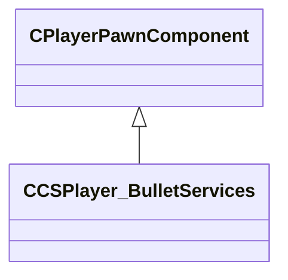

[Schemas](../../schemas.md) / [server](../server.md) / CCSPlayer_BulletServices

# CCSPlayer_BulletServices

Component tracking bullet-hit statistics registered on the server side.

**Kind:** class · **Size:** 112 bytes (`0x70`) · **Align:** 255 · **Module:** server

**Inherits from:** [CPlayerPawnComponent](../server/CPlayerPawnComponent.md)

**Relationships:**

## Memory layout

3 fields (1 declared here, 2 inherited). Offsets are absolute from the object base.

| Offset | Field | Type | From | Annotations |
|--------|-------|------|------|-------------|
| `0x8` | `__m_pChainEntity` | [CNetworkVarChainer](../entity2/CNetworkVarChainer.md) | [CPlayerPawnComponent](../server/CPlayerPawnComponent.md) | `MNotSaved` |
| `0x30` | `m_pComponentGraphController` | [CAnimGraphControllerPtr](../server/CAnimGraphControllerPtr.md) | [CPlayerPawnComponent](../server/CPlayerPawnComponent.md) |  |
| `0x48` | `m_totalHitsOnServer` | int32 |  | Cumulative number of bullet hits this player has registered on the server this round. |
